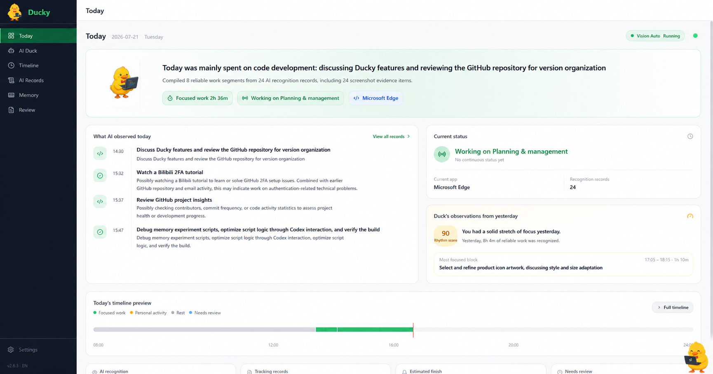
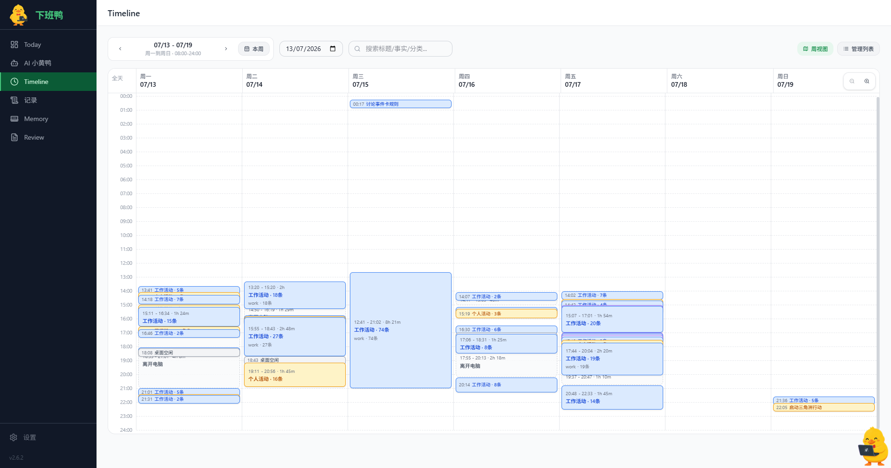
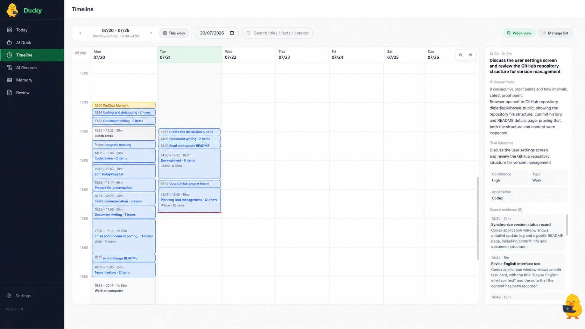
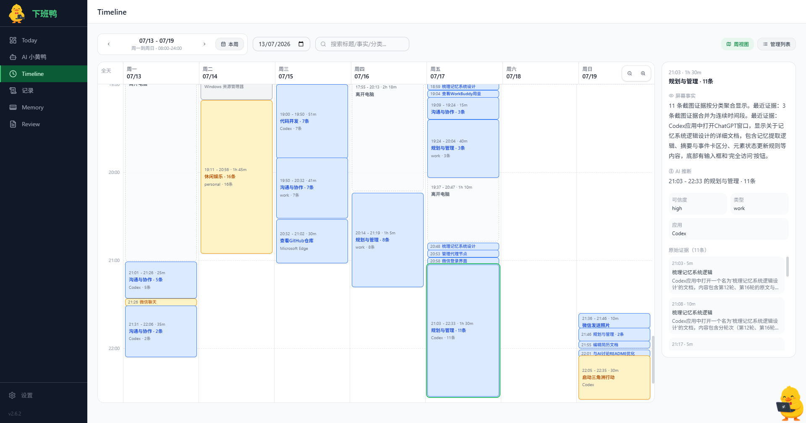
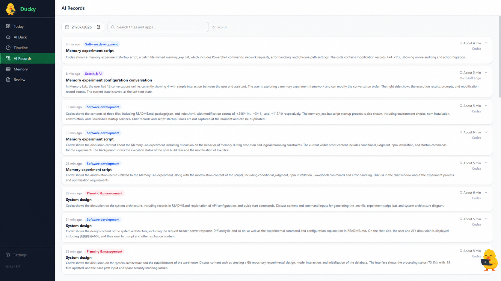
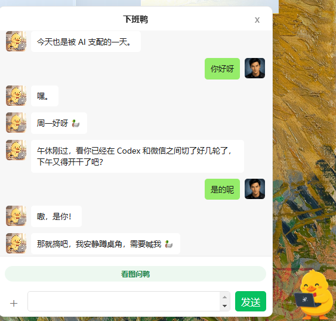
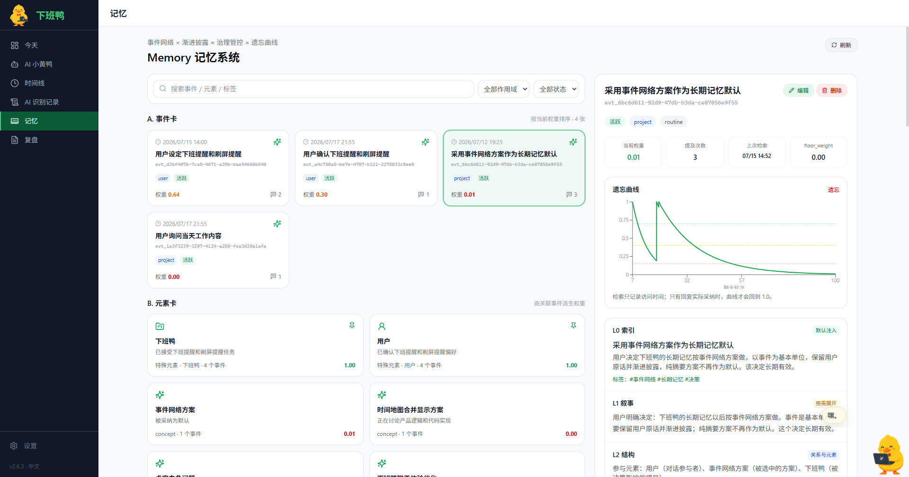

<h1 align="center">
   Ducky
</h1>

<p align="center">
  <a href="README.md">简体中文</a> · English
</p>

<p align="center">
  <strong>Ducky helps you see where your day went — and keeps you company while you work.</strong><br />
  It puts your workday in order, then helps you turn it into an editable report when needed.
</p>

<p align="center">
  Ducky by Xiabanya
</p>

<p align="center">
  <a href="https://github.com/diqierjia/xiabanya-public/releases/latest">Download for Windows</a>
  · <a href="#run-from-source">Run from source</a>
  · <a href="PRIVACY.md">Privacy</a>
</p>

<p align="center">
  
  
  
</p>

## ✨ Why Ducky?

After a busy day, it is easy to remember being busy without remembering where the time went. When AI observation is on, Ducky puts what is on your screen together with app and time context, so you can look back at today or the week and see what you actually did.

The little duck also stays on your desktop while you work. It knows what you worked on today and can follow the questions you run into, so you do not have to repeat the background every time you chat. It carries the day's records and relevant memories into the conversation, and you can ask it about a selected part of the screen whenever you need to.

## 👋 Who is it for?

Ducky is for individual developers, researchers, and others whose work happens mainly on a Windows computer.

## 🧭 What it does

- **Capture** — When you choose AI observation, use multimodal understanding of the screen, foreground app, and time context to create evidence-backed work observations. Local activity and idle data provide context; they are not a blind activity log.
  - **Merged time periods** — Consecutive activities of the same type are merged into one segment, making the timeline easier to scan.
  - **Idle detection** — After a period without keyboard or mouse input, Ducky treats the computer as idle and pauses multimodal recognition.
- **Review** — Use Today, AI observation records, and Timeline to inspect work segments, confidence, and original evidence.
- **Remember** — Chat with Ducky using your current workday, recent conversation, and relevant long-term memory cards. You can inspect, edit, pin, or forget those cards yourself.
- **Ask Ducky about the screen** — Start from the desk pet, select the part of the current screen that matters, ask a question, and receive an answer with both the selection and the surrounding screen context.
- **Write** — Generate editable Markdown daily, weekly, or monthly reports from confirmed records.
- **Stay private** — Keep data in local SQLite. AI requests go only to the compatible provider you configure.

## 🖼️ A quick look

### Today: your workday at a glance



### Timeline: review the whole week







### AI observation records



### 👀 Ask Ducky about the screen

Need help with an error, a code fragment, a page, or a document? Launch **Ask Ducky** from the desk pet chat, select the relevant area, and ask in your own words. Ducky uses the full-screen context and your selection, then continues the answer in the chat without making you save or upload a screenshot by hand.



### 🧠 Memory you can inspect

Decisions, progress, and preferences worth keeping become **event cards**. Projects, people, tools, and concepts become **entity cards** that track their current state and changes over time. Ducky normally carries only a short index, then retrieves the relevant event, state change, or key quote when a question needs it. Memories that are genuinely used stay around longer; unrelated ones gradually fade. You can inspect their sources, edit, pin, or forget them yourself.



## 🔒 Privacy

Ducky has no built-in cloud account system and does not send your data to a project-author server. Local activity, timeline, chat history, and database remain on your computer by default.

If you enable AI recognition, chat, or report generation, the relevant screenshots or text context are sent to the AI provider you configure. When you actively start Ask Ducky, the full screen is used for context; once you submit the question, the selected area is also used to answer it. Read the full [Privacy Policy](PRIVACY.md).

## ❓ FAQ

**Can I use it without an API key?** Yes. However, we strongly recommend configuring one to experience AI observation, Ducky chat, Ask Ducky about the screen, and report generation. Without an API key, local activity tracking, idle detection, records, the timeline, and data export still work.

**What does API usage cost?** With the default five-minute AI observation interval over a typical workday, the multimodal model costs about **US$0.05**. Actual cost varies with your work hours, capture interval, model, and provider. Ducky chat and Ask Ducky about the screen mainly depend on how often you chat and how much text or image content is sent.

**How do I stop or remove data?** Stop Vision Auto from Today, disable automatic tracking in Settings, export JSON from Data Management, or clear local data after exporting anything you want to keep.

**Which systems are supported?** Ducky currently ships as a Windows desktop app.

## 🚀 Run from source

Requirements: Node.js and npm.

```bash
npm install
npm run dev
```

Build a Windows installer:

```bash
npm run dist:win
```

Run tests:

```bash
npm test
```

## 🤝 Feedback and license

Use [Issues](https://github.com/diqierjia/xiabanya-public/issues) for bugs, ideas, and feedback. The code is released under the [MIT License](LICENSE); see [THIRD_PARTY_NOTICES.md](THIRD_PARTY_NOTICES.md) for dependency notices.
