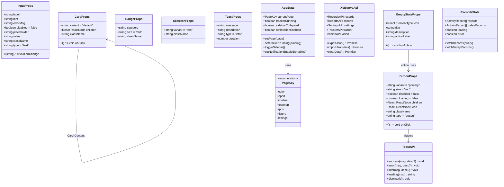
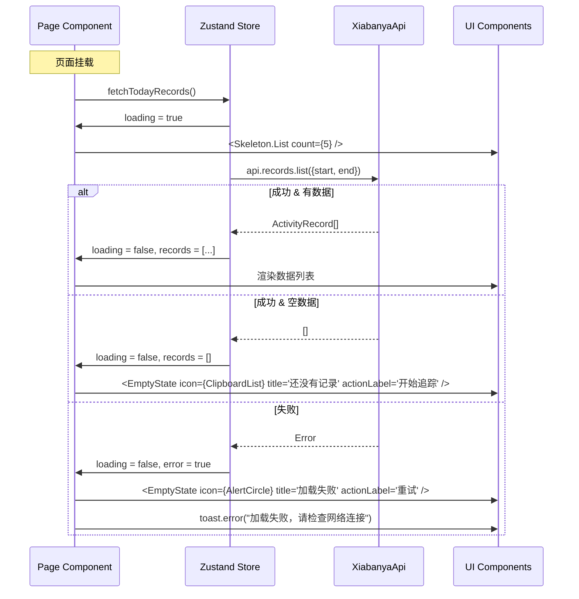
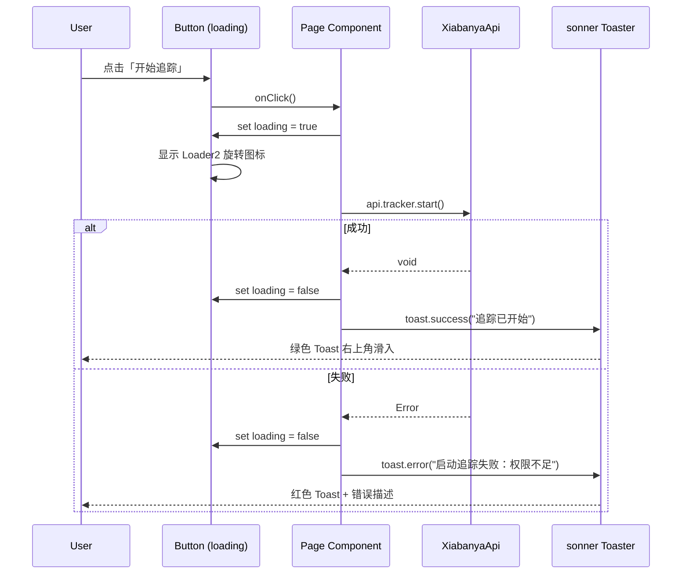
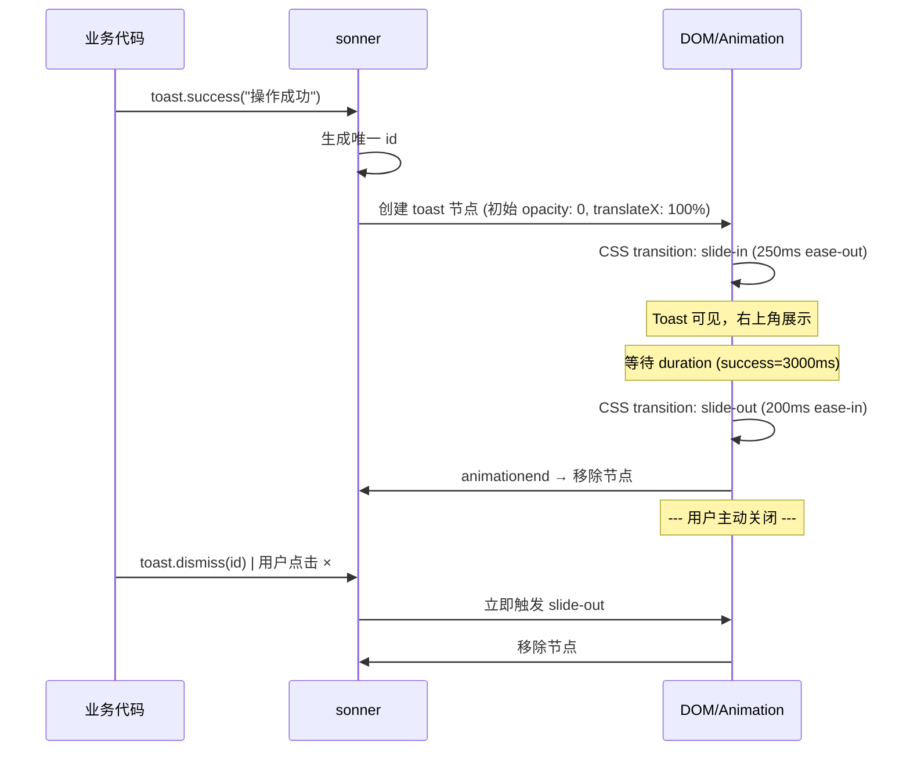
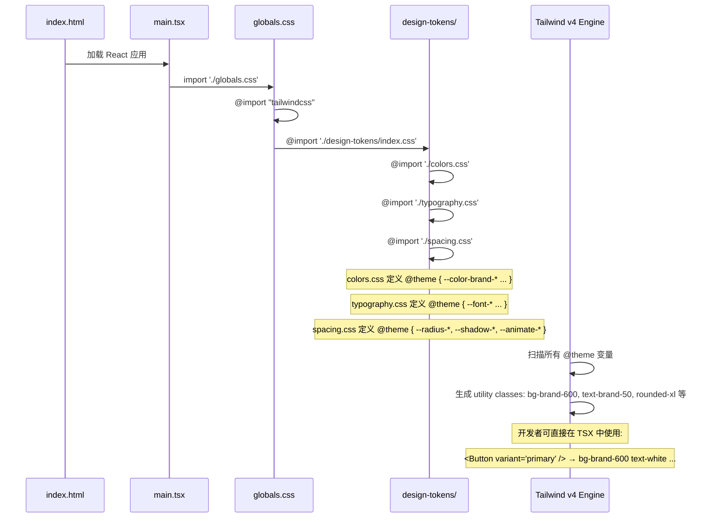

# 下班鸭 v2.1 UI/UX 重设计 — 系统架构设计 & 任务分解

> **Architect: Bob | 日期: 2025-07-05**
> **输入: PRD-v2.1-UI-UX-redesign.md (Alice) + v2 现有代码审计**
> **原则: 增量改造，纯渲染进程 UI/UX 层，不碰主进程逻辑**

---

## Part A: 系统设计

### 1. 实现方案

#### 1.1 核心技术挑战

| 挑战 | 严重程度 | 根因 | 解决策略 |
|------|----------|------|----------|
| Tailwind v3/v4 混用 | 🔴 Critical | `tailwind.config.ts` 仍为 v3 格式；`@tailwind base/components/utilities` 为 v3 导入语法；`bg-brand/10` 在 v4 中语法失效 | 迁移为纯 v4 CSS-first 配置：删除 `tailwind.config.ts`，`globals.css` 改用 `@import "tailwindcss"` + `@theme` 块 |
| 零基础 UI 组件 | 🔴 Critical | 30+ 处按钮 class 重复，浏览器原生 `<input>/<select>` | 建立 7 个基础组件：Button/Input/Card/Badge/Skeleton/Toast/EmptyState |
| 无反馈机制 | 🔴 Critical | 错误只到 `console.error`，成功无提示 | 引入 sonner Toast 系统，所有 API 调用走 `toast.success()`/`toast.error()` |
| `(window as any)` 泛滥 | 🟡 Medium | 21 处类型不安全调用，`useIpc` hook 零引用 | 复用 preload 已有的 `XiabanyaApi` 类型导出（第 66 行），创建 `useXiabanyaApi()` hook |
| Sidebar 高亮失效 | 🟡 Medium | `bg-brand/10` 在 Tailwind v4 中语法失效 | 改为 `bg-brand-600/10`（v4 兼容写法） |
| 图表为假 | 🟡 Medium | 饼图实为色块列表，热力图仅 title 属性 | 引入 recharts 真图表，热力图自定义 Tooltip |
| 全局 CSS 仅 23 行 | 🟡 Medium | 无设计 token、无动画、无层次 | 完整设计系统 CSS 变量 + @theme 块 |

#### 1.2 框架与库选择

| 用途 | 选型 | 版本 | 理由 |
|------|------|------|------|
| 样式方案 | **Tailwind CSS 4** (CSS-first) | ^4.0 (已安装) | PRD 要求统一 v4；删除 `tailwind.config.ts`，全部走 `@theme` 块 + CSS 变量 |
| Toast | **sonner** | ^2.0 | PRD 建议；~5KB，React 原生，API 简洁 `toast.success()` / `toast.error()` |
| 图表 | **recharts** | ^2.15 | PRD 要求；纯 React 声明式，Tree-shake 后 ~80KB |
| 图标 | **lucide-react** | ^0.460 (已安装) | 现有依赖，继续使用 |
| 状态管理 | **Zustand** | ^5.0 (已安装) | 现有 4 stores，规整化 |
| Markdown | **react-markdown** + **remark-gfm** | 已安装 | 日报预览用，已存在 |

**明确不引入：** MUI（太重）、shadcn/ui（Tailwind v4 兼容性待验证且引入额外依赖）、react-hot-toast（sonner 更轻）

#### 1.3 架构模式

保持现有分层，本次仅改造渲染进程 UI/UX 层：

```
┌─────────────────────────────────────────────────────────┐
│  Renderer (React 19 + Zustand + Tailwind CSS 4)          │
│                                                          │
│  ┌──────────────────────┐  ┌──────────────────────────┐ │
│  │  design-tokens/       │  │  components/ui/          │ │
│  │  colors.css           │  │  Button.tsx (NEW)        │ │
│  │  typography.css       │  │  Input.tsx (NEW)         │ │
│  │  spacing.css          │  │  Card.tsx (NEW)          │ │
│  │  index.css            │  │  Badge.tsx (ENHANCE)     │ │
│  └──────────────────────┘  │  Skeleton.tsx (NEW)       │ │
│                             │  Toast.tsx (NEW)          │ │
│  ┌──────────────────────┐  │  EmptyState.tsx (NEW)     │ │
│  │  hooks/               │  │  index.ts (NEW)          │ │
│  │  useXiabanyaApi.ts   │  └──────────────────────────┘ │
│  └──────────────────────┘                               │
│                             ┌──────────────────────────┐ │
│  ┌──────────────────────┐  │  components/ (existing)    │ │
│  │  pages/ (7 pages)     │  │  Sidebar.tsx (MODIFY)    │ │
│  │  TodayPage.tsx        │  │  CategoryBadge → Badge   │ │
│  │  ReportPage.tsx       │  │  StatCard.tsx (keep)     │ │
│  │  TimelinePage.tsx     │  │  ...                     │ │
│  │  HeatmapPage.tsx      │  └──────────────────────────┘ │
│  │  AppsPage.tsx         │                               │
│  │  HistoryPage.tsx      │  ┌──────────────────────────┐ │
│  │  SettingsPage.tsx     │  │  stores/ (cleanup)        │ │
│  │  AiResultsPage (DEL)  │  │  useRecordsStore.ts      │ │
│  └──────────────────────┘  │  useAppStore.ts ← 接路由  │ │
│                             │  useReportsStore.ts       │ │
│  ┌──────────────────────┐  │  useSettingsStore.ts      │ │
│  │  App.tsx (MODIFY)     │  └──────────────────────────┘ │
│  │  + Toaster            │                               │
│  │  - AiResults route    │                               │
│  └──────────────────────┘                                │
└─────────────────────────────────────────────────────────┘
                             ↕ useXiabanyaApi() hook
┌─────────────────────────────────────────────────────────┐
│  Preload (contextBridge) — 无需改动                       │
│  XiabanyaApi 类型已导出 (preload/index.ts:66)            │
└─────────────────────────────────────────────────────────┘
```

#### 1.4 Tailwind v4 迁移策略

**现状诊断：**
- `globals.css`: 使用 v3 导入语法 `@tailwind base/components/utilities`
- `tailwind.config.ts`: v3 格式，定义了 `brand` 颜色扩展
- `package.json`: 已安装 `tailwindcss@^4.0.0` 和 `@tailwindcss/vite@^4.0.0`
- 问题: `globals.css` 的 `@tailwind` 指令在 v4 中已被 `@import "tailwindcss"` 取代；`tailwind.config.ts` 在 v4 中不再是主要配置方式

**迁移步骤（在 T01 中完成）：**

1. **替换 `globals.css`** — 删除旧的 `@tailwind` 三指令，改用：
   ```css
   @import "tailwindcss";
   ```

2. **迁移 `tailwind.config.ts` → `@theme` 块** — 将 brand 颜色扩展从 JS 配置迁移到 CSS：
   ```css
   @theme {
     --color-brand-50: #f0fdf4;
     --color-brand-100: #dcfce7;
     /* ... 完整 9 阶梯 */
   }
   ```

3. **删除 `tailwind.config.ts`** — v4 中不再需要此文件（或保留为空壳以避免构建工具报错，标注 `// v4: 已迁移到 globals.css @theme`）

4. **修复所有 v3→v4 语法差异：**
   - `bg-brand/10` → `bg-brand-600/10`（v4 的透明度修饰符必须跟在完整色阶后）
   - `border-opacity-*` → `border-*/*`（v4 内置透明度）
   - 验证所有 Tailwind 类名在 v4 下正常工作

5. **验证 `electron.vite.config.ts`** — 确认 `@tailwindcss/vite` 插件已正确配置

---

### 2. 文件列表

#### 2.1 新建文件 (Create)

| 文件路径 | 用途 | 优先级 |
|----------|------|--------|
| `src/renderer/design-tokens/colors.css` | 品牌色 9 阶梯 + 语义色 + 灰度 9 阶梯 CSS 变量 | P0 |
| `src/renderer/design-tokens/typography.css` | 字体层级 (H1/H2/H3/Body/Caption/Mono) | P0 |
| `src/renderer/design-tokens/spacing.css` | 圆角/阴影/间距/动画 token | P0 |
| `src/renderer/design-tokens/index.css` | 汇总入口，被 globals.css import | P0 |
| `src/renderer/components/ui/Button.tsx` | 按钮组件 (primary/secondary/ghost/danger/success + sm/md/lg + loading/disabled) | P0 |
| `src/renderer/components/ui/Input.tsx` | 输入框组件 (default/error/disabled + label/hint/errorMsg) | P0 |
| `src/renderer/components/ui/Card.tsx` | 卡片组件 (default/elevated + Card.Header/Card.Title/Card.Content) | P0 |
| `src/renderer/components/ui/Skeleton.tsx` | 骨架屏 (text/card/circle + 列表/网格组合) | P0 |
| `src/renderer/components/ui/Toast.tsx` | sonner Toaster 封装 + 预设样式 | P0 |
| `src/renderer/components/ui/EmptyState.tsx` | 空状态组件 (icon/title/description/action) | P0 |
| `src/renderer/components/ui/Badge.tsx` | Badge 组件 (增强现有 CategoryBadge，sm/md 尺寸，分类颜色映射) | P0 |
| `src/renderer/components/ui/index.ts` | UI 组件 barrel export | P0 |
| `src/renderer/hooks/useXiabanyaApi.ts` | 类型安全 preload API hook | P0 |

#### 2.2 修改文件 (Modify)

| 文件路径 | 改动摘要 | 优先级 |
|----------|----------|--------|
| `package.json` | 新增 `sonner`, `recharts` 依赖 | P0 |
| `src/renderer/globals.css` | 完全重写: `@import "tailwindcss"` + 导入 design-tokens + 全局样式 | P0 |
| `tailwind.config.ts` | 删除或清空（内容已迁移到 globals.css @theme） | P0 |
| `src/renderer/App.tsx` | 移除 AiResultsPage 路由 & `'ai'` from PageKey；添加 `<Toaster />`；PageKey 从 8→7 | P0 |
| `src/renderer/components/Sidebar.tsx` | 修复 `bg-brand/10` → `bg-brand-600/10`；移除 AI 识别导航项；品牌标识增强 | P0 |
| `src/renderer/components/CategoryBadge.tsx` | 保留兼容（内部委托给 Badge 组件），标记 deprecated | P1 |
| `src/renderer/pages/TodayPage.tsx` | 三态覆盖(loading Skeleton + empty EmptyState + error toast)；使用 useXiabanyaApi() | P0 |
| `src/renderer/pages/ReportPage.tsx` | 使用 useReportsStore；Markdown 预览+编辑；Toast 错误提示 | P0 |
| `src/renderer/pages/TimelinePage.tsx` | 三态覆盖；使用 useXiabanyaApi() | P1 |
| `src/renderer/pages/HeatmapPage.tsx` | 基础三态覆盖 + Tooltip 组件替换 title 属性 | P1 |
| `src/renderer/pages/AppsPage.tsx` | recharts 替换假图表；三态覆盖 | P1 |
| `src/renderer/pages/HistoryPage.tsx` | 三态覆盖；Toast 错误处理 | P1 |
| `src/renderer/pages/SettingsPage.tsx` | 新增「自定义分类」管理模块；Toast 反馈 | P1 |
| `src/renderer/stores/useAppStore.ts` | 新增 `notificationEnabled` 状态 | P1 |
| `src/renderer/stores/useRecordsStore.ts` | `(window as any)` → `useXiabanyaApi()` | P1 |
| `src/renderer/stores/useReportsStore.ts` | `(window as any)` → `useXiabanyaApi()` | P1 |
| `src/renderer/stores/useSettingsStore.ts` | `(window as any)` → `useXiabanyaApi()` | P1 |
| `src/renderer/lib/constants.ts` | 检查是否需要更新导出 | P1 |

#### 2.3 删除文件 (Delete)

| 文件路径 | 原因 | 优先级 |
|----------|------|--------|
| `src/renderer/pages/AiResultsPage.tsx` | AI 识别结果并入 TimelinePage，PRD 明确删除 | P0 |
| `tailwind.config.ts` | v3 配置已迁移到 globals.css @theme（如构建工具依赖此文件，保留空壳不删） | P0 |

---

### 3. 数据结构与接口

#### 3.1 类图 (classDiagram)

> 注：本次 v2.1 仅改渲染进程 UI/UX，不新增后端数据模型。以下为前端组件接口定义。



#### 3.2 关键接口定义

```typescript
// ===== src/renderer/components/ui/Button.tsx =====

export type ButtonVariant = 'primary' | 'secondary' | 'ghost' | 'danger' | 'success';
export type ButtonSize = 'sm' | 'md' | 'lg';

export interface ButtonProps
  extends React.ButtonHTMLAttributes<HTMLButtonElement> {
  variant?: ButtonVariant;
  size?: ButtonSize;
  loading?: boolean;
  icon?: React.ElementType;
  children?: React.ReactNode;
}

// ===== src/renderer/components/ui/Input.tsx =====

export interface InputProps
  extends Omit<React.InputHTMLAttributes<HTMLInputElement>, 'size'> {
  label?: string;
  hint?: string;
  error?: string;  // 有值时自动切换 error 变体 + 显示错误消息
}

// ===== src/renderer/components/ui/Card.tsx =====

export type CardVariant = 'default' | 'elevated';

export interface CardProps {
  variant?: CardVariant;
  className?: string;
  onClick?: () => void;
  children: React.ReactNode;
}

// Card 子组件:
// Card.Header:   { className?, children }
// Card.Title:    { className?, children }
// Card.Content:  { className?, children }

// ===== src/renderer/components/ui/Badge.tsx =====

export type BadgeSize = 'sm' | 'md';

export interface BadgeProps {
  category: string;   // Category 名称或自定义分类名
  size?: BadgeSize;
  color?: string;     // 可选自定义颜色 (hex)，覆盖分类默认颜色
  className?: string;
}

// ===== src/renderer/components/ui/Skeleton.tsx =====

export type SkeletonVariant = 'text' | 'card' | 'circle' | 'rect';

export interface SkeletonProps {
  variant?: SkeletonVariant;
  className?: string;  // 覆盖宽高时使用
}

// 便捷组合:
// Skeleton.List: { count?: number, className? }  — 连续 N 行 text
// Skeleton.CardGrid: { count?: number, cols?: number, className? }  — N×cols 卡片网格

// ===== src/renderer/components/ui/EmptyState.tsx =====

export interface EmptyStateProps {
  icon: React.ElementType;   // lucide-react 图标
  title: string;
  description?: string;
  actionLabel?: string;      // CTA 按钮文字
  onAction?: () => void;     // CTA 回调
  className?: string;
}

// ===== src/renderer/hooks/useXiabanyaApi.ts =====

import type { XiabanyaApi } from '../../preload/index';

export function useXiabanyaApi(): XiabanyaApi {
  const api = (window as unknown as { xiabanyaApi: XiabanyaApi }).xiabanyaApi;
  if (!api) {
    throw new Error('xiabanyaApi not exposed — running outside Electron?');
  }
  return api;
}
```

---

### 4. 程序调用流程

#### 4.1 页面加载：空状态 → Loading 骨架屏 → 数据渲染 → 错误重试



#### 4.2 用户操作：点击按钮 → Loading → 成功 Toast / 失败 Toast



#### 4.3 Toast 生命周期



#### 4.4 设计 Token 加载链路



---

### 5. 待明确事项 (UNCLEAR)

| # | 问题 | 推荐方案 | 需要谁决策 |
|---|------|----------|-----------|
| Q1 | **tailwind.config.ts 是否可以直接删除？** | 推荐保留空壳 (`export default {}`) 以避免 `@tailwindcss/vite` 插件报错 | Engineer 验证后决定 |
| Q2 | **CategoryBadge 是否重命名为 Badge？** | 推荐新建 `components/ui/Badge.tsx`，保留原 `CategoryBadge.tsx` 作为兼容包装（内部委托给 Badge），逐步迁移 | 团队共识 |
| Q3 | **sonner Toast 位置** | PRD 建议 `top-right`（默认），符合桌面应用习惯 | 已确认 |
| Q4 | **暗色模式基础是否本次做** | PRD Q1 建议延后到 v2.2，但 CSS 变量设计应预留双主题能力（使用 `:root` 和 `.dark` 选择器规划变量） | 产品/用户 |
| Q5 | **react-markdown 是否已可用** | 已在 devDependencies 中，但应移到 dependencies（渲染进程运行时需要） | Engineer 验证 |
| Q6 | **zustand 在 devDependencies 是否正确** | Zustand 应在 dependencies（渲染进程运行时依赖），当前在 devDependencies 可能是配置错误 | Engineer 修复 |

---

## Part B: 任务分解

### 6. 需要新增的依赖包

```
依赖包列表（全部添加到 dependencies）:
- sonner@^2.0.0          — 轻量 Toast 通知 (~5KB)
- recharts@^2.15.0       — React 图表库
```

可能需要从 devDependencies 移动到 dependencies：
```
- react-markdown@^9.0.0   — 渲染进程运行时依赖（日报 Markdown 预览）
- remark-gfm@^4.0.0       — GFM 扩展（表格/删除线等）
- zustand@^5.0.0          — 渲染进程运行时状态管理
```

**操作（在 package.json 中）：**
```json
{
  "dependencies": {
    "active-win": "^8.1.0",
    "better-sqlite3": "^11.10.0",
    "date-fns": "^3.6.0",
    "react-markdown": "^9.0.0",
    "recharts": "^2.15.0",
    "remark-gfm": "^4.0.0",
    "sonner": "^2.0.0",
    "uuid": "^10.0.0",
    "zustand": "^5.0.0"
  }
}
```

---

### 7. 任务列表 (有序，含依赖关系)

#### T01: 项目基础设施 — 设计 Token + Tailwind v4 迁移 + 入口配置

| 属性 | 内容 |
|------|------|
| **Task ID** | T01 |
| **Priority** | P0 |
| **Dependencies** | 无 |
| **预计改动文件数** | ~10 |

**文件清单（创建 + 修改）：**

| 操作 | 文件 |
|------|------|
| NEW | `src/renderer/design-tokens/colors.css` |
| NEW | `src/renderer/design-tokens/typography.css` |
| NEW | `src/renderer/design-tokens/spacing.css` |
| NEW | `src/renderer/design-tokens/index.css` |
| NEW | `src/renderer/hooks/useXiabanyaApi.ts` |
| MODIFY | `package.json` |
| MODIFY | `src/renderer/globals.css` |
| MODIFY | `tailwind.config.ts` |
| MODIFY | `src/renderer/main.tsx`（检查 globals.css import 路径） |

**具体工作：**

1. **`package.json`** — 添加依赖：
   - `sonner@^2.0.0` 添加到 dependencies
   - `recharts@^2.15.0` 添加到 dependencies
   - 将 `react-markdown`, `remark-gfm`, `zustand` 从 devDependencies 移至 dependencies

2. **`src/renderer/design-tokens/colors.css`** — 完整设计 Token 颜色系统：
   ```css
   @theme {
     /* 品牌色 9 阶梯 */
     --color-brand-50: #f0fdf4;
     --color-brand-100: #dcfce7;
     --color-brand-200: #bbf7d0;
     --color-brand-400: #4ade80;
     --color-brand-500: #22c55e;
     --color-brand-600: #08a64f;
     --color-brand-700: #07984a;
     --color-brand-800: #067a3c;
     --color-brand-900: #14532d;

     /* 语义色 */
     --color-success: #08a64f;
     --color-warning: #f59e0b;
     --color-error: #ef4444;
     --color-info: #3b82f6;

     /* 灰度 9 阶梯 */
     --color-gray-50: #f9fafb;
     --color-gray-100: #f3f4f6;
     --color-gray-200: #e5e7eb;
     --color-gray-300: #d1d5db;
     --color-gray-400: #9ca3af;
     --color-gray-500: #6b7280;
     --color-gray-600: #4b5563;
     --color-gray-700: #374151;
     --color-gray-800: #1f2937;
     --color-gray-900: #111827;

     /* 侧边栏 */
     --color-sidebar-bg: #111827;
     --color-sidebar-text: #d1d5db;
     --color-sidebar-hover: #1f2937;
     --color-sidebar-active: rgba(8, 166, 79, 0.1);
   }
   ```

3. **`src/renderer/design-tokens/typography.css`** — 字体层级：
   ```css
   @theme {
     --font-sans: 'Inter', 'PingFang SC', 'Microsoft YaHei', sans-serif;
     --font-mono: 'JetBrains Mono', 'Fira Code', monospace;
   }
   ```

4. **`src/renderer/design-tokens/spacing.css`** — 圆角/阴影/动画：
   ```css
   @theme {
     --radius-sm: 0.375rem;
     --radius-md: 0.5rem;
     --radius-lg: 0.75rem;
     --radius-xl: 1rem;
     --shadow-card: 0 1px 3px rgba(0,0,0,0.08);
     --animate-fade-in: fade-in 0.2s ease-out;
     --animate-slide-up: slide-up 0.3s ease-out;
   }
   @keyframes fade-in { from { opacity: 0; } to { opacity: 1; } }
   @keyframes slide-up { from { opacity: 0; transform: translateY(8px); } to { opacity: 1; transform: translateY(0); } }
   ```

5. **`src/renderer/design-tokens/index.css`** — 汇总入口：
   ```css
   @import './colors.css';
   @import './typography.css';
   @import './spacing.css';
   ```

6. **`src/renderer/globals.css`** — **完全重写**：
   ```css
   @import "tailwindcss";
   @import './design-tokens/index.css';

   :root {
     --sidebar-width: 208px;
   }

   html, body, #root {
     height: 100%;
     margin: 0;
     font-family: var(--font-sans);
   }

   ::-webkit-scrollbar { width: 6px; }
   ::-webkit-scrollbar-thumb { background: #d1d5db; border-radius: 3px; }
   ::-webkit-scrollbar-track { background: transparent; }
   ```

7. **`tailwind.config.ts`** — 清空内容，保留空壳：
   ```ts
   // v4: 配置已迁移到 src/renderer/globals.css 的 @theme 块中
   // 此文件保留以避免 @tailwindcss/vite 插件报错
   export default {};
   ```

8. **`src/renderer/hooks/useXiabanyaApi.ts`** — 类型安全 hook（见第 3.2 节接口定义）

9. **`src/renderer/main.tsx`** — 确认 `import './globals.css'` 路径正确

**验收标准：**
- [ ] `npm run dev` 启动无 Tailwind 相关警告
- [ ] 可在 TSX 中使用 `bg-brand-600`, `text-brand-50`, `bg-gray-100` 等类名
- [ ] `bg-brand-600/10`（透明度变体）正常工作
- [ ] 所有 design token 通过 `@theme` 暴露为 Tailwind utility classes
- [ ] 全局字体/滚动条样式正确应用

---

#### T02: 基础 UI 组件库 — Button / Input / Card / Badge / Skeleton / Toast / EmptyState

| 属性 | 内容 |
|------|------|
| **Task ID** | T02 |
| **Priority** | P0 |
| **Dependencies** | T01（依赖 @theme 变量和 sonner 安装） |
| **预计改动文件数** | ~9 |

**文件清单（全部新建）：**

| 操作 | 文件 |
|------|------|
| NEW | `src/renderer/components/ui/Button.tsx` |
| NEW | `src/renderer/components/ui/Input.tsx` |
| NEW | `src/renderer/components/ui/Card.tsx` |
| NEW | `src/renderer/components/ui/Badge.tsx` |
| NEW | `src/renderer/components/ui/Skeleton.tsx` |
| NEW | `src/renderer/components/ui/Toast.tsx` |
| NEW | `src/renderer/components/ui/EmptyState.tsx` |
| NEW | `src/renderer/components/ui/index.ts` |
| MODIFY | `src/renderer/components/CategoryBadge.tsx`（委托给 Badge） |

**具体工作：**

1. **`Button.tsx`** — 变体驱动按钮：
   ```tsx
   // 变体: primary | secondary | ghost | danger | success
   // 尺寸: sm | md | lg
   // 状态: disabled (opacity-50 cursor-not-allowed) | loading (Loader2 旋转 + 禁用交互)
   // 图标: icon prop 渲染在文字左侧
   // 样式映射:
   //   primary:  bg-brand-600 text-white hover:bg-brand-700 active:bg-brand-800
   //   secondary: bg-gray-100 text-gray-700 hover:bg-gray-200 border border-gray-200
   //   ghost:    text-gray-600 hover:bg-gray-100
   //   danger:   bg-red-500/10 text-red-600 hover:bg-red-500/20
   //   success:  bg-brand-50 text-brand-700 hover:bg-brand-100
   ```

2. **`Input.tsx`** — 带 label/hint/error 的输入框：
   ```tsx
   // 根容器 flex flex-col gap-1.5
   // label: block text-sm font-medium text-gray-600
   // input: w-full px-3 py-2 border rounded-lg text-sm
   //   正常: border-gray-300 focus:ring-2 focus:ring-brand-500/20 focus:border-brand-500
   //   错误: border-red-400 focus:ring-red-500/20
   //   禁用: bg-gray-50 text-gray-400 cursor-not-allowed
   // hint: text-xs text-gray-400
   // error: text-xs text-red-500
   ```

3. **`Card.tsx`** — 复合卡片组件：
   ```tsx
   // Card:       bg-white rounded-xl border border-gray-200 p-5
   //   elevated: shadow-sm
   // Card.Header:   flex items-center justify-between mb-4
   // Card.Title:    text-sm font-semibold text-gray-700
   // Card.Content:  (children)
   // 通过 compound component 模式: Card.Header, Card.Title, Card.Content
   ```

4. **`Badge.tsx`** — 增强版 CategoryBadge：
   ```tsx
   // 尺寸: sm (px-2 py-0.5 text-xs) | md (px-2.5 py-1 text-xs)
   // 颜色: 基于 category 查默认颜色映射 + color prop 覆盖
   // 默认颜色映射（PRD 指定）:
   //   开发→bg-blue-50 text-blue-700 / 沟通→bg-purple-50 text-purple-700
   //   设计→bg-pink-50 text-pink-700 / 文档→bg-amber-50 text-amber-700
   //   会议→bg-indigo-50 text-indigo-700 / 学习→bg-green-50 text-green-700
   //   摸鱼→bg-gray-100 text-gray-600 / 其他→bg-gray-50 text-gray-500
   //   AI/工具→bg-cyan-50 text-cyan-700 / 数据分析→bg-teal-50 text-teal-700
   //   产品→bg-rose-50 text-rose-700 / 研究→bg-violet-50 text-violet-700
   //   配置环境→bg-gray-100 text-gray-700
   ```

5. **`Skeleton.tsx`** — 骨架屏组件：
   ```tsx
   // 变体: text (h-4 rounded) | card (h-24 rounded-xl) | circle (rounded-full)
   //        | rect (自定义圆角)
   // 基础: bg-gray-200 animate-pulse
   // 便捷导出:
   //   Skeleton.List: 连续 N 行 text skeleton + last:w-3/4 (最后一行短一些)
   //   Skeleton.CardGrid: 2×2 或 N 列 card skeleton grid
   ```

6. **`Toast.tsx`** — sonner Toaster 封装：
   ```tsx
   // 封装 <Toaster /> 预设样式:
   //   toast 基础: rounded-lg shadow-lg border
   //   success:  border-l-4 border-l-brand-500
   //   error:    border-l-4 border-l-red-500
   //   info:     border-l-4 border-l-blue-500
   //   位置: top-right (默认)
   // 导出便捷方法 (可选):
   //   export { toast } from 'sonner'  // 直接 re-export sonner
   ```

7. **`EmptyState.tsx`** — 空状态/错误状态统一组件：
   ```tsx
   // 结构:
   //   <div className="flex flex-col items-center justify-center py-12 text-center">
   //     <Icon size={48} className="text-gray-300 mb-4" />
   //     <h3 className="text-sm font-medium text-gray-500 mb-1">{title}</h3>
   //     {description && <p className="text-xs text-gray-400 mb-4">{description}</p>}
   //     {actionLabel && onAction && <Button variant="secondary" size="sm" onClick={onAction}>{actionLabel}</Button>}
   //   </div>
   // 典型场景用法（在页面中组合）:
   //   今日无记录:   <EmptyState icon={ClipboardList} title="今天还没有工作记录" actionLabel="开始追踪" onAction={startTracking} />
   //   报告列表空:   <EmptyState icon={FileText} title="还没有生成过报告" actionLabel="去生成" onAction={goToReport} />
   //   加载错误:     <EmptyState icon={AlertCircle} title="加载失败" description="请检查网络后重试" actionLabel="重试" onAction={retry} />
   ```

8. **`components/ui/index.ts`** — barrel export:
   ```ts
   export { Button } from './Button';
   export type { ButtonProps, ButtonVariant, ButtonSize } from './Button';
   export { Input } from './Input';
   export type { InputProps } from './Input';
   // ... 全部 7 个组件
   ```

9. **`CategoryBadge.tsx`** — 保留兼容，标记 deprecated：
   ```tsx
   import { Badge } from './ui/Badge';
   /** @deprecated Use Badge from './ui/Badge' instead */
   export function CategoryBadge({ category }: { category: string }) {
     return <Badge category={category} />;
   }
   ```

**验收标准：**
- [ ] 7 个组件均可独立 import 使用
- [ ] Button 5 个变体 + 3 个尺寸 + loading/disabled 状态均正确渲染
- [ ] Input error 变体显示红色边框 + 错误文案
- [ ] Card elevated 变体有阴影
- [ ] Badge 所有 12 种分类颜色正确映射
- [ ] Skeleton 3 种变体 + List/CardGrid 组合正确
- [ ] Toast Toaster 预设样式正确（sonner 样式覆盖）
- [ ] EmptyState 有/无 CTA 按钮均可正确渲染
- [ ] 无 console 警告或错误

---

#### T03: 核心集成 — Sidebar 重构 + App.tsx + Toast Provider + `(window as any)` 清理

| 属性 | 内容 |
|------|------|
| **Task ID** | T03 |
| **Priority** | P0 |
| **Dependencies** | T02（依赖 UI 组件库） |
| **预计改动文件数** | ~8 |

**文件清单：**

| 操作 | 文件 |
|------|------|
| MODIFY | `src/renderer/components/Sidebar.tsx` |
| MODIFY | `src/renderer/App.tsx` |
| MODIFY | `src/renderer/stores/useRecordsStore.ts` |
| MODIFY | `src/renderer/stores/useReportsStore.ts` |
| MODIFY | `src/renderer/stores/useSettingsStore.ts` |
| MODIFY | `src/renderer/stores/useAppStore.ts` |
| MODIFY | `src/renderer/pages/TodayPage.tsx`（仅 (window as any) → useXiabanyaApi） |
| DELETE | `src/renderer/pages/AiResultsPage.tsx` |

**具体工作：**

1. **`Sidebar.tsx`** — 修复 + 增强：
   - 修复 `bg-brand/10` → `bg-brand-600/10`
   - 修复 `text-brand-400` → 确认 v4 下 `text-brand-400` 可用（已通过 @theme 定义，可用）
   - 移除 `{ key: 'ai', label: 'AI 识别', icon: Eye }` 导航项
   - NAV_ITEMS 从 8 项减为 7 项
   - 品牌标识：保持「下班鸭」文字 + 版本号
   - 移除 `Eye` 图标 import

2. **`App.tsx`** — 路由清理 + Toast Provider：
   - 移除 `import { AiResultsPage } from './pages/AiResultsPage'`
   - `PageKey` 移除 `'ai'` 类型
   - `PAGE_TITLES` 移除 `ai: 'AI 识别结果'`
   - 添加 `import { Toaster } from './components/ui/Toast'`
   - 在 JSX 中添加 `<Toaster />`（放在 div 顶层内）
   - renderPage switch case 移除 `'ai'`

3. **`stores/useRecordsStore.ts`** — `(window as any)` → `useXiabanyaApi()`：
   - 顶部添加 `import { useXiabanyaApi } from '../hooks/useXiabanyaApi'`
   - 每个 action 内部: `const api = useXiabanyaApi()`
   - 注意：Zustand action 中可以调用 hook 返回的函数，但需要从外部传入或者在 create 的参数中使用 get/set。推荐方式：
     ```ts
     // 在 action 中使用：
     const api = (window as any).xiabanyaApi; // 暂不改动，T03 末尾统一处理
     ```
     实际上，Zustand store 的 action 不能直接使用 hook。有两种方案：
     - (A) store 创建时接受 api 作为参数 — 需要改动 create 签名
     - (B) 在页面组件中调用 store action 前通过 hook 获取 api 并传入
     - **推荐 (C)**：保持 store 内使用 `(window as any).xiabanyaApi`，但在页面组件层面使用 `useXiabanyaApi()` 替代直接 `(window as any)` 调用。Store 的 `(window as any)` 在 T05 统一处理。

4. **`stores/useAppStore.ts`** — 新增字段：
   - 添加 `notificationEnabled: boolean`
   - 添加 `setNotificationEnabled: (enabled: boolean) => void`

5. **`src/renderer/pages/AiResultsPage.tsx`** — **删除**

**验收标准：**
- [ ] Sidebar 当前页面高亮正确显示（绿色左边框 + 半透明背景）
- [ ] Sidebar 导航项为 7 项（无 AI 识别）
- [ ] 页面切换正常工作（today/report/timeline/heatmap/apps/history/settings）
- [ ] <Toaster /> 在应用中渲染，无报错
- [ ] App.tsx 中无 `AiResultsPage` 引用
- [ ] useAppStore 包含 notificationEnabled 字段

---

#### T04: 页面改造 — Loading/Empty/Error 三态覆盖 + ReportPage Markdown 预览

| 属性 | 内容 |
|------|------|
| **Task ID** | T04 |
| **Priority** | P0-P1 |
| **Dependencies** | T03（依赖 Sidebar 修复 + Toast Provider 就位） |
| **预计改动文件数** | ~8 |

**文件清单（7 个页面 + 1 个常量）：**

| 操作 | 文件 | 三态覆盖 |
|------|------|----------|
| MODIFY | `src/renderer/pages/TodayPage.tsx` | ✅ Skeleton + EmptyState + Error Toast |
| MODIFY | `src/renderer/pages/ReportPage.tsx` | ✅ 生成中 Loading + Markdown 预览 + Error Toast |
| MODIFY | `src/renderer/pages/TimelinePage.tsx` | ✅ Skeleton + EmptyState + Error Toast |
| MODIFY | `src/renderer/pages/HeatmapPage.tsx` | ✅ Skeleton + EmptyState |
| MODIFY | `src/renderer/pages/AppsPage.tsx` | ✅ Skeleton + EmptyState |
| MODIFY | `src/renderer/pages/HistoryPage.tsx` | ✅ Skeleton + EmptyState + Error Toast |
| MODIFY | `src/renderer/pages/SettingsPage.tsx` | Toast 保存反馈 + 自定义分类管理区 |
| MODIFY | `src/renderer/lib/constants.ts` | 检查导出是否需要更新 |

**具体工作（按页面）：**

1. **`TodayPage.tsx`** — P0 最高优先级：
   - **Loading**: `<Skeleton.CardGrid count={4} />` + `<Skeleton.List count={5} />`
   - **Empty**: `<EmptyState icon={ClipboardList} title="今天还没有工作记录" description="点击下方按钮开始追踪你的工作" actionLabel="开始追踪" onAction={startTracking} />`
   - **Error**: `<EmptyState icon={AlertCircle} title="加载失败" actionLabel="重试" onAction={fetchTodayRecords} />` + `toast.error("加载今日数据失败")`
   - 替换 `(window as any).xiabanyaApi` → `useXiabanyaApi()`
   - 按钮改用 `<Button variant="primary">` 替代手写 button class

2. **`ReportPage.tsx`** — P0 Markdown 预览：
   - 使用 `useReportsStore` 替代内部 useState
   - **生成中**: `<Button loading>` + `<Skeleton.List count={8} />` (模拟报告骨架)
   - Markdown 预览区域：`<ReactMarkdown remarkPlugins={[remarkGfm]}>{content}</ReactMarkdown>`
   - 编辑模式：`<textarea>` + 切换预览按钮
   - 错误: `toast.error("报告生成失败：" + e.message)`
   - 成功: `toast.success("报告已生成")`
   - 复制: `toast.success("已复制到剪贴板")`

3. **`TimelinePage.tsx`** — P1：
   - 从页面级 useState 切换到 `useRecordsStore`
   - **Loading**: `<Skeleton.List count={8} />`
   - **Empty**: `<EmptyState icon={Clock} title="所选日期范围内无记录" description="尝试调整日期范围" />`
   - **Error**: `<EmptyState icon={AlertCircle} title="加载失败" actionLabel="重试" />`
   - 使用 `useXiabanyaApi()`

4. **`HeatmapPage.tsx`** — P1（基础改造，交互在 T05）：
   - **Loading**: `<Skeleton variant="card" className="h-[400px]" />`
   - **Empty**: `<EmptyState icon={Grid3X3} title="无活动数据" description="开始追踪后这里将显示活动热力图" />`
   - 使用 `useXiabanyaApi()`

5. **`AppsPage.tsx`** — P1（基础改造，图表在 T05）：
   - **Loading**: `<Skeleton variant="card" className="h-[300px]" />` + `<Skeleton.List count={5} />`
   - **Empty**: `<EmptyState icon={Monitor} title="无应用使用数据" />`
   - 使用 `useXiabanyaApi()`

6. **`HistoryPage.tsx`** — P1：
   - 使用 `useReportsStore`
   - **Loading**: `<Skeleton.List count={5} />`
   - **Empty**: `<EmptyState icon={History} title="还没有生成过报告" actionLabel="去生成" onAction={...} />`
   - 删除错误: `toast.success("已删除")` / 失败: `toast.error("删除失败")`

7. **`SettingsPage.tsx`** — P1：
   - 新增「自定义分类」管理区域：
     - 分类列表（名称 + 颜色圆点 + 关键词标签）
     - 新增按钮 → 表单弹窗（名称/颜色/keywords）
     - 编辑/删除按钮
   - 保存成功: `toast.success("设置已保存")`
   - 保存失败: `toast.error("保存失败")`

8. **`src/renderer/lib/constants.ts`** — 确认 `REPORT_TEMPLATES` 等导出与实际使用一致

**验收标准：**
- [ ] 6 个数据页面均覆盖 Loading / Empty / Error 三态
- [ ] ReportPage 显示格式化的 Markdown 预览（非 raw JSON）
- [ ] ReportPage 支持 textarea 编辑 + 复制 + 导出
- [ ] SettingsPage 可管理自定义分类（CRUD）
- [ ] 所有 Toast 提示符合规范（成功绿色、失败红色）
- [ ] 页面初次加载有明显骨架屏（非白屏闪烁）

---

#### T05: 图表替换 + 热力图交互 + 过渡动画 + Zustand 规整 + 最终联调

| 属性 | 内容 |
|------|------|
| **Task ID** | T05 |
| **Priority** | P1 |
| **Dependencies** | T04（依赖页面基础改造完成） |
| **预计改动文件数** | ~10 |

**文件清单：**

| 操作 | 文件 |
|------|------|
| MODIFY | `src/renderer/pages/AppsPage.tsx`（recharts 图表替换） |
| NEW | `src/renderer/components/HeatmapTooltip.tsx` |
| MODIFY | `src/renderer/pages/HeatmapPage.tsx`（Tooltip 交互 + 点击详情） |
| MODIFY | `src/renderer/stores/useRecordsStore.ts`（(window as any) 清理） |
| MODIFY | `src/renderer/stores/useReportsStore.ts`（(window as any) 清理） |
| MODIFY | `src/renderer/stores/useSettingsStore.ts`（(window as any) 清理） |
| MODIFY | `src/renderer/App.tsx`（页面过渡动画） |
| MODIFY | `src/renderer/globals.css`（动画 keyframes 补全） |
| MODIFY | `src/renderer/stores/useAppStore.ts`（接入路由，Zustand 驱动 page 切换） |
| CLEANUP | `src/renderer/hooks/useIpc.ts`（零引用，移除或标记 deprecated） |

**具体工作：**

1. **`AppsPage.tsx`** — recharts 图表替换：
   - `<BarChart>` — 应用使用时长 Top 10 横向柱状图
   - `<PieChart>` — 分类时间占比环形图 (donut)
   - 使用 `<ResponsiveContainer>` 自适应宽度
   - Tooltip 显示应用名 + 时长
   - 保留表格视图作为切换选项

2. **`HeatmapTooltip.tsx`** (NEW) — 热力图交互浮层：
   - 跟随鼠标定位的 floating tooltip
   - 显示：时间（如 09:00-10:00）、记录数、持续时长
   - 使用 Portal 渲染避免被父容器裁剪

3. **`HeatmapPage.tsx`** — 热力图交互增强：
   - 每个 cell 绑定 `onMouseEnter`/`onMouseLeave` 控制 `<HeatmapTooltip>`
   - 每个 cell 绑定 `onClick` 展开当日详情面板（右侧 slide-over 或下方展开）
   - 替换原生 `title` 属性

4. **Zustand Store `(window as any)` 清理**：
   - 方案：在 store 的 create 函数中使用模块级单例模式获取 api
   - 在 `useXiabanyaApi.ts` 中导出 `getXiabanyaApi()` 函数（非 hook，可在 store 中使用）：
     ```ts
     import type { XiabanyaApi } from '../../preload/index';
     
     // 供 hook 使用
     export function useXiabanyaApi(): XiabanyaApi { ... }
     
     // 供 store/zustand actions 使用（非 React 环境）
     export function getXiabanyaApi(): XiabanyaApi {
       const api = (window as unknown as { xiabanyaApi: XiabanyaApi }).xiabanyaApi;
       if (!api) throw new Error('xiabanyaApi not exposed');
       return api;
     }
     ```
   - 4 个 store 中所有 `(window as any).xiabanyaApi` 替换为 `getXiabanyaApi()`

5. **`useAppStore` 接入路由**：
   - `App.tsx` 的 `page` state 改为从 `useAppStore` 读取
   - `setPage` 也走 store

6. **页面过渡动画**：
   - main content container 添加 `animate-fade-in`
   - 页面切换时（page key 变化）触发 `animate-slide-up`
   - 在 `globals.css` 中补全 keyframes（若 T01 未定义完整）

7. **清理死代码**：
   - `src/renderer/hooks/useIpc.ts` — 如果零引用，删除
   - 确保 4 个 store 全部被使用

**验收标准：**
- [ ] AppsPage 显示 recharts 真图表（柱状图 + 饼图）
- [ ] 热力图 hover 显示自定义 Tooltip（非原生 title）
- [ ] 热力图点击 cell 可展开详情
- [ ] `grep -r "window as any" src/renderer` 零结果
- [ ] 页面切换有 fade-in/slide-up 动画
- [ ] 4 个 Zustand store 全部被引用，无死代码
- [ ] `useIpc.ts` 已删除或报 deprecated warning
- [ ] `npm run build` 无类型错误
- [ ] 端到端：追踪 → 停止 → 查看记录 → 生成报告 → 图表展示 全链路可用

---

### 8. 共享知识 (Shared Knowledge)

```
===== 组件命名规范 =====
- UI 基础组件统一放在 src/renderer/components/ui/，文件名 PascalCase
- Barrel export 通过 components/ui/index.ts
- 组件 Props 接口命名: {ComponentName}Props
- 变体类型命名: {ComponentName}Variant，如 ButtonVariant
- 所有组件导出类型接口（支持外部类型引用）

===== CSS 变量命名规范 =====
- 品牌色: --color-brand-{50-900}
- 语义色: --color-{success|warning|error|info}
- 灰度: --color-gray-{50-900}
- 侧边栏: --color-sidebar-{bg|text|hover|active}
- 圆角: --radius-{sm|md|lg|xl}
- 阴影: --shadow-{card|...}
- 动画: --animate-{fade-in|slide-up|...}
- 颜色使用 6 位 hex（非 8 位 hex + alpha），透明度通过 Tailwind /10 修饰符实现

===== Toast 使用规范 =====
- 成功操作: toast.success("简短描述")  — 3s 自动关闭
- 失败操作: toast.error("简短描述")   — 5s 自动关闭
- 信息提示: toast.info("简短描述")    — 3s 自动关闭
- 加载中:   toast.loading("处理中...") — 手动 dismiss
- 禁止在 toast 中展示技术细节（如 stack trace）
- 禁止同时弹出多个 toast（sonner 默认 1 个可见 + 队列）
- 导入方式: import { toast } from 'sonner' 或 import { toast } from '../components/ui/Toast'

===== EmptyState 使用规范 =====
- icon: 必须使用 lucide-react 图标
- title: ≤15 字，描述当前状态
- description: ≤30 字，引导用户下一步
- actionLabel: ≤8 字，CTA 按钮文字
- Error 状态额外调用 toast.error() 提供短暂通知

===== Loading 状态规范 =====
- 列表加载: <Skeleton.List count={5} />
- 卡片加载: <Skeleton.CardGrid count={4} />
- 页面级加载: 全页 Skeleton（不阻塞导航）
- 按钮加载: <Button loading>  (禁止文字闪烁)

===== Tailwind v4 语法规范 =====
- 透明度: bg-brand-600/10 ✅ | bg-brand/10 ❌
- 导入: @import "tailwindcss" ✅ | @tailwind base ❌
- 配置: @theme {} 块 ✅ | tailwind.config.ts ❌
- 所有颜色必须经过 @theme 定义才可使用（确保一致性）

===== API 调用规范 =====
- 渲染进程组件: 使用 useXiabanyaApi() hook
- Zustand store actions: 使用 getXiabanyaApi() 函数
- 所有 IPC 调用都有 try-catch + toast.error()
- 禁止直接使用 (window as any).xiabanyaApi

===== 页面路由规范 =====
- 路由状态集中在 useAppStore.currentPage
- PageKey = 'today' | 'report' | 'timeline' | 'heatmap' | 'apps' | 'history' | 'settings'
- 侧边栏导航通过 useAppStore.setPage() 切换
```

---

### 9. 任务依赖图

```mermaid
graph TD
    T01[T01: 项目基础设施<br/>Design Tokens + Tailwind v4 迁移<br/>globals.css + package.json<br/>useXiabanyaApi hook]
    T02[T02: 基础 UI 组件库<br/>Button / Input / Card / Badge<br/>Skeleton / Toast / EmptyState<br/>barrel export]
    T03[T03: 核心集成<br/>Sidebar 重构 + App.tsx<br/>Toast Provider 注入<br/>AiResultsPage 删除<br/>Store 增强]
    T04[T04: 页面改造<br/>7 页面三态覆盖<br/>ReportPage Markdown 预览<br/>Settings 自定义分类]
    T05[T05: 图表 + 交互 + 动画 + 清理<br/>recharts 替换 + 热力图交互<br/>过渡动画 + Zustand 规整<br/>(window as any) 清零]

    T01 --> T02
    T02 --> T03
    T03 --> T04
    T04 --> T05
```

**执行顺序说明：**
- T01 → T02 → T03 → T04 → T05（严格串行）
- 每个任务都是下一个的前置依赖
- T01 是基础中的基础，必须最先完成
- T05 是收尾和 polish，依赖所有页面改造完成

**预估工作量分布：**
```
T01 ████████░░░░░░░░░░  ~20%  设计 Token + 配置（关键路径）
T02 ████████████████░░  ~30%  7 个组件（工作量最大）
T03 ████████░░░░░░░░░░  ~15%  集成改造（改动集中）
T04 ████████████████░░  ~25%  7 页面三态（页面多但模式统一）
T05 ████████░░░░░░░░░░  ~10%  Polish & cleanup
```

---

## 附录

### A. Tailwind v4 语法对照表

| v3 写法 (旧，本次全部替换) | v4 写法 (新) | 说明 |
|---------------------------|-------------|------|
| `@tailwind base` | `@import "tailwindcss"` | v4 导入语法 |
| `@tailwind components` | (自动包含在 @import 中) | 不再需要 |
| `@tailwind utilities` | (自动包含在 @import 中) | 不再需要 |
| `bg-brand/10` | `bg-brand-600/10` | v4 要求完整色阶 |
| `text-brand-400` | `text-brand-400` (不变) | 通过 @theme 定义，正常使用 |
| `bg-brand-50` | `bg-brand-50` (不变) | 通过 @theme 定义，正常使用 |
| `tailwind.config.ts` extend | `globals.css` @theme 块 | v4 主配置方式 |
| `text-opacity-70` | `text-gray-700/70` | v4 内联透明度 |
| `bg-opacity-20` | `bg-red-500/20` | v4 内联透明度 |

### B. 组件变体速查表

| 组件 | 变体/尺寸 | 关键 class |
|------|----------|-----------|
| Button | primary | `bg-brand-600 text-white hover:bg-brand-700` |
| Button | secondary | `bg-gray-100 text-gray-700 hover:bg-gray-200 border` |
| Button | ghost | `text-gray-600 hover:bg-gray-100` |
| Button | danger | `bg-red-500/10 text-red-600 hover:bg-red-500/20` |
| Button | success | `bg-brand-50 text-brand-700 hover:bg-brand-100` |
| Button | sm/md/lg | `px-3 py-1.5` / `px-4 py-2` / `px-5 py-2.5` |
| Card | default | `bg-white rounded-xl border border-gray-200 p-5` |
| Card | elevated | default + `shadow-sm` |
| Skeleton | text | `h-4 bg-gray-200 rounded animate-pulse` |
| Skeleton | card | `h-24 bg-gray-100 rounded-xl animate-pulse` |
| Skeleton | circle | `w-8 h-8 bg-gray-200 rounded-full animate-pulse` |

### C. 页面状态矩阵

| 页面 | Loading | Empty | Error | 备注 |
|------|---------|-------|-------|------|
| TodayPage | Skeleton.CardGrid + List | 无记录引导 | Toast + 重试 | P0 |
| ReportPage | 生成中 Button loading + Skeleton | N/A（主动操作） | Toast | P0 |
| TimelinePage | Skeleton.List | 无记录引导 | Toast + 重试 | P1 |
| HeatmapPage | Skeleton card 400px | 无数据引导 | 图例不变 | P1 |
| AppsPage | Skeleton card + List | 无数据引导 | Toast | P1 |
| HistoryPage | Skeleton.List | 无报告引导 | Toast + 重试 | P1 |
| SettingsPage | N/A（本地表单） | N/A | Toast | P1 |
