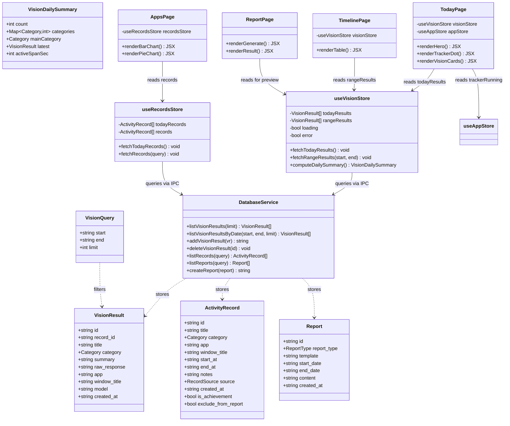
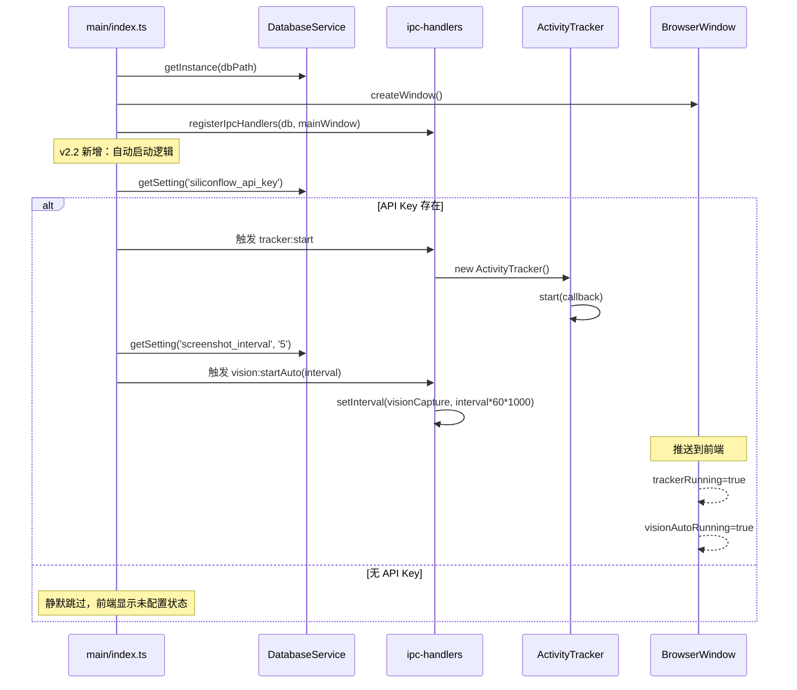
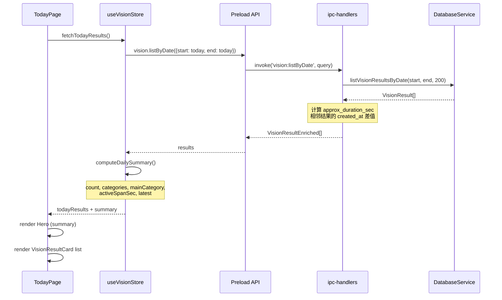
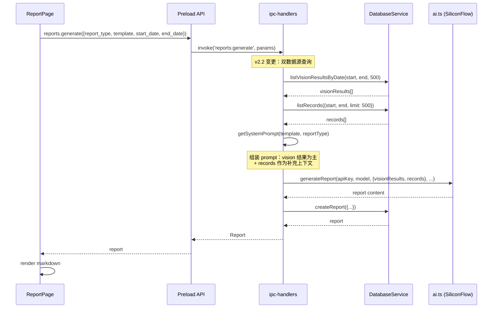
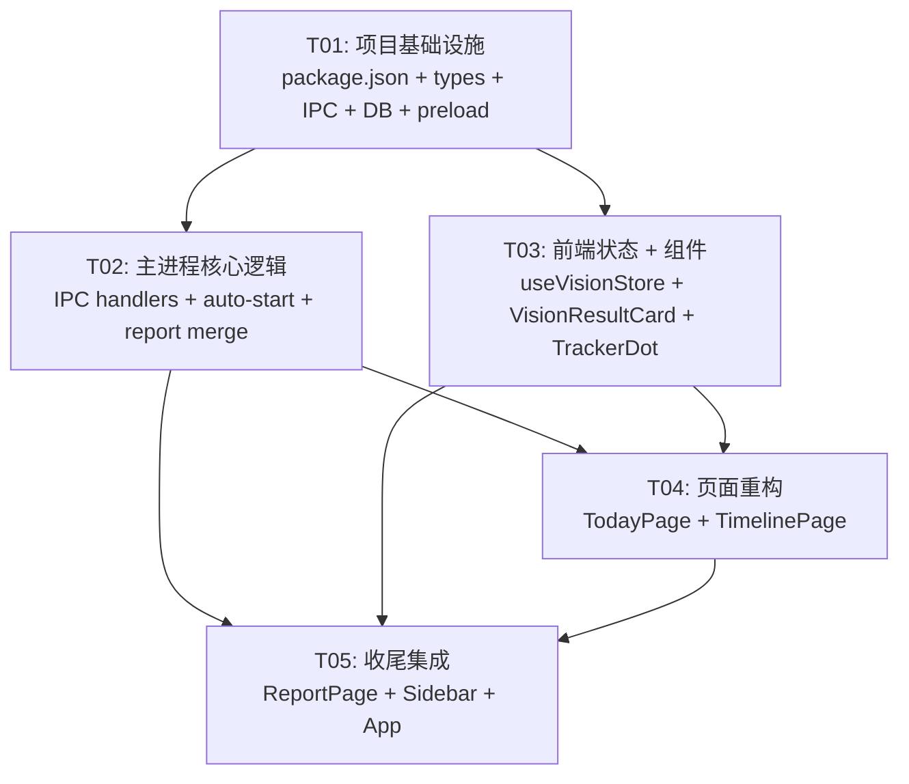

# 下班鸭 v2.2 产品定位重构 — 系统设计

> **Architect**: Bob  
> **Date**: 2025-07-14  
> **Scope**: AI 截屏识别升为核心数据源，窗口追踪降级为图表补充

---

## Part A: System Design

### 1. Implementation Approach

#### 1.1 核心技术挑战

| 挑战 | 分析 | 方案 |
|------|------|------|
| **数据源切换** | TodayPage/TimelinePage/ReportPage 当前全读 `records` 表，需切换为 `vision_results` 为主 | 新增 `vision:listByDate` IPC handler，各页面替换数据源 |
| **报告素材合并** | 报告生成需同时传入 vision_results（主）+ records（辅） | 修改 `REPORTS_GENERATE` handler，查询两表后合并给 AI |
| **时长近似计算** | vision_results 没有 `start_at/end_at`，需用相邻结果的 `created_at` 差 | 前端/后端在列表返回时附带计算字段 `approx_duration_sec` |
| **自动启动策略** | 有 API Key → 启动时自动开启 Tracker + Vision Auto；无 Key → 静默跳过 | `main/index.ts` 在 `app.whenReady()` 后检查 API Key 并自动启动 |
| **Tracker 状态指示** | Hero 不再有大按钮，改为小型指示器 | TodayPage Hero 右上角绿点/灰点 + 点击切换 |

#### 1.2 框架与库选择

保持现有技术栈不变：
- **Electron** + **electron-vite** — 桌面容器
- **React 19** + **TypeScript** — 渲染进程
- **Zustand** — 状态管理
- **Tailwind CSS 4** — 样式
- **recharts** — AppsPage 图表
- **better-sqlite3** — 本地数据库
- **active-win** — 窗口追踪（仅用于 records → AppsPage）

**无需新增依赖包。**

#### 1.3 架构模式

保持现有分层：
```
┌─────────────────────────────────────┐
│  Renderer (React + Zustand)         │
│  pages/ ← stores/ ← hooks/ ← preload│
├─────────────────────────────────────┤
│  Preload (contextBridge)            │
├─────────────────────────────────────┤
│  Main Process                       │
│  ipc-handlers → database / ai /     │
│  tracker / screenshot               │
└─────────────────────────────────────┘
```

---

### 2. File List

| 文件路径 | 操作 | 说明 |
|----------|------|------|
| `package.json` | ✏️ 修改 | 版本号 2.1.0 → 2.2.0 |
| `src/shared/types.ts` | ✏️ 修改 | 新增 `VisionQuery`, `VisionDailySummary` 类型 |
| `src/shared/ipc-channels.ts` | ✏️ 修改 | 新增 `VISION_LIST_BY_DATE`, `VISION_AUTO_STATUS` 通道 |
| `src/main/database.ts` | ✏️ 修改 | 新增 `listVisionResultsByDate()` 方法 |
| `src/main/ipc-handlers.ts` | ✏️ 修改 | 新增 handler；修改 `REPORTS_GENERATE` 合并素材；auto-start 逻辑 |
| `src/main/index.ts` | ✏️ 修改 | Tracker + Vision 自动启动入口 |
| `src/main/report-generator.ts` | ✏️ 修改 | AI prompt 适配 vision_results 数据格式 |
| `src/main/ai.ts` | ✏️ 修改 | `generateReport` 签名改为接收 `{visionResults, records}` |
| `src/preload/index.ts` | ✏️ 修改 | 暴露 `vision.listByDate`, `vision.autoStatus` |
| `src/renderer/stores/useVisionStore.ts` | 🆕 新建 | Vision results 状态管理 |
| `src/renderer/components/VisionResultCard.tsx` | 🆕 新建 | 可复用的 AI 识别结果卡片 |
| `src/renderer/components/TrackerDot.tsx` | 🆕 新建 | Hero 右上角追踪状态指示器 |
| `src/renderer/pages/TodayPage.tsx` | ✏️ 重写 | Hero 切换为 vision_results 摘要；TrackerDot；卡片列表 |
| `src/renderer/pages/TimelinePage.tsx` | ✏️ 修改 | 数据源从 records 切换为 vision_results |
| `src/renderer/pages/ReportPage.tsx` | ✏️ 修改 | 报告预览展示 vision_results 数据源提示 |
| `src/renderer/stores/useAppStore.ts` | ✏️ 修改 | 新增 `visionAutoRunning` 状态 |
| `src/renderer/components/Sidebar.tsx` | ✏️ 修改 | 版本号 v2.1 → v2.2 |
| `src/renderer/App.tsx` | ✏️ 修改 | 初始化时启动 vision store 订阅 |

---

### 3. Data Structures and Interfaces

#### 3.1 新增类型定义

```typescript
// ===== Vision 查询参数 =====
export interface VisionQuery {
  start: string;   // "YYYY-MM-DD"
  end: string;     // "YYYY-MM-DD"
  limit?: number;
}

// ===== Vision 今日摘要（TodayPage Hero 用） =====
export interface VisionDailySummary {
  count: number;
  categories: { category: Category; count: number }[];
  mainCategory: Category;
  latest: VisionResult | null;
  activeSpanSec: number;  // 第一条到最后一条的时间跨度（秒）
}

// ===== Vision 列表项增强 =====
// VisionResult 本身不变，但在 listByDate 返回时附带计算字段：
export interface VisionResultEnriched extends VisionResult {
  approx_duration_sec: number;  // 距下一条 vision_result 的 created_at 差值
}
```

#### 3.2 类图



---

### 4. Program Call Flow

#### 4.1 App 启动 → 自动启动 Tracker + Vision Auto



#### 4.2 TodayPage 加载 → Vision Results 摘要



#### 4.3 ReportPage 生成报告 → 合并素材



---

### 5. Anything UNCLEAR

| 事项 | 假设 |
|------|------|
| **vision_results 的 app/window_title 字段** | 当前自动识别时硬编码为 `app: '截图', window_title: '自动识别'`。v2.2 考虑从 Tracker 当前活跃窗口获取真实 app/title 传给 Vision，使结果更准确。**本期实现：在 `vision:startAuto` 中读取当前 tracker session 的 app/title 作为截图上下文。** |
| **时长近似的边界情况** | 当天最后一条 vision_result 无下一条记录，`approx_duration_sec` 设为 0 或从 `now - created_at` 计算。**采用 `now - created_at`，上限 30 分钟。** |
| **Tracker 与 Vision 的并发关系** | Tracker 停止时 Vision 是否也停止？**决策：Vision Auto 独立于 Tracker，有 API Key 即独立运行。TrackerDot 只控制 Tracker 启停。** |
| **vision_results 删除后 records 的处理** | 删除 vision_result 不影响对应 record。**保持独立。** |
| **报告模板的 vision 适配** | 四种模板的 system prompt 需要适配 vision_results 格式。**本期修改 report-generator.ts 的 prompt，增加对 vision 摘要数据的处理指引。** |

---

## Part B: Task Decomposition

### 6. Required Packages

无新增依赖。现有 package.json 依赖已满足需求：

```
- react@^19.0.0: UI framework
- zustand@^5.0.0: State management
- better-sqlite3@^11.10.0: Database
- lucide-react@^0.460.0: Icons
- recharts@^2.15.0: Charts (AppsPage)
- react-markdown@^9.0.0: Report rendering
```

---

### 7. Task List (ordered by dependency)

#### T01: 项目基础设施 — 数据层定义

| 属性 | 内容 |
|------|------|
| **Task ID** | T01 |
| **Priority** | P0 |
| **Dependencies** | 无 |

**Source Files:**
- `package.json` — 版本号 `2.1.0` → `2.2.0`
- `src/shared/types.ts` — 新增 `VisionQuery`、`VisionDailySummary`、`VisionResultEnriched` 接口
- `src/shared/ipc-channels.ts` — 新增 `VISION_LIST_BY_DATE`、`VISION_AUTO_STATUS` 通道常量
- `src/main/database.ts` — 新增 `listVisionResultsByDate(start, end, limit?)` 方法，查询 vision_results 按日期范围 + created_at 降序
- `src/preload/index.ts` — `vision` 命名空间新增 `listByDate(query)`、`autoStatus()` API；更新 `XiabanyaApi` 类型导出

**验收标准:**
1. `VisionQuery` 类型编译通过，包含 `start/end/limit?` 字段
2. `VISION_LIST_BY_DATE` = `'vision:listByDate'`，`VISION_AUTO_STATUS` = `'vision:autoStatus'`
3. `listVisionResultsByDate('2025-07-01', '2025-07-14')` 返回该日期范围内所有 vision_results，按 created_at DESC 排序
4. Preload API `vision.listByDate({start, end})` 可被渲染进程调用

---

#### T02: 主进程核心逻辑 — IPC Handler + 自动启动 + 报告合并

| 属性 | 内容 |
|------|------|
| **Task ID** | T02 |
| **Priority** | P0 |
| **Dependencies** | T01 |

**Source Files:**
- `src/main/ipc-handlers.ts` — 三项变更：
  1. 新增 `VISION_LIST_BY_DATE` handler：调用 `db.listVisionResultsByDate()`，计算每条 `approx_duration_sec`（相邻 created_at 差，最后一条用 now - created_at，上限 1800s），返回 `VisionResultEnriched[]`
  2. 新增 `VISION_AUTO_STATUS` handler：返回 `{ running: visionTimer !== null }`
  3. 修改 `REPORTS_GENERATE` handler：在调用 AI 前，先查 `listVisionResultsByDate` + `listRecords`，组装 vision-first 的 prompt 文本传给 `generateReport`
- `src/main/index.ts` — `app.whenReady()` 回调末尾新增：
  1. 检查 `db.getSetting('siliconflow_api_key')` 是否存在
  2. 若存在：自动 `tracker.start()` + `vision:startAuto(interval)`
  3. 向前端推送 `trackerRunning=true`、`visionAutoRunning=true`
- `src/main/report-generator.ts` — 四种模板的 `getSystemPrompt` 更新为 vision_results 优先的提示语（"根据 AI 截屏识别的工作摘要生成报告，records 作为补充上下文"）
- `src/main/ai.ts` — `generateReport` 函数签名改为接收 `{visionResults: VisionResult[], records: ActivityRecord[]}`，prompt 组装逻辑同步调整

**验收标准:**
1. 启动应用且有 API Key → Tracker 自动运行、Vision Auto 自动运行
2. 启动应用且无 API Key → 静默跳过，不报错
3. `vision:listByDate` 返回的数据包含 `approx_duration_sec` 计算字段
4. 报告生成 prompt 包含 vision_results 摘要 + records 记录
5. `vision:autoStatus` 返回正确的运行状态

---

#### T03: 前端状态管理 + 可复用组件

| 属性 | 内容 |
|------|------|
| **Task ID** | T03 |
| **Priority** | P1 |
| **Dependencies** | T01 |

**Source Files:**
- `src/renderer/stores/useVisionStore.ts` 🆕 — Zustand store：
  - `todayResults: VisionResult[]`、`rangeResults: VisionResult[]`
  - `loading/error` 状态
  - `fetchTodayResults()` — 调用 `api.vision.listByDate({start: today, end: today})`
  - `fetchRangeResults(start, end)` — 按日期范围查询
  - `computeDailySummary(): VisionDailySummary` — 从 `todayResults` 计算 count / categories 分布 / mainCategory / activeSpanSec / latest
  - 自动 poll（10s 间隔刷新今日数据）
- `src/renderer/components/VisionResultCard.tsx` 🆕 — 可复用卡片组件：
  - Props: `result: VisionResult`
  - 展示 title / category badge / summary / 时间 / app
  - 支持紧凑模式（`variant: 'compact' | 'full'`）
  - 点击可展开 raw_response 详情
- `src/renderer/components/TrackerDot.tsx` 🆕 — Hero 右上角追踪状态指示器：
  - Props: `running: boolean`, `onToggle: () => void`
  - 绿点（运行中）/ 灰点（已停止），hover 显示 tooltip
  - 点击触发 onToggle

**验收标准:**
1. `useVisionStore.fetchTodayResults()` 从 API 获取数据并更新状态
2. `computeDailySummary()` 返回正确的 count、mainCategory、activeSpanSec
3. `VisionResultCard` 在 compact/full 模式下正确渲染 title、category、summary
4. `TrackerDot` 绿点/灰点切换正确，点击触发回调

---

#### T04: TodayPage + TimelinePage 数据源切换

| 属性 | 内容 |
|------|------|
| **Task ID** | T04 |
| **Priority** | P0 |
| **Dependencies** | T02, T03 |

**Source Files:**
- `src/renderer/pages/TodayPage.tsx` — 重写：
  1. **Hero Banner**：从 records 统计 → `useVisionStore.computeDailySummary()` 驱动，展示"今日 AI 识别 N 条工作摘要"、主要分类、活跃跨度
  2. **移除**大号 Start/Stop 按钮，替换为 `TrackerDot` 组件（右上角）
  3. **列表区域**：从 ActivityRecord 行 → `VisionResultCard` 列表（compact 模式，最多 20 条）
  4. 保留 loading / error / empty 状态处理
  5. StatCard 行改为 vision 维度（识别条数 / 活跃跨度 / 主要分类 / Vision Auto 状态）
- `src/renderer/pages/TimelinePage.tsx` — 修改：
  1. 数据源从 `api.records.list()` → `useVisionStore.fetchRangeResults(start, end)`
  2. 表格列调整：时间（created_at）、分类、标题、摘要（truncated）、近似时长（approx_duration_sec）、model
  3. 批量操作（删除 vision_results、修改分类）保持
  4. 搜索改为模糊匹配 title/summary/category
- `src/renderer/stores/useAppStore.ts` — 新增：
  1. `visionAutoRunning: boolean` 状态
  2. `setVisionAutoRunning(running: boolean)` action

**验收标准:**
1. TodayPage Hero 展示 vision_results 摘要数据，而非 records 统计
2. TrackerDot 在 Hero 右上角，绿点=运行中，点击可切换
3. StatCard 行显示"AI 识别条数"、"活跃跨度"、"主要分类"
4. TimelinePage 表格行展示 vision_results（标题/分类/摘要/时长），而非 records
5. 搜索、日期范围切换正常工作

---

#### T05: ReportPage 集成 + Sidebar 更新 + App 集成

| 属性 | 内容 |
|------|------|
| **Task ID** | T05 |
| **Priority** | P1 |
| **Dependencies** | T02, T03, T04 |

**Source Files:**
- `src/renderer/pages/ReportPage.tsx` — 修改：
  1. 生成报告前，在 UI 中展示"素材预览"：vision_results N 条 + records M 条
  2. 确认生成按钮文案改为"AI 生成报告（基于截屏识别 + 活动记录）"
  3. 生成后结果展示不变（Markdown 渲染）
- `src/renderer/components/Sidebar.tsx` — 修改：
  1. 底部版本号 `v2.1` → `v2.2`
  2. 可选：导航分组标签微调（"AI 与报告" → "AI 识别与报告"）
- `src/renderer/App.tsx` — 修改：
  1. App 挂载时初始化 vision auto 状态：调用 `api.vision.autoStatus()` 同步 `visionAutoRunning`
  2. 监听 `vision:onResult` 事件，新结果到达时自动刷新 TodayPage / TimelinePage
  3. 初始化 Tracker 状态同步（已有逻辑，确认无误）

**验收标准:**
1. ReportPage 展示素材预览（vision N + records M）
2. 报告生成按钮文案更新，生成内容优先使用 vision 数据
3. Sidebar 版本号显示 v2.2
4. App 启动后 vision auto 状态正确同步到全局 store
5. 新 vision result 实时推送到 TodayPage（无需手动刷新）

---

### 8. Shared Knowledge

跨文件约定，供 Engineer 实施时参考：

```
- 所有时间存储格式: "YYYY-MM-DD HH:MM:SS" (与 better-sqlite3 现存格式一致)
- 日期查询边界: start_date 拼接 " 00:00:00"，end_date 拼接 " 23:59:59"
- approx_duration_sec 计算规则:
    - 非最后一条: 下一条 created_at - 本条 created_at (秒)
    - 最后一条: min(now - created_at, 1800) (上限 30 分钟)
    - 负值视为 0
- Vision Auto 独立于 Tracker，互不依赖
- 所有 IPC invoke 返回 Promise，前端使用 try/catch + toast.error
- Zustand store 命名: use[Feature]Store
- 组件 Props 类型在组件文件内定义 (非 shared/types.ts)
- 新增文件使用默认导出 (符合现有约定)
- API Key 检查: getSetting('siliconflow_api_key') 返回空字符串表示未配置
```

---

### 9. Task Dependency Graph



**依赖关系说明：**
- T01 是所有任务的前置（定义数据结构和 API）
- T02 和 T03 可并行开发（主进程 vs 前端，不冲突）
- T04 依赖 T02（IPC handler 就绪）+ T03（组件就绪）
- T05 依赖 T02/T03/T04 全部完成，做最终集成
