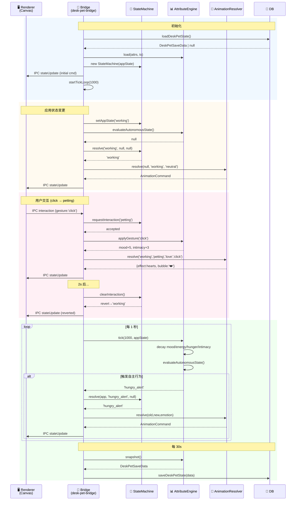

# 下班鸭桌宠 v2.0 — 架构设计文档

> **Architect**: Bob | **Date**: 2025-07-04 | **Scope**: 仅桌宠子系统（不涉及主应用其他模块）

---

## 1. 实现方案与选型

### 1.1 核心挑战与决策

| # | 挑战 | 决策 | 理由 |
|---|------|------|------|
| 1 | 16 状态三层仲裁 | 自制 Pure TS 状态机，优先级数值化 | XState 太重（16 状态不值得引入 DSL）；数值比较 O(1) 确定 |
| 2 | 属性 1s 实时衰减 | `setInterval` 轻量 tick + 纯数学 | 不影响主进程渲染；delta 显式传入，可模拟时间单测 |
| 3 | 5 层动画叠加 | Canvas 2D 分层合成 + requestAnimationFrame | 精灵表方案已有基础设施；alpha 混合 GPU 加速 |
| 4 | 过渡动画 300ms | 双帧缓冲 + 逐帧 lerp alpha | 不需要 Lottie/CSS；Canvas 直接控制 |
| 5 | Core 零依赖可单测 | 纯函数 + 时间显式传入 | `vitest` 直接 import TS 即可 |
| 6 | 最小变更原则 | 窗口管理逻辑不变，仅改状态推送通道 | `executeJavaScript` → `webContents.send()` IPC |

### 1.2 不引入的技术

| 技术 | 不选原因 |
|------|----------|
| XState | 16 状态用不着 FSM DSL，自制更轻量且类型安全 |
| Spine / Live2D | Web 技术栈限制，精灵表 + Canvas 足够 |
| Lottie | 过渡动画只需 alpha 混合，不需要矢量化 |
| IndexedDB / electron-store | 项目已有 better-sqlite3，复用即可 |
| React（在桌宠窗口） | 桌宠窗口是纯 Canvas 渲染，引入 React 是过度工程 |

### 1.3 四层架构

```
┌────────────────────────────────────────────────┐
│  src/desk-pet-renderer/    (Renderer 层)        │
│  Canvas 精灵引擎 · 5 层合成 · 交互检测 · 气泡   │
│  技术: Vanilla JS + Canvas 2D                   │
│  入口: loadFile("src/desk-pet-renderer/index.html")│
└─────────────────── IPC ────────────────────────┘
┌────────────────────────────────────────────────┐
│  src/main/desk-pet-bridge.ts  (Bridge 层)       │
│  生命周期 · IPC 路由 · 1s tick 循环 · 持久化调度 │
│  运行环境: Electron Main Process                │
└────────────────────────────────────────────────┘
┌────────────────────────────────────────────────┐
│  src/desk-pet-core/          (Core 层)          │
│  状态机 · 属性引擎 · 动画仲裁器                  │
│  运行环境: Pure TypeScript, 零依赖              │
│  可单测: ✅ vitest                              │
└────────────────────────────────────────────────┘
┌────────────────────────────────────────────────┐
│  src/main/database.ts        (Storage 层)       │
│  desk_pet_state 表 (better-sqlite3)             │
└────────────────────────────────────────────────┘
```

---

## 2. 文件列表

```
src/
├── desk-pet-core/                            # [NEW] 纯 TS 核心 —— 零依赖、可单测
│   ├── index.ts                              # [NEW] Public API barrel
│   ├── types.ts                              # [NEW] 16 状态 · 属性 · IPC 消息 · 动画命令
│   ├── constants.ts                          # [NEW] 衰减率 · 阈值 · 优先级表 · 文案映射
│   ├── state-machine.ts                      # [NEW] 3 层状态机 + 优先级仲裁 + 交互超时
│   ├── attribute-engine.ts                   # [NEW] mood/energy/hunger/intimacy 衰减/恢复
│   ├── animation-resolver.ts                 # [NEW] 状态→AnimationCommand + 过渡判断
│   └── __tests__/
│       ├── state-machine.test.ts             # [NEW] 仲裁 · 超时 · 回退 · 边界
│       └── attribute-engine.test.ts          # [NEW] 衰减公式 · 阈值 · 交互效果
│
├── desk-pet-renderer/                        # [NEW] 桌宠窗口内容 —— 替代旧 HTML
│   ├── index.html                            # [NEW] Canvas 容器 + JS 加载 + resize-handle
│   ├── sprite-engine.js                      # [NEW] 精灵表加载 · 帧裁剪 · bounds 计算
│   ├── animation-controller.js               # [NEW] 5 层合成 · 过渡混合 · RAF 循环
│   ├── interaction-handler.js                # [NEW] 指针手势检测 → IPC 上报
│   └── bubble-system.js                      # [NEW] Canvas 气泡渲染 · 排队 · 淡入淡出
│
├── main/
│   ├── desk-pet-bridge.ts                    # [NEW] Core ↔ Renderer 桥接 + tick 循环
│   ├── desk-pet-window.ts                    # [MODIFY] 状态推送 IPC 化；导出 webContents
│   ├── ipc-handlers.ts                       # [MODIFY] 新增 deskPet:* v2 handlers
│   ├── database.ts                           # [MODIFY] 新增 desk_pet_state 表 + CRUD
│   └── index.ts                              # [MODIFY] 初始化 DeskPetBridge
│
├── shared/
│   ├── types.ts                              # [MODIFY] 扩展 DeskPetState 联合类型
│   └── ipc-channels.ts                       # [MODIFY] 新增 deskPet:* 通道常量
│
└── preload/
    └── index.ts                              # [MODIFY] 暴露 deskPet v2 API
```

**统计**: 新建 14 个文件，修改 7 个文件。`assets/desk-pet/` 目录不变（精灵表资源保留）。

---

## 3. TypeScript 接口定义

### 3.1 状态枚举 (`src/desk-pet-core/types.ts`)

```typescript
// ============================================================
// 三层状态分类
// ============================================================

/** A 层 — 应用驱动（5 个，来自现有 Tracker/Vision 工作流） */
export const APP_DRIVEN_STATES = [
  'idle', 'working', 'thinking', 'done', 'sleep',
] as const;
export type AppDrivenState = typeof APP_DRIVEN_STATES[number];

/** B 层 — 自主行为（6 个，由属性阈值触发） */
export const AUTONOMOUS_STATES = [
  'wandering', 'stretching', 'daydreaming',
  'hungry_alert', 'tired', 'greeting',
] as const;
export type AutonomousState = typeof AUTONOMOUS_STATES[number];

/** C 层 — 交互触发（5 个，用户手势触发，有时效性） */
export const INTERACTION_STATES = [
  'petting', 'playing', 'eating', 'annoyed', 'dragging',
] as const;
export type InteractionState = typeof INTERACTION_STATES[number];

/** 全量 16 状态 */
export type DeskPetStateV2 = AppDrivenState | AutonomousState | InteractionState;
export const ALL_STATES_V2 = [
  ...APP_DRIVEN_STATES, ...AUTONOMOUS_STATES, ...INTERACTION_STATES,
] as const;

// ============================================================
// 状态优先级（数值越大越高）
// 规则: 交互(50+) > 应用驱动(20-29) > 自主行为(10-19)
// ============================================================
export const STATE_PRIORITY: Record<DeskPetStateV2, number> = {
  // A 层 — 应用驱动: 20-29
  idle: 20, working: 21, thinking: 22, done: 23, sleep: 24,
  // B 层 — 自主行为: 10-19
  wandering: 10, stretching: 11, daydreaming: 12,
  hungry_alert: 16, tired: 15, greeting: 14,
  // C 层 — 交互: 50-59
  petting: 50, playing: 51, eating: 52, annoyed: 53, dragging: 54,
};

// ============================================================
// 内部属性
// ============================================================
export interface DeskPetAttributes {
  mood: number;       // 0-100 (0=低落, 100=开心)
  energy: number;     // 0-100 (0=精疲力竭, 100=精力充沛)
  hunger: number;     // 0-100 (0=饱腹, 100=饥饿)
  intimacy: number;   // 0-100 (0=陌生, 100=亲密)
}

// ============================================================
// 情绪（由属性推导，影响 L2 情绪覆盖层）
// ============================================================
export type EmotionType = 'neutral' | 'happy' | 'sad' | 'tired_emo' | 'hungry_emo' | 'love';

// ============================================================
// 用户交互手势
// ============================================================
export type InteractionType = 'click' | 'double_click' | 'long_press' | 'drag_start' | 'drag_end';

// ============================================================
// 动画命令（Core → Renderer 单向数据流）
// ============================================================
export interface AnimationCommand {
  /** 目标基础状态（决定 L1 精灵帧） */
  state: DeskPetStateV2;
  /** 情绪覆盖（决定 L2 tint） */
  emotion: EmotionType;
  /** 过渡配置（null = 无过渡，直接切换） */
  transition: TransitionConfig | null;
  /** 气泡数据（null = 不显示气泡） */
  bubble: BubbleData | null;
  /** L5 特效类型 */
  effect: EffectType;
}

export interface TransitionConfig {
  fromState: DeskPetStateV2;
  toState: DeskPetStateV2;
  durationMs: number;         // 默认 300
}

export type EffectType = 'none' | 'hearts' | 'stars' | 'sparkles' | 'sweat' | 'zzz' | 'exclamation';

// ============================================================
// 气泡
// ============================================================
export interface BubbleData {
  id: string;
  text: string;
  type: 'speech' | 'thought' | 'emotion';
  durationMs: number;         // 默认 2500
}

// ============================================================
// 持久化数据结构
// ============================================================
export interface DeskPetSaveData {
  attributes: DeskPetAttributes;
  currentAppState: AppDrivenState;
  lastTickTimestamp: number;  // Unix ms
}

// ============================================================
// IPC 消息体
// ============================================================
export interface DeskPetInteractionPayload {
  gesture: InteractionType;
  timestamp: number;
}

export interface DeskPetStatusResponse {
  state: DeskPetStateV2;
  attributes: DeskPetAttributes;
  emotion: EmotionType;
  visible: boolean;
}
```

### 3.2 状态机类 (`src/desk-pet-core/state-machine.ts`)

```typescript
export class StateMachine {
  constructor(initialAppState?: AppDrivenState);

  // ---- 状态查询 ----
  getCurrentState(): DeskPetStateV2;
  getAppState(): AppDrivenState;
  getPriority(state: DeskPetStateV2): number;

  // ---- 三层仲裁 ----
  /**
   * 核心方法：输入三层候选状态，按优先级仲裁返回最终状态。
   * 优先级: interaction > appDriven > autonomous
   */
  resolve(
    appDriven: AppDrivenState,
    autonomous: AutonomousState | null,
    interaction: InteractionState | null,
  ): DeskPetStateV2;

  // ---- 交互管理 ----
  /** 请求交互状态。总是接受。返回新旧状态。 */
  requestInteraction(state: InteractionState): StateChangeResult;
  /** 清除交互状态，回退到 resolve(app,auto,null) */
  clearInteraction(): StateChangeResult;
  /** 当前是否有活跃交互 */
  hasActiveInteraction(): boolean;

  // ---- 应用状态 ----
  setAppState(state: AppDrivenState): void;
}

export interface StateChangeResult {
  newState: DeskPetStateV2;
  oldState: DeskPetStateV2;
  changed: boolean;
}
```

### 3.3 属性引擎类 (`src/desk-pet-core/attribute-engine.ts`)

```typescript
export class AttributeEngine {
  constructor(initial?: Partial<DeskPetAttributes>);

  /**
   * 每 tick 调用一次。deltaMs 为距上次 tick 的毫秒数。
   * appState 影响衰减速率（如 working 时 energy 消耗更快）。
   */
  tick(deltaMs: number, appState: AppDrivenState): void;

  /** 应用交互效果到属性 */
  applyGesture(gesture: InteractionType): DeskPetAttributes;

  /** 评估是否应触发自主行为（基于属性阈值） */
  evaluateAutonomousState(): AutonomousState | null;

  /** 从属性计算当前情绪 */
  computeEmotion(): EmotionType;

  /** 只读快照 */
  getAttributes(): Readonly<DeskPetAttributes>;

  /** 从持久化恢复 */
  load(data: DeskPetAttributes, lastTickTimestamp: number): void;

  /** 导出持久化快照 */
  snapshot(): DeskPetSaveData;
}
```

### 3.4 动画仲裁器 (`src/desk-pet-core/animation-resolver.ts`)

```typescript
export class AnimationResolver {
  /**
   * 根据状态变化生成完整的 AnimationCommand（含过渡/气泡/特效）。
   */
  resolve(
    oldState: DeskPetStateV2 | null,
    newState: DeskPetStateV2,
    emotion: EmotionType,
    gesture?: InteractionType,
  ): AnimationCommand;

  /** 两状态之间是否需要过渡动画 */
  needsTransition(from: DeskPetStateV2, to: DeskPetStateV2): boolean;

  /** 根据状态+情绪决定气泡文案 */
  getBubbleText(state: DeskPetStateV2, emotion: EmotionType): string | null;
}
```

### 3.5 IPC 通道扩展 (`src/shared/ipc-channels.ts`)

```typescript
// 追加以下通道（不修改现有常量）:
export const IPC_CHANNELS = {
  // ... 现有通道保持不变 ...

  // === Desk Pet v2 (新增) ===
  /** Main → Renderer: 推送动画命令 */
  DESK_PET_STATE_UPDATE:    'deskPet:stateUpdate',
  /** Renderer → Main: 用户交互手势 */
  DESK_PET_INTERACTION:     'deskPet:interaction',
  /** Renderer → Main: 查询当前状态 */
  DESK_PET_GET_STATUS:      'deskPet:getStatus',
  /** Renderer → Main: 查询属性值 */
  DESK_PET_GET_ATTRIBUTES:  'deskPet:getAttributes',
} as const;
```

### 3.6 数据库扩展 (`src/main/database.ts`)

```sql
-- 单行表 (id=1 保证只有一行)
CREATE TABLE IF NOT EXISTS desk_pet_state (
  id                INTEGER PRIMARY KEY CHECK (id = 1),
  attributes_json   TEXT    NOT NULL,   -- JSON: DeskPetAttributes
  app_state         TEXT    NOT NULL,   -- AppDrivenState
  last_tick_ts      INTEGER NOT NULL,  -- Unix ms
  updated_at        TEXT    NOT NULL DEFAULT (datetime('now'))
);
```

```typescript
// DatabaseService 新增方法:
saveDeskPetState(data: DeskPetSaveData): void;
loadDeskPetState(): DeskPetSaveData | null;
```

---

## 4. 程序调用流程

### 4.1 初始化流程

```
app.whenReady()
  → DatabaseService.loadDeskPetState()
  → new AttributeEngine(saved.attributes)
  → new StateMachine(saved.currentAppState)
  → new AnimationResolver()
  → new DeskPetBridge(core, db, deskPetWindow)
  → DeskPetBridge.start()           // 启动 1s tick 循环
  → createDeskPetWindow()           // 现有逻辑，loadFile→新 renderer
  → webContents.send('deskPet:stateUpdate', initialCommand)
```

### 4.2 应用状态变更流程

```
Tracker/Vision 状态变化
  → syncDeskPetWorkflowState()          // 现有函数
  → DeskPetBridge.pushAppState(newState) // 新增
  → StateMachine.setAppState(newState)
  → AttributeEngine.evaluateAutonomousState() → autoState|null
  → StateMachine.resolve(app, auto, interaction)
  → AnimationResolver.resolve(old, new, emotion)
  → deskPetWindow.webContents.send('deskPet:stateUpdate', command)
  → Renderer.AnimationController.applyCommand(command)
```

### 4.3 用户交互流程

```
用户点击桌宠
  → Renderer.InteractionHandler.detect(pointerEvent)
  → ipcRenderer.invoke('deskPet:interaction', { gesture: 'click' })
  → DeskPetBridge.handleInteraction(payload)
  → StateMachine.requestInteraction('petting')
  → AttributeEngine.applyGesture('click')          // mood+5, intimacy+3
  → AnimationResolver.resolve(old, 'petting', 'love', 'click')
  → webContents.send('deskPet:stateUpdate', command) // 含 hearts 特效+气泡
  → setTimeout(2000)
  → StateMachine.clearInteraction()
  → 重新 resolve → webContents.send('deskPet:stateUpdate', revertedCmd)
```

### 4.4 属性衰减 tick 流程

```
setInterval 每 1000ms:
  → AttributeEngine.tick(1000, appState)
  → mood/energy/hunger/intimacy 按速率衰减
  → autoState = AttributeEngine.evaluateAutonomousState()
  → if autoState changed:
      → StateMachine.resolve(app, auto, interaction)
      → AnimationResolver.resolve(...)
      → webContents.send('deskPet:stateUpdate', cmd)

每 30s:
  → AttributeEngine.snapshot() → DeskPetSaveData
  → DatabaseService.saveDeskPetState(data)
```

### 4.5 时序图 (Mermaid)



---

## 5. 依赖包列表

```
无需新增 npm 依赖。全部复用现有:
- better-sqlite3@^11.10.0  持久化
- uuid@^10.0.0             气泡 ID
- vitest@^3.0.0            Core 单测
```

---

## 6. 共享知识

### 6.1 命名规范

| 域 | 规范 | 示例 |
|----|------|------|
| 状态值 | snake_case | `hungry_alert`, `petting` |
| IPC 通道 | `namespace:action` | `deskPet:stateUpdate` |
| 文件 | kebab-case | `state-machine.ts` |
| 类 | PascalCase | `StateMachine` |
| 接口/类型 | PascalCase | `AnimationCommand` |
| 常量 | UPPER_SNAKE_CASE | `STATE_PRIORITY` |

### 6.2 属性约定

- 范围 **[0, 100]**，类型 `number`
- tick 浮点计算，存储时 `Math.round()`
- 超出范围时 **clamp** 而非报错
- 衰减速率定义在 `constants.ts`（方便调参）

### 6.3 衰减速率（默认值，可调）

| 属性 | working | idle | sleep | thinking | done |
|------|---------|------|-------|----------|------|
| mood | -0.8/min | -0.3/min | +1.0/min | -0.5/min | +0.5/min |
| energy | -2.0/min | +1.0/min | +3.0/min | -1.0/min | +0.5/min |
| hunger | +0.3/min | +0.2/min | +0.1/min | +0.3/min | +0.2/min |
| intimacy | +0.05/min | +0.05/min | +0.05/min | +0.05/min | +0.05/min |

### 6.4 自主行为触发阈值

| 状态 | 条件 |
|------|------|
| `hungry_alert` | hunger > 70 |
| `tired` | energy < 20 |
| `daydreaming` | mood ∈ [40,60] 且 idle ≥ 5min |
| `stretching` | idle ≥ 10min (随机 30% 概率) |
| `wandering` | idle ≥ 3min (随机 50% 概率) |
| `greeting` | 启动后首次出现 且 intimacy > 30 |

### 6.5 交互手势映射

| 手势 | 触发条件 | → 交互状态 | 属性效果 |
|------|----------|------------|----------|
| click | 单击 (<300ms) | `petting` | mood+5, intimacy+3 |
| double_click | 双击 (<400ms间隔) | `playing` | mood+8, intimacy+5 |
| long_press | 按住 >800ms | `annoyed` | mood-3, intimacy-1 |
| drag_start | 拖动开始 | `dragging` | 无变化 |
| drag_end | 拖动结束 | (回退) | intimacy+1 |

### 6.6 交互超时

- 所有交互状态 **2 秒**后自动清除，回退到 `resolve(app, auto, null)`
- `dragging` 例外：在 `drag_end` 时清除

### 6.7 IPC 消息方向

| 通道 | 方向 | 方式 |
|------|------|------|
| `deskPet:stateUpdate` | Main → Renderer | `webContents.send()` |
| `deskPet:interaction` | Renderer → Main | `ipcRenderer.invoke()` → `ipcMain.handle()` |
| `deskPet:getStatus` | Renderer → Main | `ipcRenderer.invoke()` → `ipcMain.handle()` |
| `deskPet:getAttributes` | Renderer → Main | `ipcRenderer.invoke()` → `ipcMain.handle()` |
| 手势(拖拽/缩放) | 现有 IPC，不变 | 保持 `send()` + `on()` 模式 |

### 6.8 错误处理

| 层级 | 策略 |
|------|------|
| Core | 不抛异常。非法值 clamp。类型安全编译期保证。 |
| Bridge | try/catch 包裹所有 IPC handler。console.error + 返回 fallback。 |
| Renderer | Canvas 异常时绘制红色 ⚠ 文字。不白屏。 |
| Storage | save 失败静默重试 1 次(5s 间隔)。仍失败则放弃本次（下一 tick 再写）。 |

### 6.9 向后兼容

- 旧 `DeskPetState`(5 状态) 保留，作为 `AppDrivenState` 的子集
- 旧 `setDeskPetState()` 函数签名保留，内部委托给 `DeskPetBridge.pushAppState()`
- 旧 IPC 通道不变，新增通道独立命名空间 `deskPet:*`
- `assets/desk-pet/` 精灵表文件不移动、不重命名

---

> **下一步**: 参见 `docs/desk-pet-v2/tasks.md` 获取任务分解与执行计划。
