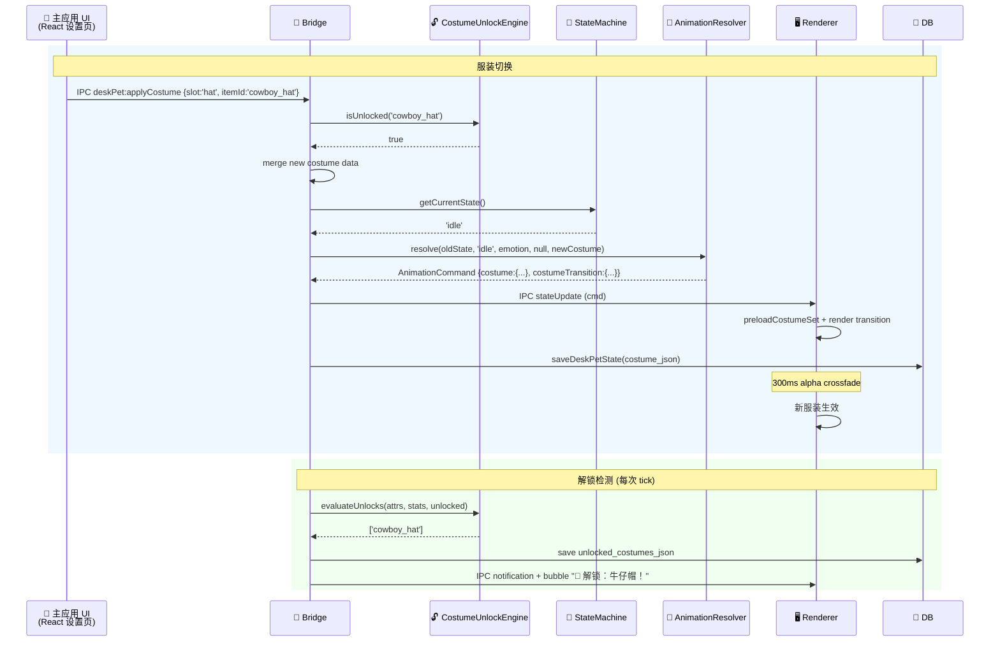

# 下班鸭桌宠 v2.0 — 服装系统可行性评估与架构改造方案

> **Architect**: Bob | **Date**: 2025-07-04 | **Scope**: 在桌宠 v2 架构上增加服装系统

---

## 目录

1. [渲染可行性](#1-渲染可行性)
2. [数据结构设计](#2-数据结构设计)
3. [Core 层影响](#3-core-层影响)
4. [渲染器影响](#4-渲染器影响)
5. [工程量估算](#5-工程量估算)
6. [建议的架构调整](#6-建议的架构调整)

---

## 1. 渲染可行性

### 1.1 核心结论：可行，且推荐"独立图层合成"方案

当前架构的 5 层 Canvas 合成模型天然支持插入服装层，无需推翻重建。

### 1.2 三种方案对比

| 维度 | 方案 A: 精灵表叠加 | 方案 B: 独立图层合成 ⭐ | 方案 C: CSS 覆盖 |
|------|-------------------|----------------------|-----------------|
| **原理** | 预渲染 N×M 套完整精灵表 PNG | 基础角色 + 服装分图层 Canvas drawImage | DOM 元素叠加 `` 标签 |
| **美术工作量** | ❌ 极高：N 角色 × M 服装 = 精灵表爆炸 | ✅ 低：1 基础 + N 服装 = 线性增长 | ✅ 低 |
| **切换时延** | ❌ 需加载新精灵表（可能闪烁） | ✅ 同帧切换，无加载延迟 | ✅ 即时 |
| **过渡动画** | ❌ 需要双精灵表 lerp | ✅ 服装层独立 alpha lerp | ⚠️ CSS transition/opacity |
| **帧同步** | ✅ 天然同步（同一张图） | ✅ 同 RAF 循环驱动 | ⚠️ 需 JS 同步 DOM |
| **性能** | ✅ 单次 drawImage | ⚠️ 3-4 次 drawImage（可接受） | ❌ DOM 重排风险 |
| **Z-Order 控制** | ❌ 静态，无法动态调整 | ✅ 完全自由（帽子→头→衣服→身体） | ⚠️ z-index |
| **与现有架构兼容** | ⚠️ 需改 L1 加载逻辑 | ✅ **插入 L1.5 层即可** | ❌ 推翻 Canvas 方案 |
| **最小改动量** | 中等 | **最小** | 大 |

**推荐方案 B：独立图层合成**。

### 1.3 方案 B 详细设计：插入 L1.5 "服装叠加层"

现有 5 层合成管线：

```
L1 基础精灵  →  L2 情绪覆盖(tint)  →  L3 过渡帧  →  L4 位移抖动  →  L5 粒子特效
```

改造后 7 层：

```
L1 裸基础角色  →  L1.5 服装叠加  →  L2 情绪覆盖(tint)  →  L3 过渡帧  →  L4 位移抖动  →  L5 粒子特效
                 ↗
        body(衣服)  hat(帽子)  accessory(配饰)
        (按 z-order: body → hat → accessory)
```

**关键设计**：

```typescript
// 服装精灵表独立于基础角色，但帧数和帧时序完全对齐
interface CostumeSpriteSet {
  slot: CostumeSlot;          // 'body' | 'hat' | 'accessory'
  itemId: string;             // 'default_shirt' | 'cowboy_hat' | 'scarf_red'
  spriteSrc: string;          // 'assets/desk-pet/costumes/body_default_shirt.png'
  frameCount: number;         // 与基础角色帧数一致 (8-16)
  frameWidth: number;         // 与基础角色帧宽一致
  frameHeight: number;        // 与基础角色帧高一致
  zOrder: number;             // 合成顺序: body=1, hat=2, accessory=3
}
```

### 1.4 服装切换过渡动画

```
服装切换流程 (300ms):
┌──────────────────────────────────────────────────┐
│ Frame 0:   旧服装 alpha=1.0, 新服装 alpha=0.0    │
│ Frame 1-15: 旧服装 alpha 从 1→0, 新服装 alpha 从 0→1  │
│            (每帧 16.7ms, 共 ~270ms, 双 buffer)   │
│ Frame 16:  旧服装释放, 新服装 alpha=1.0           │
└──────────────────────────────────────────────────┘
```

使用现有的 `TransitionConfig` 机制，`durationMs=300`，双帧缓冲 lerp alpha。与 L3 过渡层共享同一套过渡基础设施。

### 1.5 对 L1-L5 分层的影响

| 层 | 原用途 | 服装系统影响 | 改动 |
|----|--------|-------------|------|
| L1 | 基础精灵（含衣服的完整角色） | **改为裸基础角色**（无服装） | ⚠️ 精灵表需重新绘制 |
| **L1.5** | — | **新增：服装叠加层** | **新增** |
| L2 | 情绪 tint 覆盖 | 无影响。tint 均匀作用于 L1+L1.5 | 无 |
| L3 | 过渡帧 | 无影响。过渡时 L1+L1.5 一起 lerp | 无 |
| L4 | 位移抖动 | 无影响。位移作用于整个合成结果 | 无 |
| L5 | 粒子特效 | 无影响。特效在最顶层 | 无 |

---

## 2. 数据结构设计

### 2.1 服装插槽定义

```typescript
// === src/desk-pet-core/types.ts 新增 ===

/** 服装插槽（3 个固定插槽） */
export type CostumeSlot = 'body' | 'hat' | 'accessory';

/** 插槽元数据 */
export const COSTUME_SLOTS: { slot: CostumeSlot; label: string; zOrder: number; maxItems: number }[] = [
  { slot: 'body',      label: '衣服',   zOrder: 1, maxItems: 1 },
  { slot: 'hat',       label: '帽子',   zOrder: 2, maxItems: 1 },
  { slot: 'accessory', label: '配饰',   zOrder: 3, maxItems: 1 },
];

/** 每个插槽最多 1 件 → 整体最多 3 件同时穿戴 */
```

### 2.2 服装物品定义

```typescript
/** 单件服装定义（静态配置，在 constants.ts 中定义为配置表） */
export interface CostumeItem {
  /** 唯一 ID，如 'default_shirt', 'cowboy_hat' */
  itemId: string;
  /** 所属插槽 */
  slot: CostumeSlot;
  /** 显示名称 */
  displayName: string;
  /** 精灵表资源路径 */
  spriteSrc: string;
  /** 解锁条件（null = 默认拥有） */
  unlockCondition: UnlockCondition | null;
}

/** 解锁条件 */
export interface UnlockCondition {
  type: UnlockConditionType;
  threshold: number;
}

export type UnlockConditionType =
  | 'intimacy'           // 亲密度 ≥ N
  | 'consecutive_days'   // 连续使用天数 ≥ N
  | 'report_count'       // 日报完成次数 ≥ N
  | 'record_count'       // 活动记录总数 ≥ N
  | 'achievement';       // 特定成就（预留）

/** 解锁状态（运行时） */
export interface CostumeUnlockState {
  itemId: string;
  unlocked: boolean;
  unlockedAt: string | null;  // ISO timestamp
}
```

### 2.3 服装配置表（硬编码常量）

```typescript
// === src/desk-pet-core/constants.ts 新增 ===

export const DEFAULT_COSTUME_SET: Record<CostumeSlot, string> = {
  body:      'default_shirt',      // 默认白衬衫
  hat:       'none',               // 无帽子
  accessory: 'none',               // 无配饰
};

export const COSTUME_CATALOG: CostumeItem[] = [
  // ── 衣服 (body) ──
  { itemId: 'default_shirt',    slot: 'body', displayName: '白衬衫',
    spriteSrc: 'assets/desk-pet/costumes/body_default_shirt.png',
    unlockCondition: null },  // 默认拥有

  { itemId: 'hoodie_blue',     slot: 'body', displayName: '蓝色卫衣',
    spriteSrc: 'assets/desk-pet/costumes/body_hoodie_blue.png',
    unlockCondition: { type: 'intimacy', threshold: 30 } },

  { itemId: 'suit_black',      slot: 'body', displayName: '黑色西装',
    spriteSrc: 'assets/desk-pet/costumes/body_suit_black.png',
    unlockCondition: { type: 'report_count', threshold: 10 } },

  { itemId: 'pajama_yellow',   slot: 'body', displayName: '黄色睡衣',
    spriteSrc: 'assets/desk-pet/costumes/body_pajama_yellow.png',
    unlockCondition: { type: 'consecutive_days', threshold: 7 } },

  // ── 帽子 (hat) ──
  { itemId: 'none',            slot: 'hat', displayName: '无',
    spriteSrc: '',
    unlockCondition: null },

  { itemId: 'cowboy_hat',      slot: 'hat', displayName: '牛仔帽',
    spriteSrc: 'assets/desk-pet/costumes/hat_cowboy.png',
    unlockCondition: { type: 'intimacy', threshold: 50 } },

  { itemId: 'beanie_red',      slot: 'hat', displayName: '红色毛线帽',
    spriteSrc: 'assets/desk-pet/costumes/hat_beanie_red.png',
    unlockCondition: { type: 'consecutive_days', threshold: 3 } },

  // ── 配饰 (accessory) ──
  { itemId: 'none',            slot: 'accessory', displayName: '无',
    spriteSrc: '',
    unlockCondition: null },

  { itemId: 'scarf_red',       slot: 'accessory', displayName: '红围巾',
    spriteSrc: 'assets/desk-pet/costumes/acc_scarf_red.png',
    unlockCondition: { type: 'intimacy', threshold: 20 } },

  { itemId: 'glasses_round',   slot: 'accessory', displayName: '圆框眼镜',
    spriteSrc: 'assets/desk-pet/costumes/acc_glasses_round.png',
    unlockCondition: { type: 'report_count', threshold: 5 } },
];
```

### 2.4 存储层设计

#### desk_pet_state 表 schema 变更

```sql
-- 新增字段
ALTER TABLE desk_pet_state ADD COLUMN costume_json TEXT NOT NULL DEFAULT '{}';
-- costume_json 格式: Record<CostumeSlot, string>
-- 示例: {"body":"hoodie_blue","hat":"none","accessory":"scarf_red"}

ALTER TABLE desk_pet_state ADD COLUMN unlocked_costumes_json TEXT NOT NULL DEFAULT '[]';
-- unlocked_costumes_json 格式: string[] (itemId 列表)
```

最终表结构：

```sql
CREATE TABLE IF NOT EXISTS desk_pet_state (
  id                      INTEGER PRIMARY KEY CHECK (id = 1),
  attributes_json         TEXT    NOT NULL,   -- DeskPetAttributes
  app_state               TEXT    NOT NULL,   -- AppDrivenState
  costume_json            TEXT    NOT NULL DEFAULT '{}',        -- [NEW] 当前装扮
  unlocked_costumes_json  TEXT    NOT NULL DEFAULT '[]',        -- [NEW] 已解锁列表
  last_tick_ts            INTEGER NOT NULL,  -- Unix ms
  updated_at              TEXT    NOT NULL DEFAULT (datetime('now'))
);
```

#### TypeScript 持久化接口扩展

```typescript
// === src/desk-pet-core/types.ts 修改 ===

export interface DeskPetSaveData {
  attributes: DeskPetAttributes;
  currentAppState: AppDrivenState;
  // [NEW] 服装数据
  currentCostume: Record<CostumeSlot, string>;
  unlockedCostumes: string[];
  lastTickTimestamp: number;
}

// 原接口向后兼容：新增字段均有默认值
```

### 2.5 解锁条件评估引擎

```typescript
// === src/desk-pet-core/ 新增或扩展 ===

export class CostumeUnlockEngine {
  /**
   * 评估所有未解锁服装是否满足条件。
   * 在每次 tick 或特定事件（日报完成/窗口切换）时调用。
   * @returns 新解锁的 itemId 列表（空数组 = 无新解锁）
   */
  evaluateUnlocks(
    attributes: DeskPetAttributes,
    stats: CostumeUnlockStats,   // { consecutiveDays, reportCount, recordCount }
    alreadyUnlocked: string[],
  ): string[];

  /** 查询某物品是否已解锁 */
  isUnlocked(itemId: string, unlocked: string[]): boolean;

  /** 获取某插槽所有已解锁的选项 */
  getAvailableForSlot(slot: CostumeSlot, unlocked: string[]): CostumeItem[];
}

export interface CostumeUnlockStats {
  consecutiveDays: number;   // 连续使用天数
  reportCount: number;       // 日报完成次数
  recordCount: number;       // 活动记录总数
}
```

---

## 3. Core 层影响

### 3.1 属性系统：hunger 处理建议

| 选项 | 描述 | 推荐度 |
|------|------|--------|
| **A: 完全砍掉** | 从 attributes 移除 hunger | ⚠️ 不推荐 |
| **B: 保留但降低优先级** | 保留 hunger，仅作为属性维度不影响服装 | ⚠️ 浪费 |
| **C: 重新定位 hunger** ⭐ | hunger → 日常活跃度指标，与服装解锁联动 | ✅ 推荐 |
| **D: 替换为新的"时尚值"** | hunger → style/fashion，专用于服装系统 | ❌ 过度设计 |

**推荐 C：保留 hunger，重新定位**。

```
hunger 重定位为"活力值" (vitality):
  - 含义: 桌宠的日常活跃程度（不再是"饥饿"）
  - 衰减: 随时间缓慢衰减
  - 恢复: 用户交互（点击/完成任务）
  - 服装联动: 某些服装在 vitality > 60 时显示特效（如帽子发光）
  - 状态联动: vitality < 20 → 'tired' 自主状态
```

变更在 `constants.ts`:

```typescript
// 原:
// hunger: +0.3/min (working), +0.2/min (idle), +0.1/min (sleep)

// 改为:
// vitality: -0.5/min (working), -0.3/min (idle), +0.5/min (sleep)
// 阈值: tired 触发从 hunger>70 改为 vitality<20
```

### 3.2 状态机：是否需要新状态？

**不需要 `changing_costume` 新状态。**

理由：
1. 服装切换是 **300ms 瞬时操作**，不改变桌宠行为状态
2. 在 AnimationCommand 中作为过渡参数处理即可
3. 如果强行加状态，会导致粒度过细（换帽子也要切状态？）

**但是**：如果未来有"服装展示"交互（如用户双击桌宠时做一个转圈展示动画），可以在 InteractionState 中新增：

```typescript
// 可选扩展（P1）:
export const INTERACTION_STATES = [
  'petting', 'playing', 'eating', 'annoyed', 'dragging',
  // 'costume_showcase',  // P1: 服装展示动画
] as const;
```

### 3.3 AnimationCommand 扩展

```typescript
// === 修改 src/desk-pet-core/types.ts ===

export interface AnimationCommand {
  state: DeskPetStateV2;
  emotion: EmotionType;
  transition: TransitionConfig | null;
  bubble: BubbleData | null;
  effect: EffectType;

  // ── [NEW] 服装相关字段 ──
  /** 当前装扮（每个插槽的 itemId）。
   *  Renderer 据此决定每层画什么精灵。
   *  null = 不变（首次初始化时必传） */
  costume: Record<CostumeSlot, string> | null;

  /** 服装过渡配置。
   *  仅在服装切换时设置。null = 无服装过渡。
   *  旧服装由 Renderer 从上一帧的 costume 缓存中获取。 */
  costumeTransition: CostumeTransition | null;
}

export interface CostumeTransition {
  /** 换装涉及的插槽 */
  changedSlots: CostumeSlot[];
  /** 过渡时长 ms (默认 300) */
  durationMs: number;
}
```

### 3.4 属性引擎扩展

```typescript
// === 修改 src/desk-pet-core/attribute-engine.ts ===

export class AttributeEngine {
  // ... 现有方法保持不变 ...

  // [NEW]
  /** 获取统计数据（供 CostumeUnlockEngine 使用） */
  getStats(): CostumeUnlockStats;
}

// Bridge 层新增（desk-pet-bridge.ts）:
// - CostumeUnlockEngine 实例
// - 每次 tick 后检测新解锁
// - 新解锁时推送 IPC 通知 + 气泡提示 "🎉 解锁了新服装：蓝色卫衣！"
```

---

## 4. 渲染器影响

### 4.1 sprite-engine.js 改造

现有架构中 sprite-engine.js 负责加载单套精灵表。需要扩展为支持多套服装精灵表：

```javascript
// === sprite-engine.js 新增/修改 ===

class SpriteEngine {
  constructor() {
    // 原: 单精灵表缓存
    // this.sprites = { [state]: Image }

    // 改为: 分层精灵表缓存
    this.baseSprites = {};        // L1: 基础角色（裸体）精灵表, key=state
    this.costumeSprites = {};     // L1.5: 服装精灵表, key=`${slot}_${itemId}_${state}`

    // 服装精灵表按需加载（懒加载 + LRU 缓存，最多 10 张）
    this.costumeCache = new LRUCache(10);
  }

  /** 加载基础角色精灵表（全状态预加载） */
  async loadBaseSprites(states: DeskPetStateV2[]): Promise<void>;

  /** 按需加载服装精灵表 */
  async loadCostumeSprite(slot: CostumeSlot, itemId: string, state: DeskPetStateV2): Promise<HTMLImageElement>;

  /** 预加载当前装扮所有状态的精灵表 */
  async preloadCostumeSet(costume: Record<CostumeSlot, string>, currentState: DeskPetStateV2): Promise<void>;

  /** 获取当前帧的基础角色裁剪区域 */
  getBaseFrame(state: DeskPetStateV2, frameIndex: number): FrameRect;

  /** 获取当前帧的服装裁剪区域 */
  getCostumeFrame(slot: CostumeSlot, itemId: string, state: DeskPetStateV2, frameIndex: number): FrameRect | null;
}
```

### 4.2 animation-controller.js 改造

```javascript
// === animation-controller.js 修改 ===

class AnimationController {
  constructor(spriteEngine) {
    this.spriteEngine = spriteEngine;

    // ── [NEW] 服装状态缓存 ──
    this.currentCostume = null;          // Record<CostumeSlot, string>
    this.previousCostume = null;         // 过渡用旧装扮
    this.costumeTransition = null;       // CostumeTransition | null
    this.costumeTransitionStart = 0;     // performance.now()
  }

  /** 接收 AnimationCommand 并执行 */
  applyCommand(cmd: AnimationCommand) {
    // --- 原有逻辑保持不变 ---
    // this.targetState = cmd.state;
    // this.transition = cmd.transition;
    // ...

    // --- [NEW] 服装切换逻辑 ---
    if (cmd.costume && !this._costumeEquals(cmd.costume, this.currentCostume)) {
      this.previousCostume = this.currentCostume;
      this.currentCostume = cmd.costume;
      this.costumeTransition = cmd.costumeTransition;
      this.costumeTransitionStart = performance.now();

      // 预加载新服装精灵表
      this.spriteEngine.preloadCostumeSet(cmd.costume, cmd.state);
    }
  }

  /** 核心渲染循环（每帧调用） */
  renderFrame(timestamp: number) {
    const ctx = this.offscreenCanvas.getContext('2d');
    ctx.clearRect(0, 0, this.width, this.height);

    const frameIndex = this._calculateFrameIndex(timestamp);
    const currentState = this._getCurrentState();

    // ── L1: 基础角色 ──
    const baseFrame = this.spriteEngine.getBaseFrame(currentState, frameIndex);
    ctx.drawImage(this.spriteEngine.baseSprites[currentState],
      baseFrame.x, baseFrame.y, baseFrame.w, baseFrame.h,
      0, 0, this.width, this.height);

    // ── L1.5: 服装叠加 (NEW) ──
    this._renderCostumeLayer(ctx, currentState, frameIndex, timestamp);

    // ── L2: 情绪 tint ──
    this._renderEmotionTint(ctx);

    // ── L3: 过渡帧（状态切换过渡，不影响服装层） ──
    this._renderTransitionLayer(ctx, timestamp);

    // ── L4: 位移抖动 ──
    this._renderShake(ctx, timestamp);

    // ── L5: 粒子特效 ──
    this._renderParticles(ctx, timestamp);

    // 输出到主 Canvas
    this.mainCtx.drawImage(this.offscreenCanvas, 0, 0);
  }

  /** [NEW] 渲染服装层 */
  _renderCostumeLayer(ctx, currentState, frameIndex, timestamp) {
    // 确定每个插槽的最终 alpha (处理过渡)
    const slotAlphas = this._calculateCostumeAlphas(timestamp);

    // 按 z-order 渲染: body(1) → hat(2) → accessory(3)
    const orderedSlots = ['body', 'hat', 'accessory'];

    for (const slot of orderedSlots) {
      // 当前装扮的 itemId
      const currentItemId = this.currentCostume?.[slot];
      if (!currentItemId || currentItemId === 'none') continue;

      let alpha = 1.0;

      if (this.costumeTransition?.changedSlots.includes(slot)) {
        alpha = slotAlphas[slot] ?? 1.0;
      }

      if (alpha <= 0) continue;

      ctx.save();
      ctx.globalAlpha = alpha;

      const frame = this.spriteEngine.getCostumeFrame(slot, currentItemId, currentState, frameIndex);
      if (frame) {
        ctx.drawImage(
          this.spriteEngine.costumeSprites[`${slot}_${currentItemId}_${currentState}`],
          frame.x, frame.y, frame.w, frame.h,
          0, 0, this.width, this.height
        );
      }

      // 如果过渡中，叠加旧服装（alpha 递减）
      if (alpha < 1.0 && this.previousCostume?.[slot] && this.previousCostume[slot] !== 'none') {
        ctx.globalAlpha = 1.0 - alpha;
        const oldFrame = this.spriteEngine.getCostumeFrame(slot, this.previousCostume[slot], currentState, frameIndex);
        if (oldFrame) {
          ctx.drawImage(
            this.spriteEngine.costumeSprites[`${slot}_${this.previousCostume[slot]}_${currentState}`],
            oldFrame.x, oldFrame.y, oldFrame.w, oldFrame.h,
            0, 0, this.width, this.height
          );
        }
      }

      ctx.restore();
    }
  }
}
```

### 4.3 性能分析

| 场景 | drawImage 调用数/帧 | 预估帧率 (60Hz 目标) |
|------|-------------------|---------------------|
| 无服装（当前） | 5 (L1-L5) | 60fps ✅ |
| 3 件穿戴 (body + hat + accessory) | 5 + 3 = 8 | 60fps ✅ |
| 3 件穿戴 + 过渡中(双缓冲) | 5 + 6 = 11 | 60fps ✅ |
| Canvas 2D 极限 | ~30 drawImage/帧 @60fps | — |

**结论**：Canvas 2D 的 `drawImage` 是 GPU 加速操作，3-11 次调用远低于 60fps 瓶颈。性能无影响。

---

## 5. 工程量估算

### 5.1 文件变更清单

```
[新建] src/desk-pet-core/costume-unlock-engine.ts    # 服装解锁评估引擎 (~80 行)
[新建] assets/desk-pet/costumes/                      # 服装精灵表资源目录 (N 个 PNG)

[修改] src/desk-pet-core/types.ts                     # +CostumeSlot, CostumeItem, CostumeTransition
[修改] src/desk-pet-core/constants.ts                  # +COSTUME_CATALOG, DEFAULT_COSTUME_SET
[修改] src/desk-pet-core/index.ts                      # +export costume types/engine
[修改] src/desk-pet-core/animation-resolver.ts          # AnimationCommand 增加 costume 字段
[修改] src/desk-pet-core/attribute-engine.ts            # +getStats() 方法

[修改] src/main/desk-pet-bridge.ts                     # +CostumeUnlockEngine 集成, costume IPC
[修改] src/main/database.ts                            # +costume_json, unlocked_costumes_json
[修改] src/main/ipc-handlers.ts                        # +deskPet:getCostumes, deskPet:applyCostume

[修改] src/shared/types.ts                             # +CostumeSlot, DeskPetSaveData 扩展
[修改] src/shared/ipc-channels.ts                      # +DESK_PET_GET_COSTUMES, DESK_PET_APPLY_COSTUME

[修改] src/desk-pet-renderer/sprite-engine.js           # +服装精灵表加载, 多层缓存
[修改] src/desk-pet-renderer/animation-controller.js    # +L1.5 服装层渲染, 过渡动画

[修改] src/preload/index.ts                            # +costume API 暴露
```

**统计**: 新建 2 个文件，修改 12 个文件。

### 5.2 相对原 21 文件方案的增量

| 指标 | 原方案 (desk-pet-v2) | 服装增量 | 总计 |
|------|---------------------|---------|------|
| 新建文件 | 14 | +2 | 16 |
| 修改文件 | 7 | +12 | — |
| Core 层 TS 代码 | ~500 行 | +~200 行 | ~700 行 |
| Renderer 层 JS 代码 | ~600 行 | +~150 行 | ~750 行 |
| Bridge/Main 层 TS | ~300 行 | +~100 行 | ~400 行 |
| 数据库 schema 字段 | 4 | +2 | 6 |
| IPC 通道 | 4 | +2 | 6 |

**增量比例**: 约 +25% 代码量，+14% 文件量。

### 5.3 最关键的 2-3 个技术风险

| # | 风险 | 严重程度 | 缓解措施 |
|---|------|---------|---------|
| **R1** | **精灵表美术资源对齐**：基础角色（裸体）与各服装精灵表必须在每一帧完全对齐（像素级），否则会出现错位 | 🔴 高 | 1) 用同一 PSD 模板导出所有精灵表，锁定画布尺寸和帧位置；2) 实现时加入 dev 模式的叠加调试视图（半透明对比）；3) 精灵表规格文档明确定义帧尺寸和对齐基准点 |
| **R2** | **服装精灵表懒加载时序**：用户快速切换服装时，新精灵表可能尚未加载完成，导致短暂"裸体"或空白 | 🟡 中 | 1) 切换前 preloadCostumeSet() 预加载；2) 加载期间保持旧服装显示；3) 设置 2s 超时降级为纯色块显示 |
| **R3** | **L2 情绪 tint 与服装颜色冲突**：tint 是全局颜色叠加，可能让某些服装颜色失真（如红色 tint 覆盖蓝色卫衣变紫色） | 🟡 中 | 1) L2 tint 使用 `globalCompositeOperation` 而非全画布 fillRect；2) 或把 tint 限定在基础角色（L1）上，服装层不参与 tint（保持服装本色）；3) 推荐方案 2 |

### 5.4 风险 R3 详解：Tint 与服装的渲染顺序

```
推荐方案: L2 tint 仅作用于 L1 基础角色
┌─────────────────────────────────────┐
│ L5 粒子                              │
│ L4 位移                              │
│ L3 过渡                              │
│ L1.5 服装 (无 tint)                  │  ← 服装保持本色
│ L2 情绪 tint (仅 L1)                 │  ← tint 只画在基础角色上
│ L1 基础角色                          │
└─────────────────────────────────────┘

实现: 将 L1+L2 先合成到临时 buffer，再与 L1.5+ 叠加。
或者: L2 使用 clip(L1_bounds) 限制 tint 范围。
```

---

## 6. 建议的架构调整：最小可行方案 (MVA)

### 6.1 架构总览

```
┌──────────────────────────────────────────────────────────┐
│                    Renderer 层                            │
│  ┌────────────────────────────────────────────────────┐  │
│  │  AnimationController (7 层合成)                     │  │
│  │  ┌──────┐  ┌──────────┐  ┌──────┐  ┌───┐  ┌───┐  ┌──┐ │
│  │  │  L1  │→│ L1.5 服装│→│  L2  │→│L3 │→│L4 │→│L5│ │
│  │  │ 基础 │  │ body     │  │ tint │  │过渡│  │位移│  │粒子│ │
│  │  │ 角色 │  │ hat      │  │(仅L1)│  │    │  │    │  │   │ │
│  │  │      │  │ accessory│  │      │  │    │  │    │  │   │ │
│  │  └──────┘  └──────────┘  └──────┘  └───┘  └───┘  └──┘ │
│  └────────────────────────────────────────────────────┘  │
│  SpriteEngine (baseSprites + costumeCache LRU)          │
└─────────────────────── IPC ─────────────────────────────┘
┌──────────────────────────────────────────────────────────┐
│                    Bridge 层                              │
│  DeskPetBridge                                           │
│    + CostumeUnlockEngine                                 │
│    + costume IPC handlers                                │
└──────────────────────────────────────────────────────────┘
┌──────────────────────────────────────────────────────────┐
│                    Core 层                                │
│  StateMachine  ·  AttributeEngine  ·  AnimationResolver   │
│  + CostumeUnlockEngine  ·  +getStats()                   │
│  AnimationCommand +costume +costumeTransition            │
└──────────────────────────────────────────────────────────┘
┌──────────────────────────────────────────────────────────┐
│                    Storage 层                             │
│  desk_pet_state: +costume_json +unlocked_costumes_json   │
└──────────────────────────────────────────────────────────┘
```

### 6.2 服装切换完整时序



### 6.3 核心 TypeScript 接口汇总

```typescript
// ============================================================
// 完整的新增/修改接口（类型文件增量）
// ============================================================

// ── 服装插槽 ──
export type CostumeSlot = 'body' | 'hat' | 'accessory';

// ── 服装物品（配置表条目） ──
export interface CostumeItem {
  itemId: string;
  slot: CostumeSlot;
  displayName: string;
  spriteSrc: string;          // '' if itemId === 'none'
  unlockCondition: UnlockCondition | null;
}

export interface UnlockCondition {
  type: 'intimacy' | 'consecutive_days' | 'report_count' | 'record_count' | 'achievement';
  threshold: number;
}

// ── 解锁统计 ──
export interface CostumeUnlockStats {
  consecutiveDays: number;
  reportCount: number;
  recordCount: number;
}

// ── AnimationCommand 扩展 ──
export interface AnimationCommand {
  state: DeskPetStateV2;
  emotion: EmotionType;
  transition: TransitionConfig | null;
  bubble: BubbleData | null;
  effect: EffectType;
  // [NEW]
  costume: Record<CostumeSlot, string> | null;
  costumeTransition: CostumeTransition | null;
}

export interface CostumeTransition {
  changedSlots: CostumeSlot[];
  durationMs: number;         // 默认 300
}

// ── DeskPetSaveData 扩展 ──
export interface DeskPetSaveData {
  attributes: DeskPetAttributes;
  currentAppState: AppDrivenState;
  currentCostume: Record<CostumeSlot, string>;    // [NEW]
  unlockedCostumes: string[];                       // [NEW]
  lastTickTimestamp: number;
}

// ── 新增 IPC 通道 ──
// DESK_PET_GET_COSTUMES:   'deskPet:getCostumes'    → { current: Record<CostumeSlot,string>, unlocked: string[], catalog: CostumeItem[] }
// DESK_PET_APPLY_COSTUME:  'deskPet:applyCostume'   → { slot: CostumeSlot, itemId: string }
// DESK_PET_COSTUME_UNLOCK: 'deskPet:costumeUnlock'  → Main→Renderer 推送 { itemId, displayName }
```

### 6.4 精灵表规格

```
基础角色精灵表规格:
  assets/desk-pet/base_[state].png
  格式: PNG (透明背景)
  尺寸: (frameWidth × frameCount) × frameHeight
  帧数: 8-16 帧/状态
  对齐基准点: 角色足部中心 (bottom-center)

服装精灵表规格:
  assets/desk-pet/costumes/[slot]_[itemId]_[state].png
  格式: PNG (透明背景)
  尺寸: 与对应状态基础角色精灵表完全一致
  帧数: 与对应状态基础角色精灵表完全一致
  对齐基准点: 与基础角色一致 (bottom-center)

示例:
  base_idle.png         → 基础角色 idle 状态
  costumes/body_hoodie_blue_idle.png → 蓝色卫衣 idle 状态
  costumes/hat_cowboy_idle.png       → 牛仔帽 idle 状态
```

### 6.5 推荐实施策略

| 阶段 | 内容 | 优先级 |
|------|------|--------|
| **Phase 1: 数据模型** | types.ts 扩展 + DB schema 变更 + IPC 通道定义 | P0（可与 desk-pet-v2 主工程并行） |
| **Phase 2: Core 逻辑** | CostumeUnlockEngine + AnimationCommand 扩展 + Bridge 集成 | P0 |
| **Phase 3: 渲染器** | sprite-engine 服装加载 + animation-controller L1.5 | P0 |
| **Phase 4: UI 入口** | 设置页/桌宠右键菜单服装选择 UI | P1 |
| **Phase 5: 美术资源** | 基础裸角色重绘 + 首批 6-8 件服装精灵表 | P0（阻塞渲染器） |

---

## 附录 A: 与原方案的 diff 摘要

| 原方案 (architecture.md) | 服装系统改造后 |
|--------------------------|---------------|
| 5 层合成 (L1-L5) | 7 层合成 (L1 + L1.5 + L2-L5) |
| L1 = 完整角色精灵表 | L1 = 裸基础角色 + L1.5 = 服装叠加 |
| desk_pet_state 4 字段 | 6 字段 (+costume_json, +unlocked_costumes_json) |
| IPC 4 通道 | 7 通道 (+getCostumes, +applyCostume, +costumeUnlock) |
| AnimationCommand 5 字段 | 7 字段 (+costume, +costumeTransition) |
| 14 新建 + 7 修改 | 16 新建 + 12 修改 |
| ~1100 行核心代码 | ~1450 行核心代码 (+32%) |

---

## 附录 B: 降级与回退策略

如果美术资源无法及时产出（基础裸角色 + 服装精灵表）：

1. **P0 降级方案**：基础角色保持完整（含默认衣服），服装系统仅做数据层 + 解锁逻辑。L1.5 暂不渲染，只在前端 UI 显示"已解锁"状态。
2. **渐进切换**：美术资源到位后，`base_idle.png` 替换为裸角色版本，L1.5 层激活渲染。代码层面无改动——仅替换 PNG 资源。
3. **向后兼容**：如果 `costume_json` 为空或不存在，Renderer 降级为仅渲染 L1（忽略 L1.5）。无需数据库迁移。

---

*本评估文档由 Bob（架构师）产出，待主理人审阅。*
