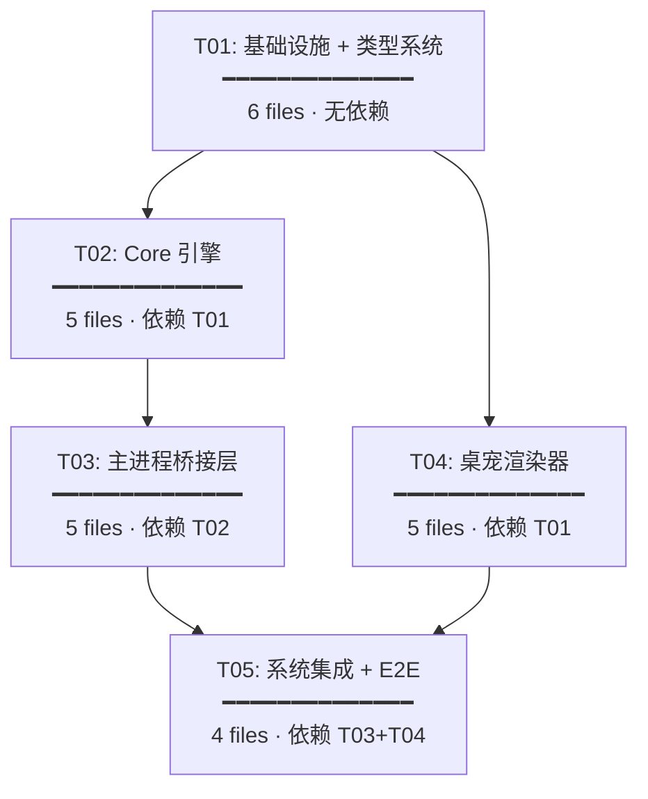

# 下班鸭桌宠 v2.0 — 任务分解

> **Architect**: Bob | **Date**: 2025-07-04 | **总任务数**: 5

---

## 任务依赖图



> **并行提示**: T02（Core 引擎）和 T04（渲染器）仅共享 T01 类型定义，可并行开发。

---

## T01: 项目基础设施 + 类型系统

| 属性 | 值 |
|------|-----|
| **优先级** | P0 |
| **依赖** | 无 |
| **预计文件数** | 6 |

### 涉及文件

| # | 文件 | 操作 | 说明 |
|---|------|------|------|
| 1 | `src/desk-pet-core/types.ts` | **NEW** | 16 状态联合类型、属性、情绪、动画命令、气泡、IPC 消息、持久化结构 |
| 2 | `src/desk-pet-core/constants.ts` | **NEW** | 衰减速率表、阈值、STATE_PRIORITY 映射、气泡文案映射、交互超时 |
| 3 | `src/desk-pet-core/index.ts` | **NEW** | barrel export（types + constants 先行导出，后续追加类导出） |
| 4 | `src/shared/types.ts` | **MODIFY** | 追加 `DeskPetStateV2`、`DeskPetAttributes` 等类型导出；保留旧 `DeskPetState` |
| 5 | `src/shared/ipc-channels.ts` | **MODIFY** | 新增 `DESK_PET_STATE_UPDATE`、`DESK_PET_INTERACTION`、`DESK_PET_GET_STATUS`、`DESK_PET_GET_ATTRIBUTES` |
| 6 | `src/preload/index.ts` | **MODIFY** | 暴露 `deskPet` API：`onInteraction`(invoke)、`getStatus`(invoke)、`getAttributes`(invoke)、`onStateUpdate`(listener) |

### 验收标准

- [ ] `src/desk-pet-core/types.ts` TypeScript 编译零错误
- [ ] `DeskPetStateV2` 联合类型覆盖全部 16 个状态字面量
- [ ] `STATE_PRIORITY` 满足: 交互(50+) > 应用驱动(20-29) > 自主行为(10-19)
- [ ] IPC 通道命名遵循 `deskPet:*` 前缀，不与现有通道冲突
- [ ] preload `XiabanyaApi` 类型更新，新增 `deskPet` 命名空间类型安全
- [ ] `npm run build` 通过（含 `tsc --noEmit` 类型检查）

---

## T02: Core 引擎 — 状态机 + 属性引擎 + 动画仲裁器 + 单测

| 属性 | 值 |
|------|-----|
| **优先级** | P0 |
| **依赖** | T01 |

### 涉及文件

| # | 文件 | 操作 | 说明 |
|---|------|------|------|
| 1 | `src/desk-pet-core/state-machine.ts` | **NEW** | `StateMachine` 类：`resolve()` 三层仲裁、`requestInteraction()`/`clearInteraction()` 交互超时管理 |
| 2 | `src/desk-pet-core/attribute-engine.ts` | **NEW** | `AttributeEngine` 类：`tick(deltaMs,appState)` 衰减、`evaluateAutonomousState()` 阈值检查、`computeEmotion()` |
| 3 | `src/desk-pet-core/animation-resolver.ts` | **NEW** | `AnimationResolver` 类：状态变更 → `AnimationCommand`（过渡判断 + 气泡文案 + 特效类型） |
| 4 | `src/desk-pet-core/__tests__/state-machine.test.ts` | **NEW** | 状态机单测（≥ 8 用例） |
| 5 | `src/desk-pet-core/__tests__/attribute-engine.test.ts` | **NEW** | 属性引擎单测（≥ 8 用例） |

### 验收标准

#### StateMachine
- [ ] `resolve('idle', null, null)` → `'idle'`（仅有应用驱动）
- [ ] `resolve('idle', 'hungry_alert', null)` → `'idle'`（应用驱动 > 自主行为）
- [ ] `resolve('idle', 'hungry_alert', 'petting')` → `'petting'`（交互 > 一切）
- [ ] `requestInteraction('petting')` 后 `hasActiveInteraction()` 返回 `true`
- [ ] `clearInteraction()` 后状态回退到上次 `resolve(app, auto, null)` 结果
- [ ] `resolve('sleep', 'tired', null)` → `'sleep'`（sleep 优先级高于 tired）
- [ ] 同状态 `resolve` 返回 `changed: false`

#### AttributeEngine
- [ ] `tick(60000, 'working')` → energy 下降 2.0、hunger 上升 0.3
- [ ] `tick(60000, 'sleep')` → energy 上升 3.0、mood 上升 1.0
- [ ] `hunger = 71` 时 `evaluateAutonomousState()` → `'hungry_alert'`
- [ ] `energy = 19` 时 `evaluateAutonomousState()` → `'tired'`
- [ ] `applyGesture('click')` → mood +5, intimacy +3
- [ ] `computeEmotion()` 正确映射属性 → 情绪（mood>80→happy, mood<20→sad, hunger>70→hungry_emo）
- [ ] 属性值 clamp 在 [0, 100]
- [ ] `npm test` 全部通过（≥ 16 个测试用例）

---

## T03: 主进程桥接层 — 持久化 + IPC 路由 + 生命周期

| 属性 | 值 |
|------|-----|
| **优先级** | P0 |
| **依赖** | T02 |

### 涉及文件

| # | 文件 | 操作 | 说明 |
|---|------|------|------|
| 1 | `src/main/desk-pet-bridge.ts` | **NEW** | `DeskPetBridge` 类：初始化/销毁、1s tick 循环、IPC 路由、30s 持久化调度 |
| 2 | `src/main/database.ts` | **MODIFY** | 新增 `desk_pet_state` 表 DDL + `saveDeskPetState()` / `loadDeskPetState()` 方法 |
| 3 | `src/main/desk-pet-window.ts` | **MODIFY** | 状态推送从 `executeJavaScript` 迁移到 `webContents.send('deskPet:stateUpdate', ...)`；导出 `getDeskPetWebContents()` |
| 4 | `src/main/ipc-handlers.ts` | **MODIFY** | 新增 4 个 IPC handler；`syncDeskPetWorkflowState()` 改为委托 `DeskPetBridge.pushAppState()` |
| 5 | `src/main/index.ts` | **MODIFY** | `app.whenReady()` 内初始化 `DeskPetBridge`；`before-quit` 内 `bridge.destroy()` |

### 验收标准

- [ ] 首次启动：DB 无数据 → AttributeEngine 默认值 (mood=50,energy=80,hunger=30,intimacy=0)
- [ ] 二次启动：从 DB 恢复属性值一致（误差 ≤1，因 round）
- [ ] `DeskPetBridge.startTickLoop(1000)` 启动后属性持续衰减
- [ ] `syncDeskPetWorkflowState()` 调用 `bridge.pushAppState()` 且状态正确推送
- [ ] `deskPet:interaction` handler 正确路由到 StateMachine + AttributeEngine
- [ ] `deskPet:getStatus` 返回完整 `DeskPetStatusResponse`
- [ ] 状态变更立即 persist；此外每 30s 定时 persist
- [ ] 应用退出时最终 persist 不丢失数据（`before-quit`）
- [ ] **现有桌宠功能无回归**: 窗口创建、透明、alwaysOnTop、拖拽手势、缩放手势、DWM workaround 均正常
- [ ] 窗口销毁时 tick loop 停止

---

## T04: 桌宠渲染器 — Canvas 精灵引擎 + 5 层动画 + 交互 + 气泡

| 属性 | 值 |
|------|-----|
| **优先级** | P0 |
| **依赖** | T01（仅类型依赖，可与 T02/T03 并行） |

### 涉及文件

| # | 文件 | 操作 | 说明 |
|---|------|------|------|
| 1 | `src/desk-pet-renderer/index.html` | **NEW** | Canvas 容器 `<canvas id="pet-canvas">` + script 加载 + resize-handle |
| 2 | `src/desk-pet-renderer/sprite-engine.js` | **NEW** | 从现有 HTML 提取并重构：精灵表 Image 加载、sprites.json 解析、帧裁剪、bounds |
| 3 | `src/desk-pet-renderer/animation-controller.js` | **NEW** | 5 层合成渲染循环（L1→L5）+ 300ms alpha 过渡混合 + IPC listener |
| 4 | `src/desk-pet-renderer/interaction-handler.js` | **NEW** | pointer 事件 → 手势分类（click/double/longpress/drag）→ IPC `deskPet:interaction` |
| 5 | `src/desk-pet-renderer/bubble-system.js` | **NEW** | Canvas 气泡渲染：圆角矩形 + 三角尾巴 + 文字 + 淡入淡出 + 排队 |

### 验收标准

#### Sprite Engine
- [ ] 加载 `xiabanya-desk-pet-spritesheet.png` + `xiabanya-desk-pet-sprites.json`
- [ ] 5 个基础状态 (idle/working/thinking/done/sleep) 帧渲染与现有效果一致
- [ ] 帧率匹配 sprites.json 中的 fps=8

#### Animation Controller
- [ ] 接收 `deskPet:stateUpdate` IPC → `applyCommand(cmd)` → 更新渲染
- [ ] **L1 基础状态**: 播放正确状态的精灵帧序列
- [ ] **L2 情绪覆盖**: happy→暖色 tint, sad→蓝色 tint, neutral→无 tint
- [ ] **L3 过渡动画**: 跨状态切换时 300ms alpha 混合（旧帧→新帧）
- [ ] **L4 自主行为**: 预留 CSS transform 偏移接口（wandering 轻微位移）
- [ ] **L5 交互特效**: hearts 粒子从 Canvas 中心上浮消散

#### Interaction Handler
- [ ] 单击 (<300ms) → `ipcRenderer.invoke('deskPet:interaction', {gesture:'click'})`
- [ ] 双击 (<400ms 间隔) → `{gesture:'double_click'}`
- [ ] 长按 (>800ms) → `{gesture:'long_press'}`
- [ ] 拖动不触发 click（与现有拖拽手势共存）
- [ ] 窗口透明区域点击穿透

#### Bubble System
- [ ] 气泡 2.5s 自动消失（淡出 200ms）
- [ ] 多个气泡排队显示（不重叠）
- [ ] 中文文案正确渲染（字体 fallback）
- [ ] 气泡不超出窗口边界

---

## T05: 系统集成 + 端到端验证

| 属性 | 值 |
|------|-----|
| **优先级** | P0 |
| **依赖** | T03, T04 |

### 涉及文件

| # | 文件 | 操作 | 说明 |
|---|------|------|------|
| 1 | `src/main/desk-pet-window.ts` | **MODIFY** | `loadFile` 路径指向 `src/desk-pet-renderer/index.html` |
| 2 | `src/main/index.ts` | **MODIFY** | 调优初始化顺序：DB → Bridge → Window → Renderer |
| 3 | `src/main/desk-pet-bridge.ts` | **MODIFY** | 边界情况处理：窗口未就绪时队列命令、窗口重建后重发状态 |
| 4 | `src/desk-pet-renderer/index.html` | **MODIFY** | 最终调优：窗口适配、DPI 缩放、错误兜底 |

### 验收标准

#### 完整流程
- [ ] 启动应用 → 桌宠窗口出现 (180×180) → idle 动画 → 开始 Tracker → working → done → sleep
- [ ] 点击桌宠 → petting 动画 + ❤️ 特效 + "好舒服~" 气泡 → 2s 后恢复正常
- [ ] 双击桌宠 → playing 动画 + ✨ 特效 + "一起玩!" 气泡 → 2s 后恢复
- [ ] hunger 衰减至 71+ → hungry_alert 状态触发（等待时间约: (71-30)/0.3 ≈ 137min）
- [ ] energy 衰减至 19- → tired 状态触发

#### 持久化验证
- [ ] 关闭应用 → 重新打开 → mood/energy/hunger/intimacy 值与关闭前一致 (误差 ≤1)
- [ ] `desk_pet_state` 表有且仅有一行 (id=1)

#### 兼容性验证
- [ ] 现有 v2.4.1 功能无回归: 记录追踪、AI 识别、日报生成
- [ ] 主窗口最小化时桌宠窗口 DWM workaround 仍生效
- [ ] 缩放 (96-360px) 后 sprite 帧正确缩放渲染
- [ ] 多显示器环境桌宠窗口位置正确

#### 稳定性验证
- [ ] 桌宠窗口创建/销毁 5 次无内存泄漏
- [ ] Canvas 渲染稳定 60fps（无掉帧）
- [ ] IPC 消息不堆积（快速连续状态变更时）
- [ ] `npm run build` 构建产物包含 `desk-pet-renderer/` 文件

---

## 实现顺序建议

```
第1天: T01 (类型系统) ────────────────── 上午搞定
第2天: T02 (Core) ──── T04 (Renderer) ── 并行开发
第3天: T03 (Bridge) ──────────────────── 等 T02 完成
第4天: T05 (集成) ────────────────────── 全部合流，端到端联调
第5天: 预留缓冲 / Bug 修复
```

**总预估**: 4-5 个工作日（单人全职）。
