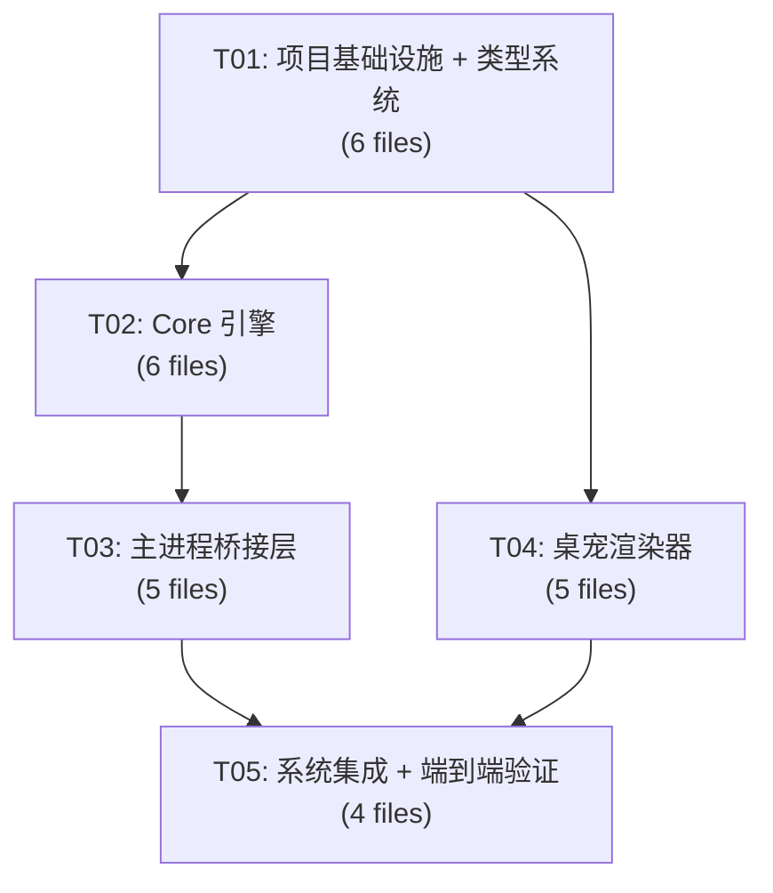

# 下班鸭 v2.0 — 系统架构设计 + 任务分解

> **Architect**: Bob
> **Date**: 2025-07-04
> **项目根目录**: 本公开仓库根目录

---

## Part A: 系统设计

### 1. 实现方案 + 框架选型

#### 1.1 核心技术挑战

| 挑战 | 分析 | 决策 |
|------|------|------|
| **16 状态优先级仲裁** | 3 层状态（应用驱动/自主行为/交互触发）可能同时激活，需要确定性仲裁 | 数值优先级 + 交互超时回退机制 |
| **属性衰减实时性** | mood/energy/hunger/intimacy 需每秒 tick，不能阻塞主进程 | `setInterval` 1s 轻量 tick，纯数学运算 |
| **动画过渡平滑性** | 状态切换需 300ms alpha 混合，Canvas 上实现 | requestAnimationFrame + 双帧缓冲 alpha 混合 |
| **Core 可单测** | 状态机/属性引擎必须零 DOM/Electron 依赖 | Pure TypeScript，仅依赖 Date 和 Math |
| **最小变更原则** | 现有 `desk-pet-window.ts` 的窗口管理逻辑保持 | 仅修改状态推送方式：`executeJavaScript` → IPC |

#### 1.2 框架/库选型

| 层级 | 技术 | 理由 |
|------|------|------|
| **Core 状态机** | 纯 TypeScript（自制） | 零依赖、可单测；XState 太重，16 状态不必要 |
| **Core 属性引擎** | 纯 TypeScript（自制） | 简单数学衰减模型，不需要仿真框架 |
| **持久化** | better-sqlite3（已有） | 项目已集成，新增 `desk_pet_state` 表即可；比 IndexedDB 更适合主进程 |
| **渲染器** | Vanilla JS + Canvas 2D | 桌宠窗口非 React 渲染，复用现有精灵表渲染逻辑 |
| **动画过渡** | requestAnimationFrame + 自定义 alpha 混合 | 不需要 Lottie（精灵表已有），CSS transition 不适用于 Canvas |
| **测试** | Vitest（已有） | 项目已配置 `vitest`，Core 模块直接用 |

#### 1.3 架构模式：四层分离

```
┌─────────────────────────────────────────────┐
│  src/desk-pet-renderer/   (Renderer 层)      │
│  Canvas 精灵引擎 + 动画 + 交互 + 气泡         │
│  技术: Vanilla JS + Canvas 2D                │
│  依赖: 无（通过 IPC 接收命令）                │
└────────────── IPC ──────────────────────────┘
┌─────────────────────────────────────────────┐
│  src/main/desk-pet-bridge.ts (Bridge 层)     │
│  生命周期管理 + IPC 路由 + 持久化调度          │
│  技术: Electron Main Process TS              │
│  依赖: Core + desk-pet-window + database     │
└─────────────────────────────────────────────┘
┌─────────────────────────────────────────────┐
│  src/desk-pet-core/        (Core 层)         │
│  状态机 + 属性引擎 + 动画仲裁器               │
│  技术: Pure TypeScript, 零依赖               │
│  可单测: ✅ (vitest)                          │
└─────────────────────────────────────────────┘
┌─────────────────────────────────────────────┐
│  src/main/database.ts      (Storage 层)      │
│  desk_pet_state 表 CRUD                      │
│  技术: better-sqlite3                        │
└─────────────────────────────────────────────┘
```

#### 1.4 Core 模块接口设计原则

1. **纯函数驱动**：所有状态变更通过显式方法调用，不依赖全局可变状态
2. **不可变输出**：`snapshot()` 返回深拷贝，外部不可修改内部状态
3. **时间显式传入**：tick 方法接受 `deltaMs` 参数，方便单测模拟时间
4. **优先级数值化**：每个状态有明确数值，仲裁结果可预测

---

### 2. 文件列表

```
src/
├── desk-pet-core/                          # [NEW] 纯 TS 核心逻辑
│   ├── index.ts                            # [NEW] Public API barrel export
│   ├── types.ts                            # [NEW] 所有 v2 类型定义
│   ├── constants.ts                        # [NEW] 衰减率/阈值/优先级常量
│   ├── state-machine.ts                    # [NEW] 16 状态分层状态机 + 优先级仲裁
│   ├── attribute-engine.ts                 # [NEW] mood/energy/hunger/intimacy 衰减/恢复
│   ├── animation-resolver.ts               # [NEW] 动画层优先级 → AnimationCommand 生成
│   └── __tests__/                          # [NEW] 单元测试
│       ├── state-machine.test.ts           # [NEW] 状态机全覆盖
│       └── attribute-engine.test.ts        # [NEW] 属性引擎全覆盖
│
├── desk-pet-renderer/                      # [NEW] 桌宠窗口渲染器
│   ├── index.html                          # [NEW] 桌宠窗口 HTML（替代 assets/desk-pet/desk-pet-window.html）
│   ├── sprite-engine.js                    # [NEW] 精灵表加载 + 帧裁剪 + bounds 计算
│   ├── animation-controller.js             # [NEW] 5 层动画合成 + 过渡混合
│   ├── interaction-handler.js              # [NEW] 手势检测（click/double/longpress/drag）
│   └── bubble-system.js                    # [NEW] 对话/情绪气泡渲染
│
├── main/
│   ├── desk-pet-bridge.ts                  # [NEW] Core ↔ Renderer 桥接 + 生命周期
│   ├── desk-pet-window.ts                  # [MODIFY] 窗口创建逻辑保持，状态推送改为 IPC
│   ├── ipc-handlers.ts                     # [MODIFY] 新增 deskPet v2 IPC handlers
│   ├── database.ts                         # [MODIFY] 新增 desk_pet_state 表
│   └── index.ts                            # [MODIFY] 初始化 DeskPetBridge
│
├── shared/
│   ├── types.ts                            # [MODIFY] 新增 v2 桌宠类型（DeskPetStateV2 等）
│   └── ipc-channels.ts                     # [MODIFY] 新增 v2 IPC channels
│
└── preload/
    └── index.ts                            # [MODIFY] 暴露 deskPet v2 API 到渲染进程
```

**文件统计**: 新建 14 个，修改 7 个，共 21 个文件。

---

### 3. 数据结构和接口

#### 3.1 核心类型定义 (`src/desk-pet-core/types.ts`)

```typescript
// ===== 状态分层 =====
export const APP_DRIVEN_STATES = ['idle', 'working', 'thinking', 'done', 'sleep'] as const;
export type AppDrivenState = typeof APP_DRIVEN_STATES[number];

export const AUTONOMOUS_STATES = ['wandering', 'hungry', 'eating', 'happy', 'sad', 'celebrating'] as const;
export type AutonomousState = typeof AUTONOMOUS_STATES[number];

export const INTERACTION_STATES = ['petted', 'grabbed', 'fed', 'scared', 'excited'] as const;
export type InteractionState = typeof INTERACTION_STATES[number];

export type DeskPetStateV2 = AppDrivenState | AutonomousState | InteractionState;
export const ALL_STATES_V2 = [...APP_DRIVEN_STATES, ...AUTONOMOUS_STATES, ...INTERACTION_STATES] as const;

// ===== 状态优先级（数值越大优先级越高） =====
export const STATE_PRIORITY: Record<DeskPetStateV2, number> = {
  // App-driven: 10-19
  idle: 10, working: 11, thinking: 12, done: 13, sleep: 14,
  // Autonomous: 30-39
  wandering: 30, hungry: 35, eating: 36, sad: 32, happy: 33, celebrating: 38,
  // Interaction: 50-59
  petted: 50, grabbed: 51, fed: 52, scared: 53, excited: 54,
};

// ===== 内部属性 =====
export interface DeskPetAttributes {
  mood: number;       // 0-100 (0=非常低落, 100=非常开心)
  energy: number;     // 0-100 (0=精疲力竭, 100=精力充沛)
  hunger: number;     // 0-100 (0=饱腹, 100=极度饥饿)
  intimacy: number;   // 0-100 (0=陌生, 100=亲密无间)
}

export type EmotionType = 'neutral' | 'happy' | 'sad' | 'angry' | 'surprised' | 'love';

export type InteractionType = 'pet' | 'feed' | 'grab' | 'scare' | 'celebrate';

// ===== 动画命令（Core → Renderer） =====
export interface AnimationCommand {
  state: DeskPetStateV2;           // 目标基础状态
  emotion: EmotionType;            // 情绪叠加层
  transition: TransitionConfig | null;  // 过渡配置
  bubble: BubbleData | null;       // 气泡数据
  effect: EffectType | null;       // 特效类型
}

export interface TransitionConfig {
  fromState: DeskPetStateV2;
  toState: DeskPetStateV2;
  durationMs: number;              // 默认 300
}

export type EffectType = 'hearts' | 'stars' | 'sparkles' | 'sweat' | 'zzz' | null;

// ===== 气泡 =====
export interface BubbleData {
  id: string;
  text: string;
  type: 'speech' | 'thought' | 'emotion' | 'notification';
  durationMs: number;
  createdAt: number;               // Date.now()
}

// ===== 持久化 =====
export interface DeskPetSaveData {
  attributes: DeskPetAttributes;
  lastTickTimestamp: number;       // UTC ms
  currentState: DeskPetStateV2;
}

// ===== 状态变更结果 =====
export interface StateChangeResult {
  newState: DeskPetStateV2;
  oldState: DeskPetStateV2;
  changed: boolean;
  transitionMs: number;
}

// ===== IPC 消息体 =====
export interface DeskPetInteractionMessage {
  type: InteractionType;
  timestamp: number;
}

export interface DeskPetStatusResponse {
  state: DeskPetStateV2;
  attributes: DeskPetAttributes;
  emotion: EmotionType;
  visible: boolean;
}
```

#### 3.2 StateMachine 类接口

```typescript
export class StateMachine {
  constructor(initialState?: DeskPetStateV2);

  /** 获取当前状态 */
  getCurrentState(): DeskPetStateV2;

  /** 获取当前情绪 */
  getEmotion(): EmotionType;

  /**
   * 三层状态仲裁： interaction > autonomous > appDriven
   * @returns 最终应显示的状态
   */
  resolveState(
    appDriven: AppDrivenState,
    autonomous: AutonomousState | null
  ): DeskPetStateV2;

  /**
   * 请求交互状态。交互状态有时效性（默认 2s），超时后自动回退。
   * @returns 是否被接受（交互优先级最高，总是接受）
   */
  requestInteraction(state: InteractionState, durationMs?: number): StateChangeResult;

  /** 清除当前交互状态（由超时定时器调用） */
  clearInteraction(): StateChangeResult;

  /** 直接设置应用驱动状态（无交互时生效） */
  setAppState(state: AppDrivenState): StateChangeResult;

  /** 获取状态优先级 */
  getPriority(state: DeskPetStateV2): number;
}
```

#### 3.3 AttributeEngine 类接口

```typescript
export class AttributeEngine {
  constructor(initial?: Partial<DeskPetAttributes>);

  /** 启动衰减定时循环（由 Bridge 层 setInterval 驱动） */
  tick(deltaMs: number, appState: AppDrivenState): void;

  /** 应用交互效果（pet/feed 等对属性加减） */
  applyInteraction(type: InteractionType): DeskPetAttributes;

  /** 评估是否应触发自主行为 */
  evaluateAutonomousState(): AutonomousState | null;

  /** 从属性推断情绪 */
  computeEmotion(): EmotionType;

  /** 获取当前属性快照（只读） */
  getAttributes(): Readonly<DeskPetAttributes>;

  /** 加载持久化数据 */
  load(data: DeskPetAttributes, lastTickTimestamp: number): void;

  /** 导出持久化快照 */
  snapshot(): DeskPetSaveData;

  /** 是否触发"饥饿"阈值 */
  isHungry(): boolean;

  /** 是否触发"低落"阈值 */
  isSad(): boolean;
}
```

#### 3.4 AnimationResolver 类接口

```typescript
export class AnimationResolver {
  /**
   * 根据状态变化生成动画命令
   * @param oldState 旧状态
   * @param newState 新状态
   * @param emotion 当前情绪
   * @param effect 可选特效
   */
  resolve(
    oldState: DeskPetStateV2 | null,
    newState: DeskPetStateV2,
    emotion: EmotionType,
    effect?: EffectType
  ): AnimationCommand;

  /** 判断两状态是否需要过渡动画 */
  needsTransition(from: DeskPetStateV2, to: DeskPetStateV2): boolean;

  /** 获取过渡时长 */
  getTransitionMs(from: DeskPetStateV2, to: DeskPetStateV2): number;

  /** 生成气泡（状态/情绪触发时） */
  generateBubble(state: DeskPetStateV2, emotion: EmotionType): BubbleData | null;
}
```

#### 3.5 IPC 通道扩展 (`src/shared/ipc-channels.ts`)

```typescript
// 新增以下通道（追加到现有 IPC_CHANNELS）:

// 桌宠 v2 交互
DESK_PET_ON_INTERACTION: 'deskPet:onInteraction',       // Renderer → Main (invoke)
DESK_PET_ON_STATE_UPDATE: 'deskPet:onStateUpdate',      // Main → Renderer (send)
DESK_PET_GET_STATUS: 'deskPet:getStatus',               // Main ↔ Renderer (invoke)
DESK_PET_GET_ATTRIBUTES: 'deskPet:getAttributes',       // Main ↔ Renderer (invoke)
DESK_PET_FEED: 'deskPet:feed',                          // Renderer → Main (invoke)
```

#### 3.6 数据库扩展 (`src/main/database.ts`)

```sql
-- 新增表
CREATE TABLE IF NOT EXISTS desk_pet_state (
  id INTEGER PRIMARY KEY CHECK (id = 1),  -- 单行表
  attributes_json TEXT NOT NULL,           -- JSON: DeskPetAttributes
  current_state TEXT NOT NULL,             -- DeskPetStateV2
  last_tick_timestamp INTEGER NOT NULL,    -- Unix ms
  updated_at TEXT NOT NULL DEFAULT (datetime('now'))
);
```

---

### 4. 程序调用流程

详见独立文件:
- `docs/class-diagram.mermaid` — 类图
- `docs/sequence-diagram.mermaid` — 时序图

关键流程文字描述:

#### 4.1 应用状态切换流程
```
Tracker/Vision 状态变化
  → ipc-handlers.syncDeskPetWorkflowState()
  → DeskPetBridge.pushAppState(appDrivenState)
  → StateMachine.resolveState(appDriven, AttributeEngine.evaluateAutonomousState())
  → AnimationResolver.resolve(old, new, emotion)
  → IPC send('deskPet:onStateUpdate', AnimationCommand)
  → Renderer.AnimationController.applyCommand(cmd)
  → requestAnimationFrame 300ms alpha 混合过渡
```

#### 4.2 用户交互流程
```
用户点击/抚摸桌宠
  → Renderer.InteractionHandler 检测手势类型
  → IPC invoke('deskPet:onInteraction', { type: 'pet' })
  → DeskPetBridge.handleInteraction('pet')
  → StateMachine.requestInteraction('petted')
  → AttributeEngine.applyInteraction('pet')  // mood+5, intimacy+3
  → AnimationResolver.resolve(...)            // 爱心特效 + 气泡
  → IPC send('deskPet:onStateUpdate', cmd)
  → 2s 后 setTimout → StateMachine.clearInteraction()
  → 回退到自主/应用状态
```

#### 4.3 持久化流程
```
每个 tick 周期 (1s):
  → AttributeEngine.tick(deltaMs, appState)
  → 属性衰减计算 → 阈值检查 → 自主行为触发

每 30s + 状态变更时:
  → AttributeEngine.snapshot()
  → DeskPetBridge.persistState()
  → DatabaseService.saveDeskPetState(data)
  → UPSERT desk_pet_state WHERE id=1
```

---

### 5. 待明确事项 (Anything UNCLEAR)

| # | 问题 | 当前假设 | 需确认 |
|---|------|----------|--------|
| 1 | 精灵表是否需要扩展？当前只有 5 状态各 8 帧 | **假设**: 保持现有精灵表，新增状态复用现有帧 + 情绪叠加（tint/滤镜）实现差异化 | 产品/设计师确认新状态的视觉资源 |
| 2 | 气泡文案由谁定义？ | **假设**: Core 层 `AnimationResolver` 内置默认文案映射表（中文），后续可扩展为配置文件 | 产品确认气泡文案风格和内容 |
| 3 | "日报庆祝"触发时机？ | **假设**: 监听 `REPORTS_GENERATE` IPC 完成后触发 `celebrate` 交互 | 与现有 report 流程确认 |
| 4 | 喂养机制具体交互方式？ | **假设**: 右键菜单或主窗口设置页提供"喂食"按钮，通过 IPC 触发 | 产品确认 UI 入口 |
| 5 | 属性衰减是否在应用不可见时暂停？ | **假设**: 仅当桌宠窗口可见时 tick；不可见时冻结属性 | 产品确认 |
| 6 | desk-pet-renderer 文件位置 | **假设**: 新建 `src/desk-pet-renderer/index.html`，main 进程 `loadFile` 指向此处；旧 `assets/desk-pet/desk-pet-window.html` 保留作为回退 | 确认是否可接受 build 步骤打包 renderer JS |

---

## Part B: 任务分解

### 6. 依赖包列表

```
无需新增 npm 依赖。所有功能使用已有依赖实现：
- better-sqlite3@^11.10.0 — 持久化（已有）
- uuid@^10.0.0 — 气泡 ID 生成（已有）
- vitest@^3.0.0 — 单元测试（已有）
```

### 7. 任务列表

---

#### T01: 项目基础设施 + 类型系统

| 属性 | 值 |
|------|-----|
| **Task ID** | T01 |
| **优先级** | P0 |
| **依赖** | 无 |

**源文件**:
| 文件 | 操作 | 说明 |
|------|------|------|
| `src/desk-pet-core/types.ts` | NEW | 全部 v2 类型定义：16 状态、属性、动画命令、气泡等 |
| `src/desk-pet-core/constants.ts` | NEW | 衰减率、阈值、优先级表、气泡文案映射 |
| `src/desk-pet-core/index.ts` | NEW | barrel export |
| `src/shared/types.ts` | MODIFY | 追加 DeskPetStateV2、DeskPetAttributes 等导出 |
| `src/shared/ipc-channels.ts` | MODIFY | 追加 5 个 v2 IPC 通道 |
| `src/preload/index.ts` | MODIFY | 暴露 deskPet v2 API（onInteraction, getStatus, getAttributes, feed） |

**验收标准**:
- [ ] `src/desk-pet-core/types.ts` 编译无错误
- [ ] `DeskPetStateV2` 联合类型覆盖全部 16 个状态
- [ ] IPC channels 命名遵循 `deskPet:*` 规范，不与现有通道冲突
- [ ] preload API 类型安全，`XiabanyaApi` 类型更新
- [ ] `npm run build` 通过（类型检查）

---

#### T02: Core 引擎（状态机 + 属性引擎 + 动画仲裁器 + 单测）

| 属性 | 值 |
|------|-----|
| **Task ID** | T02 |
| **优先级** | P0 |
| **依赖** | T01 |

**源文件**:
| 文件 | 操作 | 说明 |
|------|------|------|
| `src/desk-pet-core/state-machine.ts` | NEW | 16 状态分层状态机：resolveState / requestInteraction / clearInteraction |
| `src/desk-pet-core/attribute-engine.ts` | NEW | 4 属性衰减/恢复引擎：tick / applyInteraction / evaluateAutonomousState |
| `src/desk-pet-core/animation-resolver.ts` | NEW | 状态→AnimationCommand 映射：过渡判断 / 气泡生成 / 特效选择 |
| `src/desk-pet-core/index.ts` | MODIFY | 追加新模块导出 |
| `src/desk-pet-core/__tests__/state-machine.test.ts` | NEW | 状态机全覆盖：仲裁优先级、交互超时、状态回退 |
| `src/desk-pet-core/__tests__/attribute-engine.test.ts` | NEW | 属性引擎全覆盖：衰减公式、阈值触发、交互效果 |

**验收标准**:
- [ ] StateMachine 优先级仲裁：interaction(50+) > autonomous(30+) > app(10+)
- [ ] requestInteraction('petted') 后 2s 自动 clearInteraction，状态回退正确
- [ ] AttributeEngine.tick(60000, 'working') 后 energy 下降 2 点、hunger 上升 0.3 点
- [ ] hunger > 70 触发 evaluateAutonomousState() → 'hungry'
- [ ] AnimationResolver 对同状态切换返回 `transition: null`（无过渡）
- [ ] 跨状态切换返回 `transition: { durationMs: 300 }`
- [ ] `npm test` 全部通过（≥ 15 个测试用例）

---

#### T03: 主进程桥接层（持久化 + IPC + 生命周期管理）

| 属性 | 值 |
|------|-----|
| **Task ID** | T03 |
| **优先级** | P0 |
| **依赖** | T02 |

**源文件**:
| 文件 | 操作 | 说明 |
|------|------|------|
| `src/main/desk-pet-bridge.ts` | NEW | 核心桥接类：初始化/销毁/tick循环/IPC路由/持久化调度 |
| `src/main/database.ts` | MODIFY | 新增 `desk_pet_state` 表 + `saveDeskPetState()` / `loadDeskPetState()` 方法 |
| `src/main/desk-pet-window.ts` | MODIFY | 状态推送从 `executeJavaScript` 改为 IPC `webContents.send`；新增 `getDeskPetWebContents()` 导出 |
| `src/main/ipc-handlers.ts` | MODIFY | 新增 `deskPet:onInteraction` / `deskPet:getStatus` / `deskPet:getAttributes` / `deskPet:feed` handlers |
| `src/main/index.ts` | MODIFY | app.whenReady 中初始化 DeskPetBridge；before-quit 中销毁 |

**验收标准**:
- [ ] DeskPetBridge 初始化时从 DB 加载上次状态，恢复属性
- [ ] 1s tick 循环正常运行，属性持续衰减
- [ ] 现有 `syncDeskPetWorkflowState()` 调用 DeskPetBridge.pushAppState() 而非直接 `setDeskPetState()`
- [ ] deskPet:onInteraction IPC handler 正确调用 StateMachine + AttributeEngine
- [ ] 状态变更时自动 persist（debounce 30s）
- [ ] 应用退出时最终持久化不丢失数据
- [ ] 现有桌宠功能不回归：窗口创建/拖拽/缩放/DWM workaround 均正常

---

#### T04: 桌宠渲染器（Canvas 精灵引擎 + 动画 + 交互 + 气泡）

| 属性 | 值 |
|------|-----|
| **Task ID** | T04 |
| **优先级** | P0 |
| **依赖** | T01（仅类型依赖，可与 T02/T03 并行） |

**源文件**:
| 文件 | 操作 | 说明 |
|------|------|------|
| `src/desk-pet-renderer/index.html` | NEW | 桌宠窗口 HTML：Canvas + resize-handle + 加载 JS 模块 |
| `src/desk-pet-renderer/sprite-engine.js` | NEW | 精灵表加载、帧 bounds 计算（从现有 desk-pet-window.html 提取并重构） |
| `src/desk-pet-renderer/animation-controller.js` | NEW | 5 层动画合成：base → emotion_tint → transition_blend → behavior → effect |
| `src/desk-pet-renderer/interaction-handler.js` | NEW | 指针事件 → 手势类型检测（click/double/longpress/drag）→ IPC 上报 |
| `src/desk-pet-renderer/bubble-system.js` | NEW | Canvas 气泡渲染：圆角矩形 + 文字 + 三角尾巴 + 淡入淡出 |

**验收标准**:
- [ ] 精灵表加载 + 帧渲染与现有效果一致（5 个基础状态动画正常）
- [ ] 接收到 `deskPet:onStateUpdate` IPC 后，动画平滑过渡（300ms alpha 混合）
- [ ] 情绪叠加层：happy → 暖色 tint，sad → 蓝色 tint，neutral → 无 tint
- [ ] 单击触发 `deskPet:onInteraction({ type: 'pet' })` IPC
- [ ] 双击触发 `deskPet:onInteraction({ type: 'excited' })` IPC（P1 预留）
- [ ] 气泡正确渲染：2s 自动消失，支持多个气泡排队
- [ ] 拖拽/缩放手势不受影响（复用现有 pointerdown/pointermove 逻辑）
- [ ] 窗口透明区域点击穿透正常

---

#### T05: 系统集成 + 端到端验证

| 属性 | 值 |
|------|-----|
| **Task ID** | T05 |
| **优先级** | P0 |
| **依赖** | T03, T04 |

**源文件**:
| 文件 | 操作 | 说明 |
|------|------|------|
| `src/main/desk-pet-bridge.ts` | MODIFY | 集成调试：边界情况处理、错误恢复 |
| `src/main/index.ts` | MODIFY | 调整初始化顺序：DB → Bridge → Window → Renderer |
| `src/main/desk-pet-window.ts` | MODIFY | loadFile 路径指向新 renderer HTML |
| `assets/desk-pet/desk-pet-window.html` | KEEP | 保留作为回退（不删除） |

**验收标准**:
- [ ] 完整流程：启动应用 → 桌宠窗口出现 → idle 动画播放 → 开始追踪 → 切换到 working → 完成 → done → sleep
- [ ] 属性从上次退出恢复（关闭再打开，mood/energy/hunger/intimacy 值不变）
- [ ] 点击桌宠触发 petting 动画 + 爱心特效 + 气泡，2s 后恢复正常
- [ ] 主窗口最小化/失焦时 DWM workaround 仍生效
- [ ] 内存无泄漏：桌宠窗口创建/销毁 10 次，内存稳定
- [ ] 现有 v2.4.1 功能无回归：记录追踪、AI 识别、日报生成均正常

---

### 8. 共享知识 (Shared Knowledge)

#### 8.1 命名规范
- **状态值**: 小写下划线（`idle`, `working`, `petted`）— 与现有保持一致
- **IPC 通道**: `namespace:action`（`deskPet:onInteraction`）— 遵循现有 `ipc-channels.ts` 规范
- **文件命名**: kebab-case（`state-machine.ts`, `attribute-engine.ts`）
- **类名**: PascalCase（`StateMachine`, `AttributeEngine`）
- **接口/类型**: PascalCase（`DeskPetStateV2`, `AnimationCommand`）
- **常量**: UPPER_SNAKE_CASE（`DEFAULT_DECAY_RATES`, `STATE_PRIORITY`）

#### 8.2 错误处理策略
- **Core 层**: 不抛异常，非法输入通过 TypeScript 类型约束在编译期拦截；运行时边界值 clamp 到 [0,100]
- **Bridge 层**: IPC handler 用 try/catch 包裹，错误日志 → console.error，不阻断主流程
- **Renderer 层**: 渲染异常在 Canvas 上绘制红色警告文字 + console.warn，不白屏
- **持久化**: save 失败静默重试 1 次（间隔 5s），仍失败则放弃本次存储（下次 tick 再存）

#### 8.3 IPC 消息模式
- **Main → Renderer (push)**: 使用 `webContents.send()`，Renderer 监听 `ipcRenderer.on()`
- **Renderer → Main (request)**: 使用 `ipcRenderer.invoke()`，Main 使用 `ipcMain.handle()`
- **手势事件 (existing)**: 保持 `ipcRenderer.send()` + `ipcMain.on()` 模式不变

#### 8.4 属性数值约定
- 所有属性范围: **[0, 100]**，整数
- 超出范围时 **clamp** 而非报错
- tick 计算使用浮点数，存储时 `Math.round()`

#### 8.5 时间约定
- 所有时间戳存储为 **Unix 毫秒** 整数 (`Date.now()`)
- tick delta 单位: **毫秒**
- 持久化时间戳: ISO 8601 UTC 字符串（与现有 DB 风格一致，`updated_at` 字段）

#### 8.6 向后兼容
- 旧 `DeskPetState` (5 states) 作为 `AppDrivenState` 子集存在
- 旧 `setDeskPetState()` 函数保留签名，内部委托给 DeskPetBridge
- 旧 `DESK_PET_STATES` 常量不变（仅新增 STATES_V2）

---

### 9. 任务依赖图



**并行执行建议**: T02 和 T04 可并行开发（仅共享类型定义 T01），T03 依赖 T02 完成后进行，T05 在所有模块完成后集成。

---

> **设计完成。** 下一步: 将本设计文档提交给团队评审，确认待明确事项后进入实现阶段。
