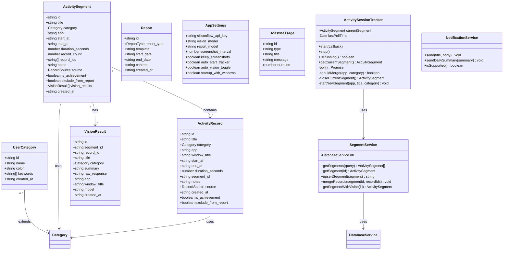
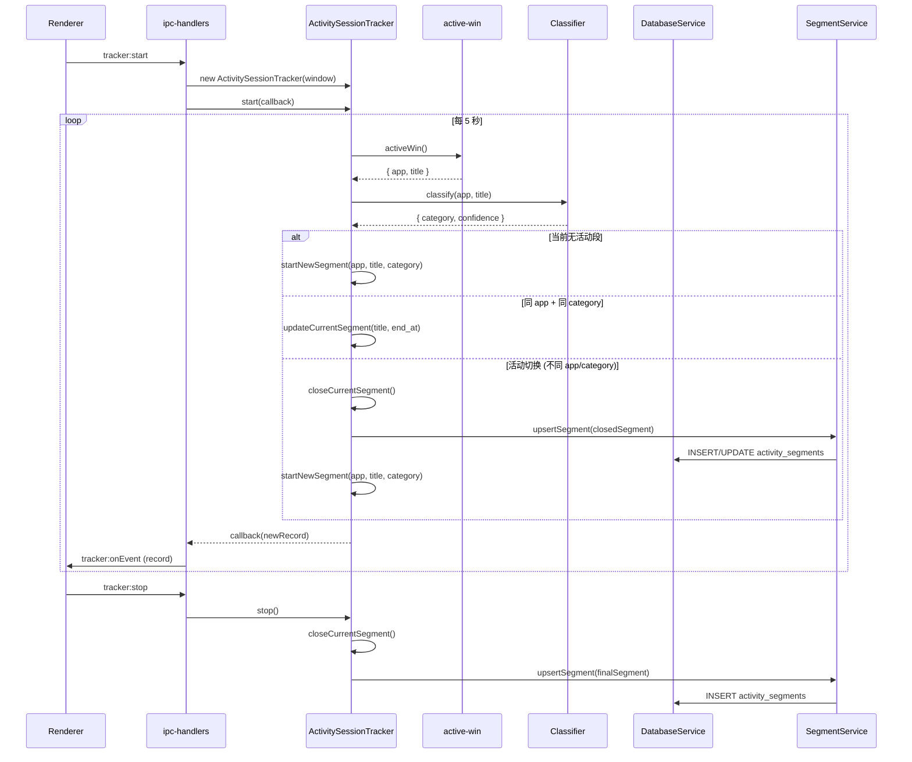
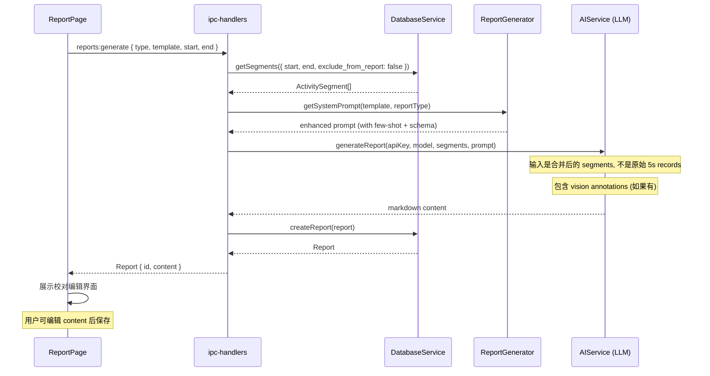
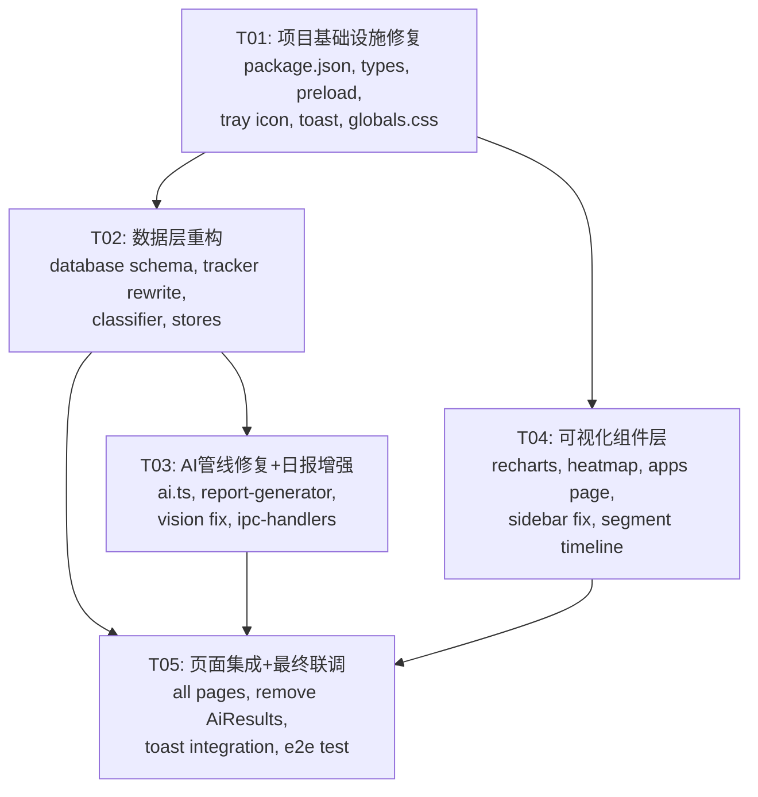

# 下班鸭 v2.1 — 增量架构设计 & 任务分解

> **Architect: Bob | 日期: 2025-07-04**
> **基础：v2 现有代码 + 产品审视报告 + 用户反馈**
> **原则：增量修改，最小变更面，能改不新建**

---

## Part A: 系统设计

### 1. 实现方案

#### 1.1 核心技术挑战

| 挑战 | 严重程度 | 根因 | 解决策略 |
|------|----------|------|----------|
| 记录粒度过粗（5s/poll） | 🔴 Critical | tracker.ts 每次 poll 都创建新记录 | 会话级追踪：维持 current segment，活动切换时才关闭旧段 |
| Vision.record_id 永远为空 | 🔴 Critical | ipc-handlers.ts 硬编码 `record_id: ''` | 截图时刻取当前 active segment_id 写入 |
| Sidebar 高亮失效 | 🟡 Medium | Tailwind v4 不支持 `bg-brand/10` | 改为 `bg-brand-50/50` 或完整 hex + opacity |
| 热力图无交互 | 🟡 Medium | 纯 div + title 属性 | 自定义 tooltip 组件 + 点击展开详情 |
| 假饼图 | 🟡 Medium | AppsPage 饼图实际是色块列表 | 引入 recharts，真正的 PieChart + BarChart |
| 状态管理形同虚设 | 🟡 Medium | 5/7 页面用内部 useState | 所有数据获取统一走 Zustand store |
| AI prompt 简陋 | 🟡 Medium | 无 few-shot、无 output schema | 添加 structured output + few-shot 示例 |
| report-generator 别名 bug | 🟡 Medium | `replace(/(日报\|周报\|月报)$/, '')` 丢信息 | 完整键值映射，不做字符串 strip |
| 错误处理只到 console.error | 🟡 Medium | 全项目无 toast | 引入 sonner 轻量 toast |
| 托盘图标空白 | 🟢 Low | `nativeImage.createEmpty()` | 生成带品牌色的小鸭 icon |
| 无全局快捷键/系统通知 | 🟢 Low | 未实现 | Electron globalShortcut + Notification API |

#### 1.2 框架与库选择

| 用途 | 选型 | 理由 |
|------|------|------|
| 图表 | **recharts** ^2.15 | 纯 React 声明式，零 DOM 操作，与现有 Tailwind 不冲突；包体积 ~500KB gzipped~80KB |
| Toast | **sonner** ^2.0 | 极轻量（~5KB），React 原生，无 MUI 依赖，API 简洁 |
| 通知 | **Electron Notification API** | 内置，无需额外包 |
| 类型安全 IPC | 现有 preload + **导出 XiabanyaApi 类型** | 零依赖，纯 TS 约束 |

**明确不引入：** MUI（用户确认不需要）、Tauri（Electron 迁移成本高）、shadcn/ui（Tailwind v4 兼容性待验证）

#### 1.3 架构模式

保持现有分层，增强中间层：

```
┌─────────────────────────────────────────────────┐
│  Renderer (React 19 + Zustand + Tailwind v4)      │
│  ┌──────────┐ ┌──────────┐ ┌──────────────────┐ │
│  │  Pages    │ │Components│ │  Stores (Zustand) │ │
│  │ (8→7 页) │ │ (+4 new) │ │  (4 existing)    │ │
│  └──────────┘ └──────────┘ └──────────────────┘ │
│              ↕ useXiabanyaApi() hook             │
├─────────────────────────────────────────────────┤
│  Preload (contextBridge)                          │
│  ┌────────────────────────────────────────────┐  │
│  │  XiabanyaApi type export ← NEW             │  │
│  │  typed IPC invoke wrappers                 │  │
│  └────────────────────────────────────────────┘  │
├─────────────────────────────────────────────────┤
│  Main Process (Electron)                         │
│  ┌──────────┐ ┌──────────┐ ┌─────────────────┐ │
│  │Tracker   │ │AI Service│ │Database Service │ │
│  │(sessions)│ │(enhanced)│ │(+segments table)│ │
│  └──────────┘ └──────────┘ └─────────────────┘ │
│  ┌──────────┐ ┌──────────────────────────────┐  │
│  │Notifier  │ │ IPC Handlers (refactored)    │  │
│  │(NEW)     │ │                              │  │
│  └──────────┘ └──────────────────────────────┘  │
└─────────────────────────────────────────────────┘
```

---

### 2. 文件列表

#### 2.1 修改的文件（Modify）

| 文件路径 | 改动摘要 |
|----------|----------|
| `package.json` | 添加 recharts, sonner 依赖 |
| `tailwind.config.ts` | 无需改动（v4 用 CSS 变量） |
| `src/shared/types.ts` | 新增 ActivitySegment, UserCategory, 扩展 ActivityRecord |
| `src/shared/ipc-channels.ts` | 新增 segment, userCategory, notification 通道 |
| `src/main/index.ts` | 真实托盘图标, 全局快捷键, notification 支持 |
| `src/main/database.ts` | 新增 activity_segments 表, user_categories 表; 迁移脚本 |
| `src/main/ipc-handlers.ts` | 重写 tracker (会话模式), 修复 vision record_id, 新增 segment IPC |
| `src/main/tracker.ts` | 完全重写：ActivitySessionTracker, 会话合并逻辑 |
| `src/main/classifier.ts` | 支持用户自定义分类关键词 |
| `src/main/ai.ts` | 增强 prompt (few-shot + JSON schema) |
| `src/main/report-generator.ts` | 修复别名 bug, 增强 prompt 模板 |
| `src/main/tray.ts` | 真实托盘图标（如果独立文件）或合并进 index.ts |
| `src/preload/index.ts` | 导出 XiabanyaApi 类型, 新增 segment API |
| `src/renderer/App.tsx` | 移除 AiResultsPage 路由, 添加 Toaster |
| `src/renderer/components/Sidebar.tsx` | 修复 Tailwind v4 高亮, 移除 AI 识别导航项 |
| `src/renderer/pages/TodayPage.tsx` | 使用 segment store, 展示合并后的活动段 |
| `src/renderer/pages/HeatmapPage.tsx` | 添加 tooltip 交互, 点击展开详情面板 |
| `src/renderer/pages/AppsPage.tsx` | 用 recharts 替换假饼图, 添加真实图表 |
| `src/renderer/pages/TimelinePage.tsx` | 展示 activity_segments, 内联 vision 结果 |
| `src/renderer/pages/ReportPage.tsx` | 校对编辑工作流, 生成中状态, toast 错误 |
| `src/renderer/pages/HistoryPage.tsx` | toast 错误处理 |
| `src/renderer/pages/SettingsPage.tsx` | 新增用户自定义分类管理, toast 反馈 |
| `src/renderer/globals.css` | 补充 Tailwind v4 兼容的 brand 透明度 token |
| `src/renderer/lib/utils.ts` | 新增 segment 时间格式化函数 |
| `src/renderer/lib/constants.ts` | 新增导出类型 |
| `src/renderer/stores/useRecordsStore.ts` | 新增 segments 状态, fetchSegments |
| `src/renderer/stores/useAppStore.ts` | 新增 notificationEnabled 状态 |

#### 2.2 新增的文件（Create）

| 文件路径 | 用途 |
|----------|------|
| `src/main/notification.ts` | 系统通知服务（Electron Notification 封装） |
| `src/renderer/hooks/useXiabanyaApi.ts` | 类型安全的 preload API hook |
| `src/renderer/components/Toast.tsx` | Toast 通知组件（sonner 包装） |
| `src/renderer/components/HeatmapTooltip.tsx` | 热力图 hover tooltip 组件 |
| `src/renderer/components/AppCharts.tsx` | 应用统计图表组件（recharts 封装） |
| `src/renderer/components/SegmentTimeline.tsx` | 合并后的活动段时间线展示 |
| `src/renderer/components/EmptyState.tsx` | 可复用空状态/加载状态/错误状态组件 |

#### 2.3 删除的文件（Delete）

| 文件路径 | 原因 |
|----------|------|
| `src/renderer/pages/AiResultsPage.tsx` | 独立 AI 识别页丢弃，结果并入 TimelinePage |

---

### 3. 数据结构与接口

#### 3.1 数据模型 (classDiagram)



#### 3.2 关键类型定义

```typescript
// === 新增类型 ===

/** 活动合并段 — tracker 输出粒度 */
export interface ActivitySegment {
  id: string;
  title: string;
  category: Category;
  app: string;
  start_at: string;        // ISO datetime
  end_at: string;          // ISO datetime
  duration_seconds: number;
  record_count: number;    // 合并了多少条原始 poll 记录
  record_ids: string[];    // 关联的原始记录 ID 列表
  notes: string;
  source: RecordSource;
  is_achievement: boolean;
  exclude_from_report: boolean;
  created_at: string;
}

/** 用户自定义分类 */
export interface UserCategory {
  id: string;
  name: string;           // 分类名，如「炒股」「游戏」
  color: string;          // hex color, 如 '#ef4444'
  keywords: string[];     // 触发关键词
  created_at: string;
}

/** ActivityRecord 扩展字段 */
// 在现有基础上新增：
// - duration_seconds: number    预计算时长（秒）
// - segment_id: string          所属合并段 ID

/** VisionResult 修正 */
// segment_id: string   ← 主要关联字段
// record_id: string    ← 保留兼容，可为空

/** 合并配置 */
export interface MergeConfig {
  enabled: boolean;
  gap_seconds: number;       // 多长时间无活动视为新段（默认 120s）
  same_category_only: boolean; // 是否只合并同类活动（默认 true）
}
```

---

### 4. 程序调用流程

#### 4.1 活动追踪 + 合并流程 (Sequence Diagram)



#### 4.2 AI 识别 + 关联新流程（活动切换时触发）

```mermaid
sequenceDiagram
    participant T as ActivitySessionTracker
    participant IPC as ipc-handlers
    participant SS as ScreenshotService
    participant AI as AIService
    participant DB as DatabaseService
    participant UI as Renderer

    Note over T: 活动切换时触发

    T->>T: closeCurrentSegment()
    T->>SS: captureScreenshot(mainWindow)
    SS-->>T: JPEG Buffer (base64)
    
    T->>IPC: 传递 segment + screenshot
    IPC->>AI: classifyWithVision(apiKey, model, base64, app, title)
    AI->>AI: promptVLM (enhanced with few-shot)
    AI-->>IPC: { title, category, summary }
    
    IPC->>DB: addVisionResult({
        segment_id: currentSegment.id,
        title, category, summary, ...
    })
    DB-->>IPC: visionResultId
    
    IPC->>UI: vision:onResult (visionResult with segment_id)
    
    Note over UI: TimelinePage 收到后 inline 展示
    Note over UI: TodayPage 可选展示最新 AI 标记
```

#### 4.3 日报生成新管线



---

### 5. 待确认的设计决策

以下决策建议已给出推荐方案，但需用户/团队拍板：

| # | 决策点 | 推荐方案 | 备选方案 | 影响 |
|---|--------|----------|----------|------|
| D1 | 活动合并粒度 | 同 app+同 category 连续则合并，gap>120s 断 | 仅同 app 合并（忽略 category） | 太少合并 → 记录碎片；太多合并 → 丢失细节 |
| D2 | AI 截图时机 | **活动切换时**截一次 + 可选手动触发 | 保持定时截（5分钟） | 切换时截 = 省 API 钱 + 精准关联；定时截 = 覆盖无切换场景 |
| D3 | Toast 库 | **sonner** (~5KB) | react-hot-toast (~10KB) | sonner 更轻量，API 更现代 |
| D4 | 图表库 | **recharts** | visx (airbnb) | recharts 更简单，visx 更灵活但学习成本高 |
| D5 | 数据库迁移 | **自动迁移**（启动时 ALTER TABLE ADD COLUMN IF NOT EXISTS） | 手动迁移脚本 | 自动迁移对用户无感，但 SQLite 的 ALTER TABLE 有限制 |
| D6 | 用户自定义分类存储 | **独立 user_categories 表** | JSON 字段在 settings 中 | 独立表查询方便，后续可扩展 CRUD |
| D7 | 全局快捷键 | Ctrl+Shift+X 显示/隐藏窗口 | 可配置 | 写死简单，可配置复杂但灵活 |
| D8 | 托盘图标 | 用 Canvas 绘制 SVG → nativeImage | 使用 .ico 文件 | Canvas 绘制不需要额外资源文件，打包简单 |

---

## Part B: 任务分解

### 6. 需要新增的依赖包

```
- recharts@^2.15.0: React 图表库 (BarChart, PieChart, ResponsiveContainer)
- sonner@^2.0.0: 轻量 Toast 通知
```

增加到 `dependencies`（因为渲染进程需要）:
```
- recharts
- sonner
```

### 7. 任务列表

#### T01: 项目基础设施修复

| 属性 | 内容 |
|------|------|
| **Task ID** | T01 |
| **Priority** | P0 |
| **Dependencies** | 无 |
| **Source Files** | `package.json`, `tailwind.config.ts` (或 `src/renderer/globals.css`), `src/shared/types.ts`, `src/shared/ipc-channels.ts`, `src/preload/index.ts`, `src/main/index.ts`, `src/main/notification.ts` (NEW), `src/renderer/hooks/useXiabanyaApi.ts` (NEW), `src/renderer/components/Toast.tsx` (NEW), `src/renderer/components/EmptyState.tsx` (NEW), `src/renderer/globals.css` |

**具体工作：**

1. **package.json** — 添加 `recharts`, `sonner` 依赖
2. **globals.css** — 添加 Tailwind v4 兼容的 brand 透明度 token：
   ```css
   @theme {
     --color-brand-50: #f0fdf4;
     --color-brand-400: #4ade80;
     /* ... etc */
   }
   ```
   修复 Sidebar 中 `bg-brand/10` → `bg-brand-50/80` 等
3. **src/shared/types.ts** — 新增 `ActivitySegment`, `UserCategory` 接口；`ActivityRecord` 增加 `duration_seconds`, `segment_id`；`VisionResult` 增加 `segment_id`
4. **src/shared/ipc-channels.ts** — 新增通道：
   - `SEGMENTS_LIST`, `SEGMENTS_GET`, `SEGMENTS_UPSERT`
   - `USER_CATEGORIES_LIST`, `USER_CATEGORIES_CREATE`, `USER_CATEGORIES_UPDATE`, `USER_CATEGORIES_DELETE`
   - `NOTIFICATION_SEND`
5. **src/preload/index.ts** — 导出 `XiabanyaApi` 类型，新增 segments/userCategories/notification 的 wrapper
6. **src/main/index.ts** — 真实托盘图标（Canvas 绘制 16×16 鸭子 emoji），注册全局快捷键 `Ctrl+Shift+X`（显示/隐藏窗口），初始化 NotificationService
7. **src/main/notification.ts** (NEW) — 封装 Electron Notification API
8. **src/renderer/hooks/useXiabanyaApi.ts** (NEW) — 类型安全的 API hook，替代 `(window as any).xiabanyaApi`：
   ```ts
   import type { XiabanyaApi } from '../../preload/index';
   export function useXiabanyaApi(): XiabanyaApi {
     return (window as any).xiabanyaApi;
   }
   ```
9. **src/renderer/components/Toast.tsx** (NEW) — 基于 sonner 的 Toaster 包装
10. **src/renderer/components/EmptyState.tsx** (NEW) — 空状态/加载中/错误状态统一组件

---

#### T02: 数据层重构（活动合并 + 数据库 + 状态管理）

| 属性 | 内容 |
|------|------|
| **Task ID** | T02 |
| **Priority** | P0 |
| **Dependencies** | T01 |
| **Source Files** | `src/main/database.ts`, `src/main/tracker.ts`, `src/main/classifier.ts`, `src/main/ipc-handlers.ts` (tracker 部分), `src/renderer/stores/useRecordsStore.ts`, `src/renderer/stores/useAppStore.ts` |

**具体工作：**

1. **src/main/database.ts** — 新增 `activity_segments` 表、`user_categories` 表；records 表新增 `duration_seconds INTEGER DEFAULT 0`, `segment_id TEXT`；vision_results 表新增 `segment_id TEXT`；编写自动迁移方法 `migrateV2toV21()`
2. **src/main/tracker.ts** — **完全重写**为 `ActivitySessionTracker`：
   - 维持 `currentSegment`，每 poll 对比 app+category
   - 同 app+同 category → 更新 end_at + title
   - 不同 → `closeCurrentSegment()` → `startNewSegment()`
   - 每 60s 强制 flush 当前段到 DB（防止异常退出丢失数据）
   - 合并配置：`{ gap_seconds: 120, same_category_only: true }`
3. **src/main/classifier.ts** — `classify()` 增加第三个可选参数 `userCategories: UserCategory[]`，在预设关键词之前先匹配用户自定义关键词；新增 `classifyWithUserRules()` 导出
4. **src/main/ipc-handlers.ts** — 重写 tracker START/STOP handlers 使用新 `ActivitySessionTracker`；新增 segments CRUD handlers；新增 userCategories CRUD handlers；新增 notification send handler
5. **src/renderer/stores/useRecordsStore.ts** — 新增 `segments: ActivitySegment[]`, `todaySegments`, `fetchSegments()`, `fetchTodaySegments()`
6. **src/renderer/stores/useAppStore.ts** — 新增 `notificationEnabled: boolean`, `setNotificationEnabled()`

---

#### T03: AI 管线修复 + 日报增强

| 属性 | 内容 |
|------|------|
| **Task ID** | T03 |
| **Priority** | P0 |
| **Dependencies** | T02 |
| **Source Files** | `src/main/ai.ts`, `src/main/report-generator.ts`, `src/main/ipc-handlers.ts` (vision + report 部分) |

**具体工作：**

1. **src/main/ai.ts** — 
   - `classifyWithVision()`: 增强 system prompt，添加 few-shot 示例（3 组），明确 JSON output schema：
     ```json
     {
       "title": "简短任务描述（≤20字）",
       "category": "分类（12类之一）",
       "summary": "一句话总结正在做什么（≤50字）"
     }
     ```
   - `generateReport()`: 输入改为 `ActivitySegment[]`（不是原始 records）；prompt 增加统计上下文（总时长、分类占比、top apps）
2. **src/main/report-generator.ts** — 
   - **修复别名 bug**: 删除 `PROMPT_ALIASES` 和 `replace` strip 逻辑，改用完整键映射：
     ```ts
     const FULL_KEY_MAP: Record<string, string> = {
       '成果导向日报': '成果导向日报',
       '成果导向周报': '成果导向周报',  // 各自独立 prompt
       // ...
     };
     ```
   - 每个模板的 prompt 增加更详细的格式约束和示例
3. **src/main/ipc-handlers.ts** — 
   - `VISION_ANALYZE_ONCE`: 截屏时获取当前 active segment_id，写入 `vision_results.segment_id`
   - `VISION_START_AUTO`: 同上修复
   - `REPORTS_GENERATE`: 改为查询 `activity_segments` 而非 `records`

---

#### T04: 可视化组件层（图表 + 热力图交互 + UI 组件）

| 属性 | 内容 |
|------|------|
| **Task ID** | T04 |
| **Priority** | P1 |
| **Dependencies** | T01 |
| **Source Files** | `src/renderer/components/AppCharts.tsx` (NEW), `src/renderer/components/HeatmapTooltip.tsx` (NEW), `src/renderer/components/SegmentTimeline.tsx` (NEW), `src/renderer/components/Sidebar.tsx`, `src/renderer/pages/HeatmapPage.tsx`, `src/renderer/pages/AppsPage.tsx`, `src/renderer/globals.css` |

**具体工作：**

1. **src/renderer/components/AppCharts.tsx** (NEW) — 基于 recharts 的图表组件：
   - `<AppBarChart>` — 应用使用时长横向柱状图（Top 10）
   - `<CategoryPieChart>` — 分类时间占比饼图（真正的 PieChart）
   - `<DailyTrendChart>` — 每日工作时长趋势折线图
2. **src/renderer/components/HeatmapTooltip.tsx** (NEW) — 热力图 hover tooltip：
   - 跟随鼠标浮层
   - 显示：时间、记录数、持续时长、使用应用列表
   - 点击展开当日该小时的详细记录列表
3. **src/renderer/components/SegmentTimeline.tsx** (NEW) — 合并段时间线展示：
   - 按时间段展示 activity_segment（不是 5s 碎片记录）
   - 每个段显示时长、分类色条、应用名
   - 内联展示关联的 vision 结果
4. **src/renderer/pages/HeatmapPage.tsx** — 替换 `title` 属性为 `<HeatmapTooltip>` 组件；添加点击展开面板（当日该小时详细记录）；数据源改为 segments（算 duration 而非 count）
5. **src/renderer/pages/AppsPage.tsx** — 用 `<AppBarChart>`, `<CategoryPieChart>` 替换假饼图；保留表格作为补充视图；添加日期范围筛选
6. **src/renderer/components/Sidebar.tsx** — 修复高亮：`bg-brand/10` → `bg-brand-600/10`（或使用 CSS 变量 `background: rgba(8, 166, 79, 0.1)`）；移除「AI 识别」导航项
7. **src/renderer/globals.css** — 添加动画/过渡 CSS 变量，增强视觉层次：
   ```css
   @theme {
     --animate-fade-in: fade-in 0.2s ease-out;
     --animate-slide-up: slide-up 0.3s ease-out;
   }
   ```

---

#### T05: 页面集成 + 最终联调

| 属性 | 内容 |
|------|------|
| **Task ID** | T05 |
| **Priority** | P1 |
| **Dependencies** | T02, T03, T04 |
| **Source Files** | `src/renderer/App.tsx`, `src/renderer/pages/TodayPage.tsx`, `src/renderer/pages/TimelinePage.tsx`, `src/renderer/pages/ReportPage.tsx`, `src/renderer/pages/SettingsPage.tsx`, `src/renderer/pages/HistoryPage.tsx`, `src/renderer/pages/AiResultsPage.tsx` (DELETE) |

**具体工作：**

1. **src/renderer/App.tsx** — 
   - 移除 `AiResultsPage` 导入和 `'ai'` 路由
   - 添加 `<Toaster />` 组件
   - `PageKey` 类型移除 `'ai'`
2. **src/renderer/pages/TodayPage.tsx** — 
   - 全量改用 `useRecordsStore` 的 `todaySegments`
   - 使用 `<SegmentTimeline>` 替代手写记录列表
   - 统计卡片数据源改为 segments
   - 使用 `useXiabanyaApi()` 替代 `(window as any)`
   - 所有 catch 块添加 `toast.error()`
3. **src/renderer/pages/TimelinePage.tsx** — 
   - 数据源改为 segments（通过 store）
   - 使用 `<SegmentTimeline>` 展示
   - 批量操作适配 segments API
   - 使用 `useXiabanyaApi()`
4. **src/renderer/pages/ReportPage.tsx** — 
   - 使用 `useReportsStore` 替代内部 useState
   - 生成完成后展示可编辑的校对界面（`<textarea>` 编辑 markdown）
   - 保存编辑后的内容到 report
   - Toast 错误提示
5. **src/renderer/pages/SettingsPage.tsx** — 
   - 新增「自定义分类」管理区：分类列表 + 新增/编辑/删除
   - 每个分类可配置名称、颜色、关键词
   - Toast 保存反馈
6. **src/renderer/pages/HistoryPage.tsx** — 
   - 使用 `useReportsStore` 替代内部 useState
   - Toast 错误处理
7. **src/renderer/pages/AiResultsPage.tsx** — **删除**
8. **最终联调** — 端到端测试 tracking → merge → AI → report 完整管线

---

### 8. Shared Knowledge（跨任务共享约定）

```
- 所有 IPC 返回统一用 {code, data, message} 格式（新增 handlers 遵循此约定）
- 日期时间统一使用 ISO 8601 UTC 格式，存储时 replace('T', ' ') 
- Tailwind v4 不支持 bg-brand/10 透明度语法，统一使用 bg-brand-600/10 或 CSS 变量
- 所有 (window as any).xiabanyaApi 逐步替换为 useXiabanyaApi() hook
- 错误处理统一使用 sonner toast: toast.error(message), toast.success(message)
- 新表 activity_segments 是日报生成的数据源，records 表保留作为原始日志
- 数据库迁移在 DatabaseService.initTables() 中自动执行（幂等）
- 用户自定义分类的 keywords 大小写不敏感匹配
- Sidebar 宽度 208px 保持不变
- 品牌色主色 #08a64f（brand-600）保持不变
```

---

### 9. 任务依赖图



**执行顺序建议：**
- **第一轮（修管道）**: T01 → T02 → T03（串行）
- **第二轮（可视化+集成）**: T04 可与 T02/T03 并行启动，T05 收尾
- 实际可并行：T04 不依赖 T02/T03（仅依赖 T01），可以在 T01 完成后立即启动

---

## 附录

### A. 数据库迁移脚本（参考）

```sql
-- v2 → v2.1 自动迁移 (在 DatabaseService.migrateV2toV21() 中执行)

-- 1. records 表新增字段
ALTER TABLE records ADD COLUMN duration_seconds INTEGER DEFAULT 0;
ALTER TABLE records ADD COLUMN segment_id TEXT;

-- 2. 新建 activity_segments 表
CREATE TABLE IF NOT EXISTS activity_segments (
  id TEXT PRIMARY KEY,
  title TEXT,
  category TEXT,
  app TEXT,
  start_at TEXT,
  end_at TEXT,
  duration_seconds INTEGER DEFAULT 0,
  record_count INTEGER DEFAULT 1,
  record_ids TEXT DEFAULT '[]',
  notes TEXT,
  source TEXT DEFAULT 'auto',
  is_achievement INTEGER DEFAULT 0,
  exclude_from_report INTEGER DEFAULT 0,
  created_at TEXT
);

-- 3. 新建 user_categories 表
CREATE TABLE IF NOT EXISTS user_categories (
  id TEXT PRIMARY KEY,
  name TEXT NOT NULL UNIQUE,
  color TEXT DEFAULT '#08a64f',
  keywords TEXT DEFAULT '[]',
  created_at TEXT
);

-- 4. vision_results 新增字段
ALTER TABLE vision_results ADD COLUMN segment_id TEXT;
```

### B. 新增 IPC 通道清单

```typescript
// src/shared/ipc-channels.ts 新增
export const IPC_CHANNELS = {
  // ... existing ...

  // Activity Segments (NEW)
  SEGMENTS_LIST: 'segments:list',
  SEGMENTS_GET: 'segments:get',
  SEGMENTS_UPSERT: 'segments:upsert',

  // User Categories (NEW)
  USER_CATEGORIES_LIST: 'userCategories:list',
  USER_CATEGORIES_CREATE: 'userCategories:create',
  USER_CATEGORIES_UPDATE: 'userCategories:update',
  USER_CATEGORIES_DELETE: 'userCategories:delete',

  // Notifications (NEW)
  NOTIFICATION_SEND: 'notification:send',
} as const;
```

### C. 可视化增强方案细则

| 组件 | 现状 | v2.1 | 工具 |
|------|------|------|------|
| 热力图 | 纯 div grid + title hover | 自定义 tooltip（显示时间/时长/应用列表）+ 点击展开当日详情 | 自己写 + recharts 可选 |
| 应用统计柱状图 | 手写 div bar | recharts `<BarChart>` horizontal | recharts |
| 应用统计饼图 | 色块标签列表 (假饼图) | recharts `<PieChart>` 交互式 | recharts |
| 每日趋势 | 无 | recharts `<LineChart>` 7/30天趋势 | recharts |
| 分类占比 | 统计卡片文字 | recharts `<PieChart>` donut 环形图 | recharts |
| 加载状态 | "加载中..." 文字 | 骨架屏 / spinner 图标 | lucide-react Loader2 |
| 空状态 | 纯文字 | 图标 + 引导文案 + CTA 按钮 | EmptyState 组件 |
| 过渡动画 | 无 | fade-in, slide-up CSS animations | Tailwind v4 @theme animate |

### D. UI 组件层级

```
App
├── Toaster (sonner)
├── Sidebar (7 items, fixed 208px)
│   ├── 今日工作 (LayoutDashboard)
│   ├── 生成报告 (FileText)
│   ├── 时间线 (Clock)
│   ├── 热力图 (Grid3X3)
│   ├── 应用记录 (Monitor)
│   ├── 历史报告 (History)
│   └── 设置 (Settings)
└── Main Content
    ├── TodayPage
    │   ├── Hero Banner (stats)
    │   ├── StatCard × 4
    │   └── SegmentTimeline
    ├── ReportPage
    │   ├── ReportTypeSelector
    │   ├── TemplateSelector
    │   ├── DateRangePicker
    │   ├── GenerateButton
    │   └── ReportEditor (markdown textarea)
    ├── TimelinePage
    │   ├── DateRangePicker + Search
    │   ├── BatchActions bar
    │   └── SegmentTimeline (with inline vision)
    ├── HeatmapPage
    │   ├── DateRangePicker
    │   ├── HeatmapGrid
    │   │   └── HeatmapTooltip (per cell)
    │   └── DayDetailPanel (slide-over)
    ├── AppsPage
    │   ├── ViewToggle (bar/pie/trend/table)
    │   ├── AppBarChart / CategoryPieChart / DailyTrendChart
    │   └── AppTable
    ├── HistoryPage
    │   ├── Search + TypeFilter
    │   └── ReportCard × N (expandable)
    └── SettingsPage
        ├── API Config section
        ├── Screenshot Settings section
        ├── Auto Features section
        ├── User Categories section (NEW)
        └── Data Management section
```
